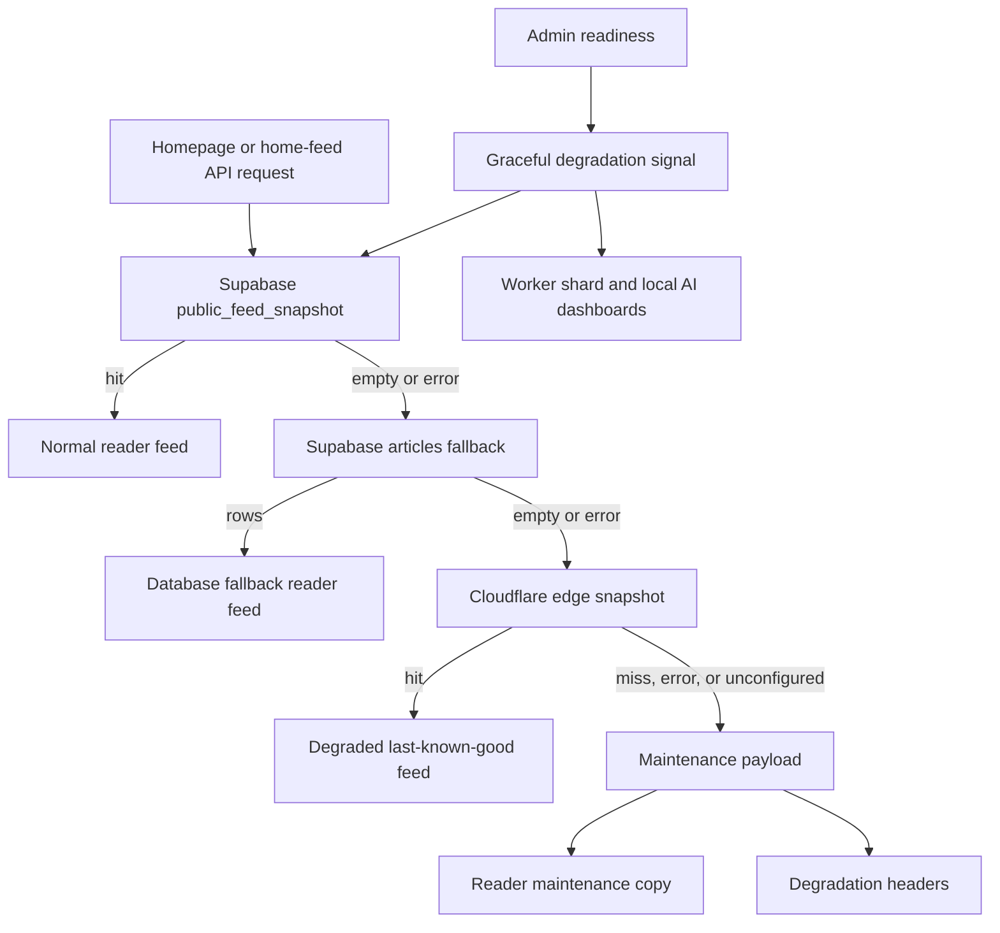
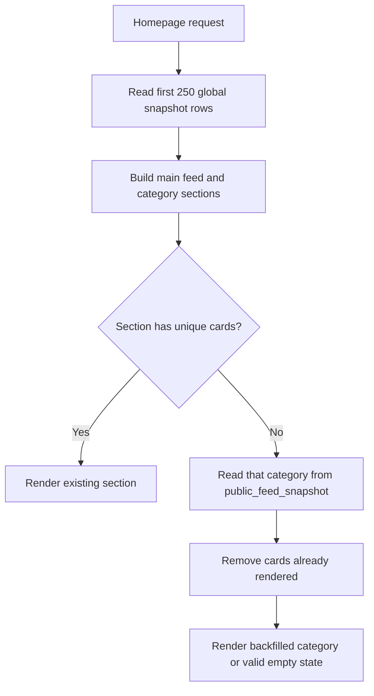

# Public Feed Snapshot and Edge Fallback

NutsNews uses two snapshot layers for the public feed:

1. **Supabase materialized snapshot**: the normal fast read path for the homepage and `/api/articles`.
2. **Cloudflare KV edge snapshot**: a last-known-good fallback served by the Worker if Supabase public feed reads fail.

Issue #104 adds the second layer. Supabase remains the source of truth; KV only stores a compact public copy of recent article cards for outages.

---

## Why This Exists

The public feed should stay readable during temporary Supabase or API failures.

The edge fallback also reduces risk during incidents because the public site can still return a small, cached article list instead of failing closed.

---

## Read Path

Normal reader request:

```text
1. /api/articles
2. public.public_feed_snapshot in Supabase
3. public.articles fallback in Supabase
```

Outage fallback request:

```text
1. /api/articles
2. Supabase snapshot read fails
3. Supabase articles fallback fails or returns no rows
4. Web app fetches Cloudflare Worker /public-feed-snapshot
5. Worker serves last-known-good snapshot from Cloudflare KV
```

The homepage uses the same edge-aware helper for its initial article load and category sections.

---

## Issue #92 Graceful Degradation Mode

Related links:

- Issue: [ramideltoro/nutsnews#92](https://github.com/ramideltoro/nutsnews/issues/92)
- App PR: [ramideltoro/nutsnews#239](https://github.com/ramideltoro/nutsnews/pull/239)

### Simple Summary

If the news feed systems are having a bad moment, NutsNews now stays calm. It can show saved good-news cards when they exist, or a clear refresh message when nothing safe is available.

### Intermediate Summary

The web app now treats the homepage feed as a degraded service instead of only success or failure. The normal order is Supabase `public_feed_snapshot`, Supabase `articles`, Cloudflare edge snapshot, and then a stable maintenance payload. Readers see maintenance copy instead of a broken or generic empty feed. Admin readiness now includes a graceful degradation signal that tells operators whether the reader is protected by a snapshot, relying on database fallback, or blocked.

### Expert Summary

`HomeFeedPayload` can now include degradation metadata with a mode, reason, safe service states, and log timestamp. `/api/home-feed` and `/api/articles?home=1` return HTTP 200 for home-feed maintenance states with `X-NutsNews-Degradation-Mode` and `X-NutsNews-Degradation-Reason` headers. Non-home article API failures still fail closed. `getHomeFeedDataWithEdgeFallback` logs warning events when snapshot reads fail, when edge snapshot recovery is used, and when maintenance payloads are returned. The maintenance payload preserves the known homepage section ids with empty article arrays so the reader layout remains stable. No database migration, secret, or environment-variable change is required.



### Who Is Affected

- Readers see a clearer maintenance message when all public feed sources are unavailable.
- Operators see a new `/admin/readiness` signal for public feed fallback coverage.
- API consumers of home-feed mode can check degradation headers and payload metadata while still receiving a stable JSON shape.
- Worker maintainers keep ownership of ingestion and local AI fallback behavior in the worker repo; the app now surfaces the risk and links operators to the right dashboards.

### Operational Behavior

Normal healthy behavior:

```text
public_feed_snapshot -> reader feed
```

Supabase snapshot issue:

```text
public_feed_snapshot -> articles fallback -> reader feed
```

Supabase read outage with edge snapshot available:

```text
public_feed_snapshot -> articles fallback -> Cloudflare edge snapshot -> degraded reader feed
```

Full public feed outage:

```text
public_feed_snapshot -> articles fallback -> Cloudflare edge snapshot -> maintenance payload
```

The maintenance payload includes:

```text
articles: []
nextPage: null
nextCursor: null
sections: [{ id: "community", articles: [] }, ...]
degradation.mode: "maintenance"
degradation.reason: "no_public_feed_data" or "home_feed_exception"
```

### Headers and Logs

Home-feed maintenance and degraded responses include:

```text
X-NutsNews-Degradation-Mode: degraded | maintenance
X-NutsNews-Degradation-Reason: edge_snapshot_fallback | no_public_feed_data | home_feed_exception
```

Expected warning events include:

```text
web.home_feed.snapshot_read_failed
web.home_feed.fallback_read_failed
web.home_feed.edge_snapshot_degraded
web.home_feed.maintenance_returned
api.home_feed.maintenance_returned
api.articles.home_maintenance_returned
```

### Verification

Local checks used for the app PR:

```bash
cd web
npm run test:routes
npm run test:api-contracts
npm run test:admin-production-readiness
npm run test:runtime-safety
npm run build
npm run test:e2e:offline
```

The plain `npm run build` requires a valid NutsNews runtime-safety environment. For local synthetic validation, use staging-safe fixture values instead of production secrets.

Browser verification for the maintenance state can point the app at a mock Supabase endpoint returning HTTP 503 and open:

```text
/?qualification=nutsnews-test-issue-92
```

Expected result:

```text
NutsNews is refreshing the feed right now. Please check back soon.
```

### Risks, Mitigations, and Rollback

| Risk | Mitigation |
| --- | --- |
| A home-feed API caller might treat HTTP 200 as fully healthy. | Degradation headers and payload metadata explicitly mark degraded or maintenance responses. |
| The reader could show a generic empty feed during an outage. | `ArticleFeed` switches to maintenance copy when `degradation.mode` is `maintenance`. |
| Empty maintenance sections could change the homepage layout contract. | The payload preserves stable section ids with empty article arrays. |
| Worker or local AI failures still need worker-owned fixes. | The admin signal points operators to Worker shard and local AI dashboards; worker implementation remains in `ramideltoro/nutsnews-worker`. |

Rollback is a normal revert of the app PR. No Supabase migration, Cloudflare KV change, secret rotation, or environment-variable rollback is needed.

---

## Homepage Category Backfill

### Simple Summary

If a category such as Animals has stories but the home page cannot see one in its first quick scan, NutsNews now asks the snapshot for that category specifically. Readers see available stories instead of an incorrect empty message.

### Intermediate Summary

The homepage still makes its normal bounded snapshot read for fast loading. It builds the main feed and category sections from that result first. When a section has no unique cards, the web app makes one additional filtered snapshot read for only that category. Existing card identity rules still prevent an article already shown in the main feed or an earlier section from appearing twice.

### Expert Summary

`getHomeFeedFromSnapshot` reads the first 250 globally ranked `public_feed_snapshot` rows to bound homepage read cost. Globally ranked rows do not guarantee that every category is represented: a category-specific query can contain matching rows beyond that window. Empty sections are therefore backfilled with the existing category-filtered read path, which retains the `public_feed_snapshot`-then-`articles` fallback behavior and the current translation handling. The additional reads run only for empty sections and are deduplicated against cards already selected for the page.



### Verification

Use the public API to compare the combined homepage payload with a category result. Replace `animals` with another category when investigating a different section:

```bash
curl --fail --silent --show-error "https://www.nutsnews.com/api/articles?home=1" \
  | jq '.sections[] | select(.id == "animals") | {id, count: (.articles | length)}'

curl --fail --silent --show-error "https://www.nutsnews.com/api/articles?category=animals" \
  | jq '{count: (.articles | length), dataSource}'
```

Run the code regression checks before release:

```bash
cd web
npm run test:article-dedupe
npm run test:public-route-cpu-cache
npm run test:public-cache
```

### Risks, Mitigations, and Rollback

- Risk: a sparse category can add one filtered database read to a homepage refresh.
  Mitigation: no category read is made when the bounded scan already populates every section.
- Risk: a multi-category article could appear twice.
  Mitigation: backfilled cards use the established article identity set shared by the main feed and earlier sections.
- Rollback: revert the homepage category-backfill change. This restores the former bounded-scan-only behavior without changing the snapshot schema, Worker, cache headers, or environment variables.

---

## Write Path

After an ingestion or translation run, the Worker refreshes the Supabase materialized snapshot:

```text
/rest/v1/rpc/refresh_public_feed_snapshot
```

If `NUTSNEWS_KV` is bound to the Worker, the Worker then reads the newest rows from `public.public_feed_snapshot` and writes one compact JSON document to KV:

```text
public-feed:snapshot:v1:latest
```

The KV snapshot includes:

```text
version
updatedAt
refreshedAt
shardIndex
articleCount
maxArticles
articles[]
```

Each article contains only public card fields:

```text
id
source
title
original_url
image_url
published_at
published_on_site_at
ai_summary
category
positivity_score
```

---

## Worker Endpoints

### Public feed fallback

```bash
curl -i "https://nutsnews-worker-0.nutsnews.workers.dev/public-feed-snapshot?page=0&pageSize=5"
```

Optional category filter:

```bash
curl -i "https://nutsnews-worker-0.nutsnews.workers.dev/public-feed-snapshot?page=0&pageSize=5&category=Science"
```

### Snapshot status

```bash
curl -i "https://nutsnews-worker-0.nutsnews.workers.dev/public-feed-snapshot/status"
```

---

## Response Headers

`/api/articles` now exposes the active data source:

```text
X-NutsNews-Article-Data-Source: public_feed_snapshot | articles_fallback | edge_feed_snapshot
X-NutsNews-Feed-Snapshot: hit | fallback | edge-fallback
X-NutsNews-Edge-Snapshot: not-used | hit | miss | error
X-NutsNews-Edge-Snapshot-Updated-At: 2026-07-01T00:00:00.000Z
X-NutsNews-Edge-Snapshot-Age-Seconds: 120
X-NutsNews-Edge-Snapshot-Article-Count: 120
X-NutsNews-Edge-Snapshot-Version: 1
```

The Worker fallback endpoint exposes the same edge snapshot age headers.

---

## Admin Visibility

The admin portal includes:

```text
/admin/edge-snapshot
```

Use it to check:

- whether the web app has an edge snapshot endpoint configured
- whether the Worker has a KV snapshot available
- snapshot age
- article count
- snapshot version
- configured endpoint

---

## Environment Variables

### Web / Vercel

Set this to one deployed Worker endpoint. Shard 0 is enough because the KV namespace is shared across shards.

```bash
NUTSNEWS_EDGE_FEED_SNAPSHOT_URL="https://nutsnews-worker-0.nutsnews.workers.dev"
```

The code also accepts the older alias:

```bash
NUTSNEWS_EDGE_SNAPSHOT_URL="https://nutsnews-worker-0.nutsnews.workers.dev"
```

### Worker / Cloudflare

Create and bind a KV namespace:

```bash
cd worker
npx wrangler kv namespace create NUTSNEWS_KV
```

Then generate Worker configs with the namespace id:

```bash
export NUTSNEWS_KV_NAMESPACE_ID="paste_namespace_id_here"
export PUBLIC_FEED_EDGE_SNAPSHOT_LIMIT=120
export PUBLIC_FEED_EDGE_SNAPSHOT_TTL_SECONDS=604800
npm run generate:wrangler
```

Deploy the Workers:

```bash
npm run deploy:all
```

---

## Invalidation and Update Rules

The edge snapshot updates after successful Worker refreshes.

Recommended defaults:

```text
PUBLIC_FEED_EDGE_SNAPSHOT_LIMIT=120
PUBLIC_FEED_EDGE_SNAPSHOT_TTL_SECONDS=604800
```

Rules:

- Supabase is still the source of truth.
- KV is overwritten after each successful public snapshot refresh.
- KV stores a bounded number of article cards, not the whole archive.
- KV TTL protects against serving very old data forever.
- The API only uses KV when the normal Supabase paths cannot serve the feed.

---

## Verification

Check the Worker has a snapshot:

```bash
curl -i "https://nutsnews-worker-0.nutsnews.workers.dev/public-feed-snapshot/status"
```

Check the public API normal path:

```bash
curl -I "https://nutsnews.com/api/articles?page=0"
```

Expected normal headers:

```text
X-NutsNews-Article-Data-Source: public_feed_snapshot
X-NutsNews-Feed-Snapshot: hit
X-NutsNews-Edge-Snapshot: not-used
```

During a Supabase read incident, expected fallback headers:

```text
X-NutsNews-Article-Data-Source: edge_feed_snapshot
X-NutsNews-Feed-Snapshot: edge-fallback
X-NutsNews-Edge-Snapshot: hit
X-NutsNews-Edge-Snapshot-Age-Seconds: <number>
```

Run the mocked web regression test:

```bash
cd web
npm run test:e2e:offline
```

The test includes a mocked Supabase outage and verifies `/api/articles` can recover from the edge snapshot fallback.

---

## Troubleshooting

### `/admin/edge-snapshot` says unconfigured

Set this in Vercel:

```bash
NUTSNEWS_EDGE_FEED_SNAPSHOT_URL="https://nutsnews-worker-0.nutsnews.workers.dev"
```

Redeploy the web app.

### Worker status returns 503

The Worker probably does not have `NUTSNEWS_KV` bound. Create the namespace, export `NUTSNEWS_KV_NAMESPACE_ID`, regenerate Wrangler configs, and redeploy.

### Worker status returns 404

KV is bound, but no snapshot has been written yet. Run a small Worker refresh:

```bash
curl "https://nutsnews-worker-0.nutsnews.workers.dev/?limit=1"
```

Then check `/public-feed-snapshot/status` again.

### API never uses the edge snapshot

That is normal while Supabase is healthy. The edge snapshot is a fallback, not the primary path.

---

## Admin Health Display Update

`/admin/edge-snapshot` now reads the full Worker status payload and shows:

```text
Endpoint configured
Worker KV binding
HTTP status
Snapshot age
Article count
Version
```

This makes the common failure mode clear:

```text
status: unbound
kvBound: false
message: NUTSNEWS_KV is not bound to this Worker
```

The offline web E2E regression includes a protected admin dashboard check using a dev-only test bypass. The bypass is disabled in production because it only works when `NODE_ENV !== "production"`.
