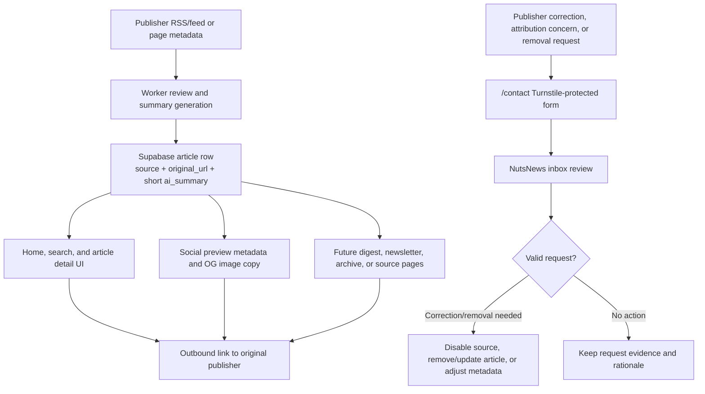

# Publisher Attribution And Content Use

Related issue: `ramideltoro/nutsnews#113`

Related app branch: `ramideltoro/nutsnews@issue-113-publisher-compliance`

## Simple Summary

NutsNews gives credit to the original publisher, shows only short summaries, and sends readers to the publisher for the full story.

## Intermediate Summary

Every public story surface must keep the publisher name visible and link to the original publisher page. NutsNews can summarize and categorize uplifting stories, but it must not republish full articles, long excerpts, or publisher-owned media in a way that implies NutsNews owns the reporting. Publishers can use the contact form for corrections, attribution concerns, opt-out requests, or source removal.

## Expert Summary

The web app centralizes publisher labeling in `web/lib/publisherAttribution.ts`. Home cards, search results, article detail metadata, JSON-LD, and article social-preview copy use that policy boundary while preserving the existing cache-safe article detail and OG image routes. The source of truth remains the `articles` or `public_feed_snapshot` row fields `source`, `original_url`, `title`, `image_url`, `published_at`, `published_on_site_at`, `ai_summary`, and `category`. Future digest, newsletter, social, or archive features must reuse the same attribution and removal rules before launch.

## Attribution Flow

## Public Attribution Rules

| Surface | Required behavior |
| --- | --- |
| Home/article cards | Show the normalized publisher/source name and link the card to `original_url`. |
| Search results | Show the normalized publisher/source name and link both thumbnail and CTA to `original_url`. |
| Article detail page | Keep publisher attribution in visible metadata, structured data, `author`, `citation`, and outbound CTA labels. |
| Social previews | Describe NutsNews as a summary/curation surface and state that publisher attribution is preserved. |
| Privacy/about/support copy | State that NutsNews links back to original publishers instead of replacing the full article. |
| Future digest/newsletter/social posts | Include publisher name, original URL, and short summary only; do not make NutsNews appear to be the original reporter. |

## Summary And Excerpt Limits

NutsNews summaries must remain short, original, and non-substitutive.

| Content type | Policy |
| --- | --- |
| Article title | Use the publisher title or validated localized title. Do not rewrite in a misleading way. |
| AI summary | Use a short NutsNews summary of the reported facts. Do not include full article text. |
| Original excerpt | Keep any stored or displayed excerpt minimal and only when needed for review/context. Avoid public long excerpts. |
| Images | Use publisher image URLs or approved cached/proxy paths with attribution preserved. Do not imply NutsNews owns publisher images. |
| Paywalled or restricted content | Do not bypass publisher access controls or reproduce paywalled article substance. |

## Contact And Removal Workflow

Publishers, readers, or rights holders can use `/contact` for:

- Publisher corrections.
- Attribution concerns.
- Broken or wrong original links.
- Requests to remove a story, image, source, or feed.
- Requests to stop using a source in future ingestion.

When a request arrives:

1. Identify the article by URL, title, publisher name, or screenshot.
2. Confirm whether the story is still public and whether the request comes from a plausible publisher/rights-holder channel.
3. If removal is valid, remove or unpublish the article and consider disabling the feed/source.
4. If only attribution is wrong, update source metadata or ingestion mapping before the next refresh.
5. If images are affected, purge any app/CDN/proxy cache that could continue serving the publisher asset.
6. Keep a short internal note with the request, decision, action taken, and rollback path.

## Future Feature Requirements

Before launching digest, newsletter, source pages, archive pages, related stories, or social automation:

- Reuse `formatPublisherName` or an equivalent shared attribution helper.
- Include publisher/source name beside each story.
- Link the story title or CTA to the original publisher URL.
- Keep summaries short and non-substitutive.
- Do not add custom analytics around outbound publisher clicks unless the analytics allowlist is updated first.
- Include removal/correction handling in launch docs and PR release notes.

## Risks And Mitigations

| Risk | Mitigation |
| --- | --- |
| Publisher attribution disappears from a new surface | Regression coverage checks app helper usage, article metadata, contact copy, and social-preview text. |
| A summary becomes a replacement for the original article | Keep summaries short, avoid long excerpts, and route readers to `original_url`. |
| Publisher asks for removal after a story is cached | Remove/unpublish first, then purge relevant app/CDN/proxy caches if used. |
| Future digest/social tooling omits source links | Treat this document as a required launch checklist for those features. |
| Google News feed labels obscure the real publisher | Normalize known Google News prefixes before display. |

## Rollback

Revert the app PR that adds centralized publisher attribution helpers and contact copy. If rollback is needed after a publisher complaint, remove or unpublish the affected article first, then revert code only after the live content issue is handled.

## Validation

- `npm run test:publisher-attribution`
- `npm run test:public-route-cpu-cache`
- `npx tsc --noEmit`
- `npm run lint`
- `node scripts/app_store_docs_check.mjs`
- `git diff --check`

## Operational Notes

- No new environment variables are required.
- No database migration is required.
- No provider account change is required.
- Browser verification should use chrome-devtools MCP only; if it is unavailable, use local tests and CI evidence.
