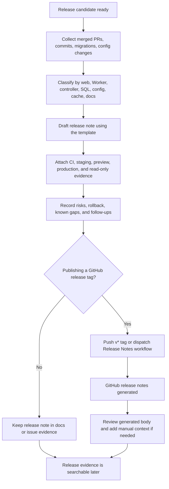

# Release Notes Workflow

Related issue: `ramideltoro/nutsnews#32`

Status: active manual workflow. The app repository also has `.github/workflows/release-notes.yml`, which creates GitHub release notes when a `v*` tag is pushed or the workflow is manually dispatched.

## Simple Summary

Every production release needs a short, consistent note that explains what changed, what was deployed, what database or configuration changes were included, how it was verified, and how to roll back. The note should be readable later without reopening every pull request.

## Intermediate Summary

Use this workflow before tagging or promoting a production release. GitHub can auto-generate a release body from merged pull requests, but the manual release note is the source of operational context: web changes, Worker shard changes, controller changes, SQL migrations, runtime/config changes, verification evidence, known risks, and rollback state.

For documentation-only releases, record the docs commit and skip deployment sections that do not apply. For app or infra releases, link the app PR, docs commit, infra PR or protected apply evidence, deployment target, and production verification results.

## Expert Summary

Release notes are owned in `ramideltoro/nutsnews-docs` as cross-repo release documentation. The app repo's `Release Notes` workflow can publish GitHub releases for `v*` tags with generated notes, but generated notes are not enough for production operations. The manual checklist below records the release boundary across `ramideltoro/nutsnews`, `ramideltoro/nutsnews-worker`, `ramideltoro/nutsnews-infra`, Supabase SQL, Vercel, Cloudflare, and runtime configuration.

## Release Note Format

Use this format for a production release note, either in a GitHub release body, a docs update, or an issue comment that links to the final evidence.

```markdown
# NutsNews Release <version or date>

Release window:
Release owner:
Production target:
Primary app commit:
GitHub release tag:

## Summary

- Reader-visible:
- Admin/operator-visible:
- Infrastructure/runtime:
- Documentation/process:

## Included Changes

| Area | Change | PR/commit | Verification |
| --- | --- | --- | --- |
| Web app |  |  |  |
| Worker shards |  |  |  |
| Controller Worker |  |  |  |
| SQL/migrations |  |  |  |
| Runtime/config |  |  |  |
| Cloudflare/cache |  |  |  |
| Docs/runbooks |  |  |  |

## Required Manual Checks

- [ ] Web app changes reviewed.
- [ ] Worker shard changes reviewed, or explicitly not changed.
- [ ] Controller Worker changes reviewed, or explicitly not changed.
- [ ] SQL migrations reviewed, ordered, and covered by migration gate, or explicitly not changed.
- [ ] Runtime/config/env changes reviewed, with secret names only and no secret values.
- [ ] Cache/CDN behavior reviewed, or explicitly not changed.
- [ ] Docs/runbooks updated for the release.
- [ ] Production verification commands/results recorded.
- [ ] Known risks and rollback path recorded.

## Verification

- Local validation:
- CI:
- Preview/staging:
- Production:
- Live read-only checks:

## Risks

- TBD

## Rollback

- Last-known-good:
- Rollback command/workflow:
- Data/schema rollback boundary:

## Follow-ups

- TBD
```

## Scope Checklist

Use this table to decide which sections must be completed.

| Area | Include when | Required release-note details |
| --- | --- | --- |
| Web app | `ramideltoro/nutsnews/web`, app routes, components, API routes, admin UI, analytics, auth, cache headers, or Vercel behavior changed | PR URL, app commit, user-facing behavior, affected routes, tests, browser verification, Vercel preview or production evidence |
| Worker shards | Worker ingestion, source fetch, RSS/API parsing, AI review, translation, queueing, or shard config changed | Worker repo PR/commit, shard/config impact, provider/API limits, dry-run or smoke evidence, rollback or disable switch |
| Controller Worker | Controller scheduling, refresh triggers, orchestration, locks, or admin-triggered Worker control changed | Controller PR/commit, trigger schedule, lock behavior, rate limits, verification and rollback |
| SQL/migrations | Supabase migrations, RPCs, tables, indexes, RLS, views, functions, or fixtures changed | Migration file names, migration head, backup/restore evidence when production-bound, forward-only/rollback notes, RLS/security impact |
| Runtime/config | Environment variables, feature flags, GitHub secrets, Vercel settings, Cloudflare settings, Supabase project settings, or VPS env rendering changed | Secret/config names only, target environment, default/fallback behavior, validation command, rollback value or disable path |
| Cloudflare/cache | Cache headers, purge automation, DNS/routes, Turnstile, Access, Workers routes, or CDN policy changed | Zone/route names only, cache TTLs, purge requirement, read-only verification, rollback |
| Docs/runbooks | Product, operations, deployment, API, privacy, source quality, release, or incident docs changed | Docs commit, affected runbooks, whether the docs change is release-blocking |

## Manual Workflow



1. Start from the merged PR list, deployment candidate, or production apply evidence.
2. Fill the release note template before production promotion when a deploy is planned.
3. Mark every scope area as changed or explicitly unchanged.
4. Include PR URLs, commit SHAs, workflow runs, migration file names, and docs commits.
5. Record only secret names or setting names. Do not paste secret values, private connection strings, cookies, tokens, or raw environment files.
6. After production verification, update the note with actual results and any follow-ups.
7. If a `v*` tag is used, review the generated GitHub release and add the manual context if GitHub's generated body omits operational details.

## GitHub Release Automation

`ramideltoro/nutsnews/.github/workflows/release-notes.yml` creates a GitHub release when:

- a tag matching `v*` is pushed; or
- the workflow is manually dispatched with an optional tag name.

The workflow uses GitHub-generated release notes and `softprops/action-gh-release`. It is useful for publication, but it cannot decide whether Worker, controller, SQL, config, cache, docs, or rollback details are complete. Treat generated notes as a starting point, not as the operational record.

## Required Evidence

| Evidence | Required for |
| --- | --- |
| App PR URL and commit SHA | Every app release |
| Docs commit SHA | Every release with docs or runbook impact |
| Worker/controller PR or commit | Worker or controller changes |
| Migration file names and migration head | SQL changes |
| Vercel deployment URL or workflow run | Vercel release claims |
| GHCR image digest and staging qualification | VPS app releases |
| Protected Ansible Apply run | VPS production changes |
| Cloudflare purge/cache check | Cache, DNS, route, or CDN behavior changes |
| Read-only live check command/result | Production/runtime claims |
| Rollback path | Every production release |

## Storage And Search

- GitHub releases are appropriate for tagged app releases.
- Issue comments are appropriate for docs-only or planning work that closes a GitHub issue without a deploy.
- `ramideltoro/nutsnews-docs` is the canonical place for reusable release workflow and runbook updates.
- Do not store release notes in local-only files, chat transcripts, screenshots without text, or provider dashboards that are hard to search later.

## Rollback Notes

Every production release note needs a rollback section even when the rollback is "revert the PR." SQL and config changes need explicit boundaries:

- Forward-only migrations should state whether rollback is app-only, data-preserving, or blocked without a new migration.
- Runtime/config changes should name the setting and the safe previous state without exposing values.
- VPS releases should name the protected rollback workflow and the last-known-good source/digest evidence.
- Docs-only changes roll back by reverting the docs commit.

## Related Docs

- [Deployment Checklist](DEPLOYMENT_CHECKLIST.md)
- [NutsNews Release Pipeline](NUTSNEWS_RELEASE_PIPELINE.md)
- [Dual-Target Web Deployment](NUTSNEWS_DUAL_TARGET_WEB_DEPLOYMENT.md)
- [Migration Release Gate](MIGRATION_RELEASE_GATE.md)
- [GitHub Actions Automation](GITHUB_ACTIONS_AUTOMATION.md)
