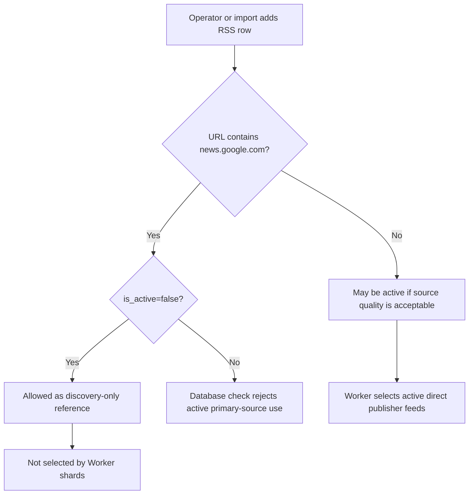

# RSS Source Quality Scoring

Issue #3 adds source quality scoring so NutsNews can rank RSS feeds by useful output instead of keeping every source active forever.

A smaller set of reliable sources is better than hundreds of weak or noisy feeds.

---

## Issue #5 Google News RSS Discovery-Only Policy

Issue: https://github.com/ramideltoro/nutsnews/issues/5

App PR: https://github.com/ramideltoro/nutsnews/pull/242

### Simple Summary

NutsNews should use feeds from the real publishers, not Google News RSS, when publishing stories. Google News can help discover sources, but it should not be an active story feed.

### Intermediate Summary

Google News RSS rows may exist only as inactive discovery references. Active `rss_feeds` rows must point to direct publisher feeds so article URLs, thumbnails, attribution, and source quality stay clean. On 2026-07-17, production Supabase had 49 active feeds and `active_google_feeds = 0`; no production data change was needed.

### Expert Summary

Issue #5 adds a database guardrail in `supabase/migrations/20260717032000_keep_google_news_discovery_only.sql`. The constraint permits `news.google.com` URLs only when `rss_feeds.is_active = false`, so inactive discovery records remain possible while Worker-selected active feeds stay direct-publisher-only. The app repo also adds `supabase/rss_source_policy.sql` with the zero-count acceptance query and controlled remediation update, `scripts/rss_source_policy_regression.mjs` to protect the policy, and `activeGoogleFeedCount` in `scripts/feed_health_report.mjs`.

### Operating Rule

| Source type | Allowed active? | Use |
| --- | --- | --- |
| Direct publisher RSS | Yes | Primary ingestion and publishing source |
| Google News RSS (`news.google.com`) | No | Discovery-only reference; must remain inactive |
| Weak direct publisher RSS | Maybe | Evaluate with feed quality score and disable if it stays poor |

### Verification Queries

This acceptance query must return zero:

```sql
select count(*) as active_google_feeds
from public.rss_feeds
where is_active = true
  and url ilike '%news.google.com%';
```

If a Google News row is accidentally active, use the controlled remediation query from `supabase/rss_source_policy.sql`:

```sql
update public.rss_feeds
set is_active = false
where is_active = true
  and url ilike '%news.google.com%'
returning id, source, url, is_active;
```

### Data Flow



### Risks And Mitigations

| Risk | Mitigation |
| --- | --- |
| A future import accidentally enables Google News RSS | The database check constraint rejects active `news.google.com` rows. |
| Operators still need Google News for discovery | Inactive rows remain allowed, and the policy SQL documents discovery-only use. |
| Active feed count changes after disabling a row | Replace Google News with direct publisher RSS before increasing shard counts. |
| Production migration fails because a Google News row is active | Run the verification query first; disable active Google News rows with the controlled remediation SQL. |

### Rollback

Rollback is to revert the app PR that adds the migration, `supabase/rss_source_policy.sql`, report count, and regression script. If the migration has already been applied and must be reverted, drop `rss_feeds_google_news_discovery_only_check` only after explicitly accepting the risk that Google News RSS can be re-enabled as a primary source.

---

## What Changed

NutsNews now has a computed Supabase view:

```text
public.feed_quality_scores
```

The view gives each RSS feed:

* `quality_score` from 0 to 100
* `quality_grade`
* `quality_reason`
* Success rate
* Thumbnail rate
* Accepted rate
* Failure rate
* Duplicate/already-seen rate

The `/admin/feeds` dashboard displays the score directly on each RSS feed card and adds sections for lowest-quality and highest-quality sources.

---

## Quality Grades

| Grade | Meaning |
| --- | --- |
| `excellent` | Strong source; prioritize when expanding shards |
| `good` | Reliable source; generally safe to keep active |
| `review` | Usable but should be reviewed before scaling |
| `poor` | Weak source; consider disabling or replacing |
| `untracked` | Worker has not collected enough data yet |
| `inactive` | Feed is disabled in `rss_feeds` |

---

## Scoring Rules

The score is based on five signals:

| Signal | Weight | Column |
| --- | ---: | --- |
| Fetch success rate | 25% | `success_rate_pct` |
| Thumbnail coverage | 25% | `thumbnail_rate_pct` |
| Accepted article rate | 30% | `accepted_rate_pct` |
| Low failure rate | 10% | `100 - failure_rate_pct` |
| Low duplicate/already-seen rate | 10% | `100 - duplicate_rate_pct` |

The view also applies penalties:

| Penalty | Rule |
| --- | --- |
| `-10` | Feed is inactive |
| `-25` | Feed has never been checked |
| `-20` | Feed has 3 or more consecutive failures |

The final score is capped between 0 and 100.

---

## Duplicate Rate Note

The duplicate rate is an approximate duplicate/already-seen signal.

It compares cumulative discovered articles from `feed_health.total_article_count` against unique reviewed URLs from `article_ai_reviews`. If a feed repeatedly returns the same stories, the discovered count rises faster than the unique reviewed URL count.

This is useful for ranking sources, but it should be treated as an operational signal rather than an exact duplicate counter.

---

## Admin Dashboard

Open:

```text
/admin/feeds
```

The feed management dashboard now shows:

* Quality score badge on each feed card
* Quality reason
* Quality grade
* Success rate
* Thumbnail rate
* Accepted rate
* Failure rate
* Duplicate/already-seen rate
* Unique reviewed URL count
* Lowest quality feeds section
* Highest quality feeds section
* Ranking SQL for Supabase

Use the lowest-quality section to decide what to disable first.

Use the highest-quality section to decide what to prioritize when adding more feeds or increasing shard coverage.

---

## Supabase Ranking Query

Rank all feeds by quality:

```sql
select
  source,
  feed_url,
  is_active,
  quality_score,
  quality_grade,
  success_rate_pct,
  thumbnail_rate_pct,
  accepted_rate_pct,
  failure_rate_pct,
  duplicate_rate_pct,
  total_fetch_count,
  total_accepted_count,
  quality_reason
from public.feed_quality_scores
order by quality_score desc, total_accepted_count desc, source asc;
```

Find active feeds that should be reviewed or replaced:

```sql
select
  source,
  feed_url,
  quality_score,
  quality_grade,
  quality_reason,
  consecutive_failure_count,
  success_rate_pct,
  thumbnail_rate_pct,
  accepted_rate_pct,
  duplicate_rate_pct
from public.feed_quality_scores
where is_active = true
  and (
    quality_score < 50
    or quality_grade = 'poor'
    or consecutive_failure_count >= 3
  )
order by quality_score asc, consecutive_failure_count desc, source asc;
```

Find best active feeds:

```sql
select
  source,
  feed_url,
  quality_score,
  quality_grade,
  total_accepted_count,
  thumbnail_rate_pct,
  success_rate_pct
from public.feed_quality_scores
where is_active = true
  and total_fetch_count > 0
order by quality_score desc, total_accepted_count desc, thumbnail_rate_pct desc;
```

---

## Promotion Rules

Promote or prioritize a feed when:

* `quality_score >= 70`
* It has accepted articles
* It has good thumbnail coverage
* It has a strong success rate
* It has low consecutive failures
* It is not mostly duplicate or already-seen content

Excellent feeds can be used as anchor sources when increasing shard coverage.

---

## Disable or Replace Rules

Consider disabling or replacing a feed when:

* `quality_score < 50`
* `quality_grade = 'poor'`
* `consecutive_failure_count >= 3`
* It has many fetches but no accepted output
* It has poor thumbnail coverage
* It returns mostly duplicate or already-seen stories

Disable weak feeds without a code deploy:

```sql
update public.rss_feeds
set is_active = false
where url in (
  select feed_url
  from public.feed_quality_scores
  where is_active = true
    and quality_score < 50
  order by quality_score asc
  limit 25
);
```

Worker shards already select only active feeds, so disabled feeds are skipped automatically.

---

## Migration

The view is created by:

```text
supabase/migrations/20260615002000_create_feed_quality_scores.sql
```

Apply migrations with:

```bash
supabase db push
```

After migration, refresh `/admin/feeds` to see scores.
