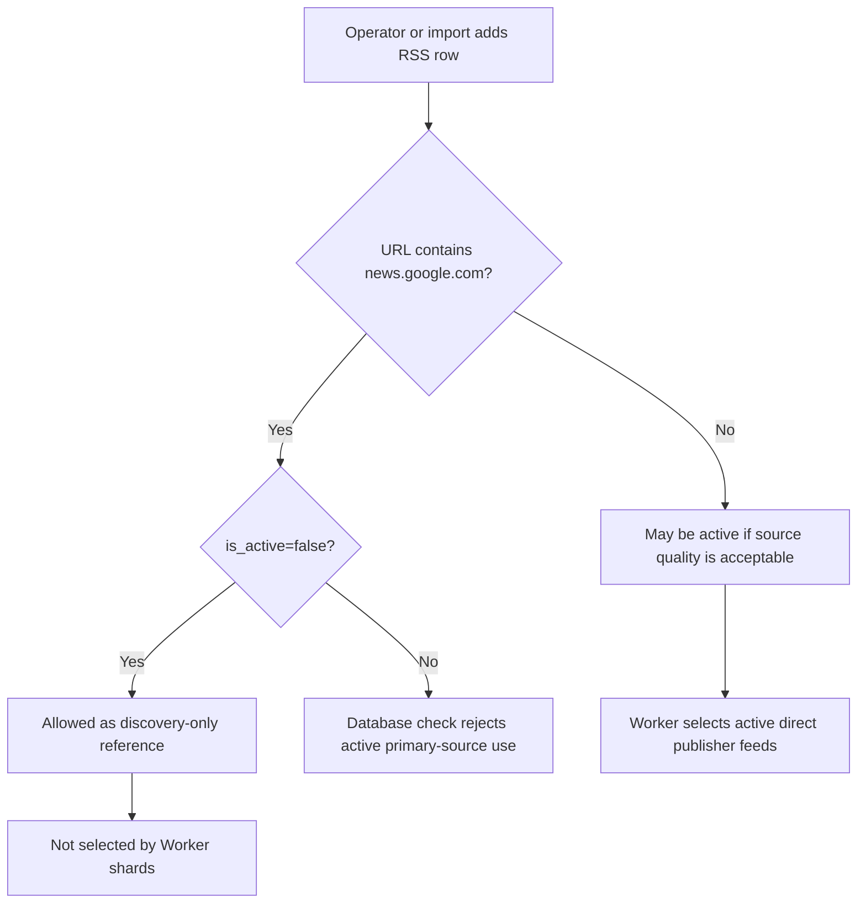
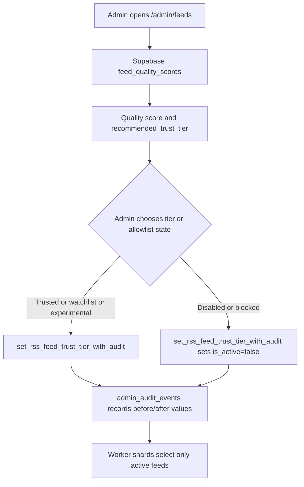
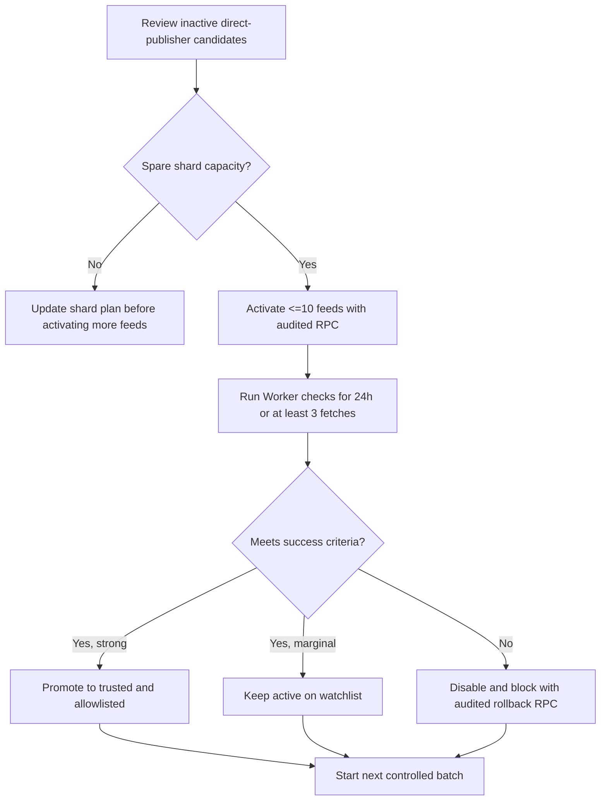

# RSS Source Quality Scoring

Issue #3 adds source quality scoring so NutsNews can rank RSS feeds by useful output instead of keeping every source active forever.

A smaller set of reliable sources is better than hundreds of weak or noisy feeds.

---

## Issue #5 Google News RSS Discovery-Only Policy

Issue: https://github.com/ramideltoro/nutsnews/issues/5

App PR: https://github.com/ramideltoro/nutsnews/pull/242

### Simple Summary

NutsNews should use feeds from the real publishers, not Google News RSS, when publishing stories. Google News can help discover sources, but it should not be an active story feed.

### Intermediate Summary

Google News RSS rows may exist only as inactive discovery references. Active `rss_feeds` rows must point to direct publisher feeds so article URLs, thumbnails, attribution, and source quality stay clean. On 2026-07-17, production Supabase had 49 active feeds and `active_google_feeds = 0`; no production data change was needed.

### Expert Summary

Issue #5 adds a database guardrail in `supabase/migrations/20260717032000_keep_google_news_discovery_only.sql`. The constraint permits `news.google.com` URLs only when `rss_feeds.is_active = false`, so inactive discovery records remain possible while Worker-selected active feeds stay direct-publisher-only. The app repo also adds `supabase/rss_source_policy.sql` with the zero-count acceptance query and controlled remediation update, `scripts/rss_source_policy_regression.mjs` to protect the policy, and `activeGoogleFeedCount` in `scripts/feed_health_report.mjs`.

### Operating Rule

| Source type | Allowed active? | Use |
| --- | --- | --- |
| Direct publisher RSS | Yes | Primary ingestion and publishing source |
| Google News RSS (`news.google.com`) | No | Discovery-only reference; must remain inactive |
| Weak direct publisher RSS | Maybe | Evaluate with feed quality score and disable if it stays poor |

### Verification Queries

This acceptance query must return zero:

```sql
select count(*) as active_google_feeds
from public.rss_feeds
where is_active = true
  and url ilike '%news.google.com%';
```

If a Google News row is accidentally active, use the controlled remediation query from `supabase/rss_source_policy.sql`:

```sql
update public.rss_feeds
set is_active = false
where is_active = true
  and url ilike '%news.google.com%'
returning id, source, url, is_active;
```

### Data Flow



### Risks And Mitigations

| Risk | Mitigation |
| --- | --- |
| A future import accidentally enables Google News RSS | The database check constraint rejects active `news.google.com` rows. |
| Operators still need Google News for discovery | Inactive rows remain allowed, and the policy SQL documents discovery-only use. |
| Active feed count changes after disabling a row | Replace Google News with direct publisher RSS before increasing shard counts. |
| Production migration fails because a Google News row is active | Run the verification query first; disable active Google News rows with the controlled remediation SQL. |

### Rollback

Rollback is to revert the app PR that adds the migration, `supabase/rss_source_policy.sql`, report count, and regression script. If the migration has already been applied and must be reverted, drop `rss_feeds_google_news_discovery_only_check` only after explicitly accepting the risk that Google News RSS can be re-enabled as a primary source.

---

## Issue #95 Source Trust Tiers And Publisher Allowlist

Issue: https://github.com/ramideltoro/nutsnews/issues/95

App PR: https://github.com/ramideltoro/nutsnews/pull/243

### Simple Summary

NutsNews now has labels for how much we trust each news source. Good sources can be marked trusted, new sources can stay experimental, risky sources can go on a watchlist, and bad sources can be disabled.

### Intermediate Summary

RSS feeds now have durable `source_trust_tier` and `publisher_allowlist_status` fields in Supabase. The `/admin/feeds` page shows the trust tier beside the quality score, shows the publisher allowlist state, recommends a tier from source-quality signals, and lets admins update the tier without a deploy. Setting a source to `disabled` or a publisher to `blocked` keeps the feed inactive so Worker shards cannot select it.

### Expert Summary

Issue #95 adds migration `20260717093000_add_source_trust_tiers.sql`. It extends `public.rss_feeds` with `source_trust_tier` (`trusted`, `watchlist`, `experimental`, `disabled`) and `publisher_allowlist_status` (`allowlisted`, `candidate`, `blocked`), adds consistency constraints and indexes, appends trust fields and `recommended_trust_tier` to `public.feed_quality_scores`, and adds `set_rss_feed_trust_tier_with_audit(...)`. The existing `set_rss_feed_active_with_audit(...)` RPC now keeps disabled sources consistent by moving disabled feeds to `disabled`/`blocked` and restoring re-enabled feeds to `experimental`/`candidate` unless another tier is set.

### Trust Tier Rules

| Tier | Meaning | Operational use |
| --- | --- | --- |
| `trusted` | Proven direct publisher source | Safe to prioritize when expanding shards |
| `watchlist` | Active source with quality or reliability concerns | Review quality signals before keeping or expanding |
| `experimental` | New or not-yet-proven source | Keep active only while collecting health and quality history |
| `disabled` | Source should not be selected | Enforced inactive and paired with `publisher_allowlist_status = 'blocked'` |

### Publisher Allowlist States

| Status | Meaning |
| --- | --- |
| `allowlisted` | Publisher is approved for trusted/source-expansion use |
| `candidate` | Publisher is under evaluation |
| `blocked` | Publisher is blocked and the feed must remain inactive |

### Admin Workflow

1. Open `/admin/feeds`.
2. Review the source card's trust-tier pill, quality score, allowlist pill, and tier recommendation.
3. Use the Tier and Allowlist menus to promote, watchlist, or disable a source.
4. Confirm the matching event in `/admin/audit`.

Low-quality or repeatedly failing active feeds should normally move to `watchlist` first. If the source is not useful or keeps failing, set the tier to `disabled` or the allowlist to `blocked`; either path makes the feed inactive.

### Data Flow



### Verification Queries

Find sources whose tier does not match the quality recommendation:

```sql
select
  source,
  feed_url,
  source_trust_tier,
  publisher_allowlist_status,
  recommended_trust_tier,
  quality_score,
  quality_grade,
  tier_recommendation_reason
from public.feed_quality_scores
where source_trust_tier <> recommended_trust_tier
order by quality_score asc, source asc;
```

Verify disabled/blocked consistency:

```sql
select
  id,
  source,
  url,
  is_active,
  source_trust_tier,
  publisher_allowlist_status
from public.rss_feeds
where
  (source_trust_tier = 'disabled' and (is_active = true or publisher_allowlist_status <> 'blocked'))
  or (publisher_allowlist_status = 'blocked' and source_trust_tier <> 'disabled');
```

This consistency query should return zero rows.

### Risks And Mitigations

| Risk | Mitigation |
| --- | --- |
| Admin accidentally disables a useful feed | Tier changes are audited with before/after values, and re-enabling restores the source to experimental/candidate for review. |
| Trust tier drifts away from measured quality | `feed_quality_scores.recommended_trust_tier` and the admin summary surface mismatches. |
| Blocked publishers remain active | Database constraints and RPC behavior pair `disabled` with `blocked` and force inactive status. |
| Worker code does not understand trust tiers yet | Worker shards already select by `is_active`; trust tiers add admin control without changing Worker selection semantics. |

### Rollback

Rollback is to revert the application PR that adds migration `20260717093000_add_source_trust_tiers.sql`, admin UI wiring, and regression tests. If the migration has already been applied, first export any admin tier decisions that need to be preserved, then drop the new RPC, constraints, indexes, and columns only after accepting that source trust state and allowlist state will be lost. The existing `is_active` feed-selection behavior remains the fallback control.

---

## Issue #38 Feed Source Expansion Plan

Issue: https://github.com/ramideltoro/nutsnews/issues/38

Docs-only completion: no application PR required.

### Simple Summary

Add new news feeds slowly. Turn on a small group, watch whether they work, keep the good ones, and turn off the bad ones before adding more.

### Intermediate Summary

Feed expansion must happen in controlled validation batches. Activate no more than 10 new feeds at once, and never exceed current shard capacity without first updating the controller/shard configuration. Keep each batch in `experimental`/`candidate` state until it has enough health and quality history, then promote strong sources or disable weak ones.

### Expert Summary

Issue #38 defines an operations plan for expanding active `rss_feeds` safely. With the current production controller guidance of `SHARD_COUNT=3` and `FEEDS_PER_SHARD=20`, active feed capacity is 60. The last verified active count in this doc set was 49, leaving 11 spare active-feed slots before shard configuration must be revisited. Expansion batches should use the audited admin RPCs from issue #95, preserve Google News RSS as discovery-only from issue #5, and rely on `feed_quality_scores` to decide whether sources stay active, move to `watchlist`, promote to `trusted`, or roll back to `disabled`/`blocked`.

### Batch Size

Use this batch limit:

```text
validation_batch_size = min(10, shard_capacity - current_active_feeds)
```

Rules:

* Activate one validation batch at a time.
* Wait for at least 3 Worker checks or 24 hours before adding the next batch.
* Stop expansion if active feeds reach current shard capacity.
* Increase `SHARD_COUNT` only when active feeds exceed the current capacity formula in `CONTROLLER_AND_SHARDS.md`.
* Do not activate Google News RSS rows; they remain discovery-only.

### Preflight Queries

Check current active capacity:

```sql
select
  count(*) filter (where is_active = true) as active_feeds,
  count(*) filter (where is_active = false) as inactive_feeds,
  count(*) filter (where is_active = true and url ilike '%news.google.com%') as active_google_feeds
from public.rss_feeds;
```

Find candidate direct-publisher rows for the next batch:

```sql
select
  id,
  source,
  url,
  source_trust_tier,
  publisher_allowlist_status
from public.rss_feeds
where is_active = false
  and url not ilike '%news.google.com%'
  and coalesce(source_trust_tier, 'experimental') in ('experimental', 'watchlist', 'disabled')
order by created_at asc, source asc
limit 10;
```

### Activation Query

Use the audited activation RPC so `/admin/audit` records who changed the feed. Replace the feed URLs and actor email before running.

```sql
with activation_batch(feed_url) as (
  values
    ('https://publisher.example/feed.xml'),
    ('https://another-publisher.example/rss')
)
select result.*
from activation_batch batch
cross join lateral public.set_rss_feed_active_with_audit(
  'operator@example.com',
  batch.feed_url,
  true
) as result;
```

After activation, keep the batch as `experimental`/`candidate` unless a source already has a documented reason to be trusted.

### Success Criteria

Keep a new feed active after the validation window only if all of these are true:

| Signal | Pass threshold |
| --- | --- |
| Fetch history | `total_fetch_count >= 3` |
| Success rate | `success_rate_pct >= 70` |
| Consecutive failures | `< 3` |
| Quality score | `quality_score >= 50` |
| Source policy | Direct publisher RSS; no active `news.google.com` URL |
| Attribution | Source and original URLs point to the publisher, not a redirect aggregator |

Promote to `trusted` only after stronger evidence:

* `quality_score >= 85`
* `total_accepted_count >= 3`
* No repeated fetch or thumbnail failures
* Publisher attribution is clean

Move to `watchlist` when the feed is useful but below the trusted threshold. Disable it when it fails the pass criteria after the validation window.

### Review Query

Review the active validation batch:

```sql
select
  source,
  feed_url,
  source_trust_tier,
  publisher_allowlist_status,
  recommended_trust_tier,
  quality_score,
  quality_grade,
  total_fetch_count,
  success_rate_pct,
  thumbnail_rate_pct,
  accepted_rate_pct,
  consecutive_failure_count,
  quality_reason,
  tier_recommendation_reason
from public.feed_quality_scores
where is_active = true
  and source_trust_tier in ('experimental', 'watchlist')
order by quality_score asc, consecutive_failure_count desc, source asc;
```

### Rollback And Deactivation Query

Use the audited tier RPC to disable or block a failed batch. Replace the feed URLs and actor email before running.

```sql
with rollback_batch(feed_url) as (
  values
    ('https://publisher.example/feed.xml'),
    ('https://another-publisher.example/rss')
)
select result.*
from rollback_batch batch
cross join lateral public.set_rss_feed_trust_tier_with_audit(
  'operator@example.com',
  batch.feed_url,
  'disabled',
  'blocked'
) as result;
```

Confirm rollback:

```sql
select source, url, is_active, source_trust_tier, publisher_allowlist_status
from public.rss_feeds
where url in (
  'https://publisher.example/feed.xml',
  'https://another-publisher.example/rss'
);
```

The confirmation rows should show `is_active = false`, `source_trust_tier = 'disabled'`, and `publisher_allowlist_status = 'blocked'`.

### Expansion Flow



### Risks And Mitigations

| Risk | Mitigation |
| --- | --- |
| Adding too many feeds overloads shard time | Limit each validation batch to 10 or spare shard capacity, whichever is lower. |
| Weak feeds crowd out reliable sources | Use `feed_quality_scores` pass/fail criteria before starting another batch. |
| Google News RSS returns as a primary source | Keep the issue #5 active-Google query at zero before activation. |
| Source changes lack audit history | Use `set_rss_feed_active_with_audit` and `set_rss_feed_trust_tier_with_audit`, not unaudited direct updates. |
| Active feed count exceeds shard capacity | Stop expansion and update controller/shard capacity before activating more rows. |

### Rollback

Rollback for an expansion batch is to run the audited deactivation query above, confirm every failed feed is inactive/disabled/blocked, and wait for Worker shards to complete one normal cycle. If the batch caused shard timeouts or empty shard rotations, pause additional activation and revisit `SHARD_COUNT`, `FEEDS_PER_SHARD`, and the source quality thresholds before trying again.

---

## What Changed

NutsNews now has a computed Supabase view:

```text
public.feed_quality_scores
```

The view gives each RSS feed:

* `quality_score` from 0 to 100
* `quality_grade`
* `quality_reason`
* `source_trust_tier`
* `publisher_allowlist_status`
* `recommended_trust_tier`
* `tier_recommendation_reason`
* Success rate
* Thumbnail rate
* Accepted rate
* Failure rate
* Duplicate/already-seen rate

The `/admin/feeds` dashboard displays the score directly on each RSS feed card and adds sections for lowest-quality and highest-quality sources.

---

## Quality Grades

| Grade | Meaning |
| --- | --- |
| `excellent` | Strong source; prioritize when expanding shards |
| `good` | Reliable source; generally safe to keep active |
| `review` | Usable but should be reviewed before scaling |
| `poor` | Weak source; consider disabling or replacing |
| `untracked` | Worker has not collected enough data yet |
| `inactive` | Feed is disabled in `rss_feeds` |

---

## Scoring Rules

The score is based on five signals:

| Signal | Weight | Column |
| --- | ---: | --- |
| Fetch success rate | 25% | `success_rate_pct` |
| Thumbnail coverage | 25% | `thumbnail_rate_pct` |
| Accepted article rate | 30% | `accepted_rate_pct` |
| Low failure rate | 10% | `100 - failure_rate_pct` |
| Low duplicate/already-seen rate | 10% | `100 - duplicate_rate_pct` |

The view also applies penalties:

| Penalty | Rule |
| --- | --- |
| `-10` | Feed is inactive |
| `-25` | Feed has never been checked |
| `-20` | Feed has 3 or more consecutive failures |

The final score is capped between 0 and 100.

---

## Duplicate Rate Note

The duplicate rate is an approximate duplicate/already-seen signal.

It compares cumulative discovered articles from `feed_health.total_article_count` against unique reviewed URLs from `article_ai_reviews`. If a feed repeatedly returns the same stories, the discovered count rises faster than the unique reviewed URL count.

This is useful for ranking sources, but it should be treated as an operational signal rather than an exact duplicate counter.

---

## Admin Dashboard

Open:

```text
/admin/feeds
```

The feed management dashboard now shows:

* Quality score badge on each feed card
* Source trust tier beside the quality score
* Publisher allowlist status
* Quality-based recommended trust tier
* Tier and allowlist update controls
* Quality reason
* Quality grade
* Success rate
* Thumbnail rate
* Accepted rate
* Failure rate
* Duplicate/already-seen rate
* Unique reviewed URL count
* Lowest quality feeds section
* Highest quality feeds section
* Ranking SQL for Supabase

Use the lowest-quality section to decide what to disable first.

Use the highest-quality section to decide what to prioritize when adding more feeds or increasing shard coverage.

---

## Supabase Ranking Query

Rank all feeds by quality:

```sql
select
  source,
  feed_url,
  is_active,
  source_trust_tier,
  publisher_allowlist_status,
  recommended_trust_tier,
  quality_score,
  quality_grade,
  success_rate_pct,
  thumbnail_rate_pct,
  accepted_rate_pct,
  failure_rate_pct,
  duplicate_rate_pct,
  total_fetch_count,
  total_accepted_count,
  quality_reason,
  tier_recommendation_reason
from public.feed_quality_scores
order by source_trust_tier asc, quality_score desc, total_accepted_count desc, source asc;
```

Find active feeds that should be reviewed or replaced:

```sql
select
  source,
  feed_url,
  source_trust_tier,
  publisher_allowlist_status,
  recommended_trust_tier,
  quality_score,
  quality_grade,
  quality_reason,
  consecutive_failure_count,
  success_rate_pct,
  thumbnail_rate_pct,
  accepted_rate_pct,
  duplicate_rate_pct
from public.feed_quality_scores
where is_active = true
  and (
    quality_score < 50
    or quality_grade = 'poor'
    or consecutive_failure_count >= 3
  )
order by quality_score asc, consecutive_failure_count desc, source asc;
```

Find best active feeds:

```sql
select
  source,
  feed_url,
  quality_score,
  quality_grade,
  total_accepted_count,
  thumbnail_rate_pct,
  success_rate_pct
from public.feed_quality_scores
where is_active = true
  and total_fetch_count > 0
order by quality_score desc, total_accepted_count desc, thumbnail_rate_pct desc;
```

---

## Promotion Rules

Promote or prioritize a feed when:

* `quality_score >= 70`
* It has accepted articles
* It has good thumbnail coverage
* It has a strong success rate
* It has low consecutive failures
* It is not mostly duplicate or already-seen content

Excellent feeds can be used as anchor sources when increasing shard coverage.

---

## Disable or Replace Rules

Consider disabling or replacing a feed when:

* `quality_score < 50`
* `quality_grade = 'poor'`
* `consecutive_failure_count >= 3`
* It has many fetches but no accepted output
* It has poor thumbnail coverage
* It returns mostly duplicate or already-seen stories

Disable weak feeds without a code deploy:

```sql
update public.rss_feeds
set is_active = false
where url in (
  select feed_url
  from public.feed_quality_scores
  where is_active = true
    and quality_score < 50
  order by quality_score asc
  limit 25
);
```

Worker shards already select only active feeds, so disabled feeds are skipped automatically.

---

## Migration

The view is created by:

```text
supabase/migrations/20260615002000_create_feed_quality_scores.sql
```

Apply migrations with:

```bash
supabase db push
```

After migration, refresh `/admin/feeds` to see scores.

Issue #95 trust-tier fields and audited admin updates are added by:

```text
supabase/migrations/20260717093000_add_source_trust_tiers.sql
```
