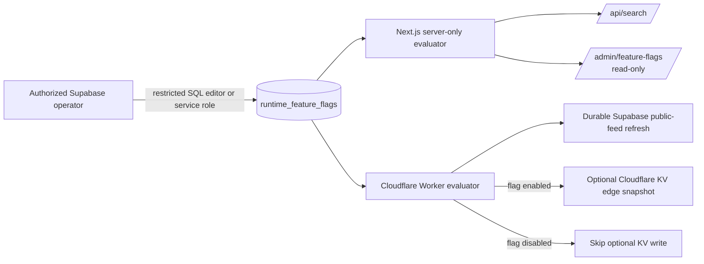

# Runtime Feature Flags

NutsNews uses a small Supabase-backed runtime flag table to pause two documented behaviors without redeploying the Next.js app or Cloudflare Worker.

Related work: [NutsNews issue #118](https://github.com/ramideltoro/nutsnews/issues/118), [web PR #180](https://github.com/ramideltoro/nutsnews/pull/180), and [Worker PR #23](https://github.com/ramideltoro/nutsnews-worker/pull/23).

## Simple Summary

Think of each flag as a safe on/off switch. An authorized operator can temporarily pause archive search or the Worker's optional backup-style feed copy without changing code or restarting anything.

## Intermediate Summary

The shared `public.runtime_feature_flags` table contains only known boolean flags. The Next.js server checks the reader flag for every archive-search request, and the Worker checks its flag once per refresh before writing the optional Cloudflare KV public-feed snapshot. The admin page at `/admin/feature-flags` shows state only; it cannot change a flag.

Both initial values are `true` so the absence of a table row, unavailable storage, malformed data, or missing server-side configuration preserves today's stable behavior. Setting a flag to `false` is the no-redeploy rollback.

## Expert Summary

### Schema and access boundary

The web migration creates `public.runtime_feature_flags`:

| Column | Meaning |
| --- | --- |
| `key` | Primary key, constrained to the documented flag names below. |
| `enabled` | Required boolean runtime value. |
| `created_at` | Insert timestamp. |
| `updated_at` | Automatically refreshed on update. |

Row-level security is enabled. `anon` and `authenticated` have no table privileges. Only server-side callers using the Supabase service-role credential can read or update it. The browser receives neither the service-role key nor a generic flag-management API.

The flag definitions are allow-listed in code in both owning repositories. Unknown keys evaluate to `false` and do not query storage. No arbitrary JSON, percentage rollout, client mutation, or third-party configuration service is part of this system.

### Initial flags

| Key | Default | Behavior when `false` | Why default is `true` |
| --- | --- | --- | --- |
| `reader_archive_search` | `true` | `/api/search` returns an intentional no-store HTTP 503 with no article lookup. The footer keeps its ordinary safe error message. | Archive search is already a stable reader feature. |
| `worker_public_feed_edge_snapshot_publish` | `true` | The Worker skips only the optional Cloudflare KV public-feed snapshot write. It still completes durable Supabase article, feed-health, and public-feed refresh work. | The edge snapshot publisher is already an established resiliency path. |

### Runtime flow



### Propagation and caching

- The web evaluator intentionally has no cache. A changed reader flag takes effect on the next `/api/search` request.
- The Worker intentionally has no process-global cache. A changed Worker flag takes effect on the next manual or scheduled Worker refresh for that shard.
- A failed, unauthorized, unavailable, or malformed read resolves to the documented default without noisy request-by-request logging.
- The two `true` defaults are explicit compatibility exceptions to the usual fail-disabled pattern. They preserve existing stable behavior while the protected table is unavailable; explicit `false` remains the rollback action.

## Operator Procedure

Use the Supabase SQL editor or another authorized service-role operation. Do not add browser controls, use the public anon key, or introduce new keys.

Pause reader archive search:

```sql
update public.runtime_feature_flags
set enabled = false
where key = 'reader_archive_search';
```

Resume it:

```sql
update public.runtime_feature_flags
set enabled = true
where key = 'reader_archive_search';
```

Pause only the optional Worker KV snapshot publication:

```sql
update public.runtime_feature_flags
set enabled = false
where key = 'worker_public_feed_edge_snapshot_publish';
```

Verify values through the authenticated `/admin/feature-flags` page. It shows the current state, default, source, and description but intentionally has no mutation control.

## Rollback and Troubleshooting

- To roll back a risky reader-search launch, set `reader_archive_search` to `false`; the API response is no-store and readers receive the existing generic search error handling.
- To reduce optional KV write pressure, set `worker_public_feed_edge_snapshot_publish` to `false`; do not expect this to stop ingestion, article saves, or the Supabase snapshot refresh.
- If the admin page reports `Safe default`, confirm that the migration was applied and the server-only `SUPABASE_SERVICE_ROLE_KEY` is configured for the web deployment. Do not expose that value to the browser.
- If a Worker value does not change immediately, wait for the next scheduled shard refresh or make an already-authorized manual refresh request. Do not redeploy solely to change a flag.
- Do not delete rows to roll back; update the documented boolean value so the audit timestamp remains useful.

## Risks and Limits

- Each search request and Worker refresh adds one small Supabase read. This is intentional to avoid stale rollout state.
- This is not a general remote-configuration platform. Adding a key requires a reviewed migration, typed allow-list changes in the owning repositories, focused tests, and an update to this document.
- The flag table does not replace normal deployment review, tests, monitoring, or rollback procedures.

## Related Docs

- [Public Feed Snapshot and Edge Fallback](PUBLIC_FEED_SNAPSHOT.md)
- [Cloudflare KV Worker State](CLOUDFLARE_KV_WORKER_STATE.md)
- [Deployment Checklist](DEPLOYMENT_CHECKLIST.md)
- [Security Hardening](SECURITY_HARDENING.md)
