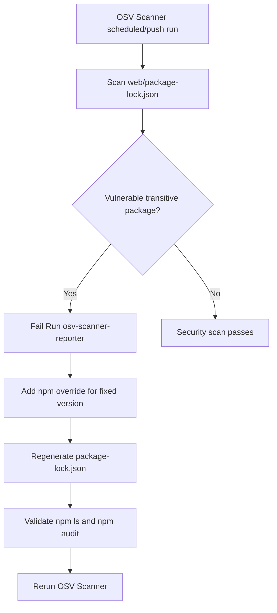
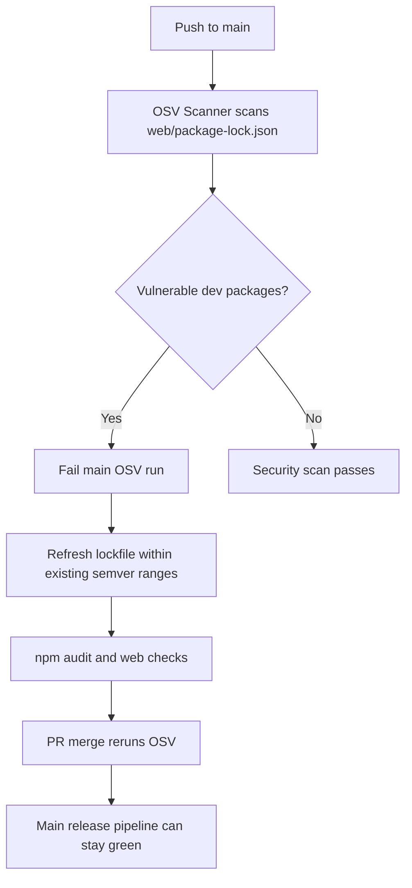
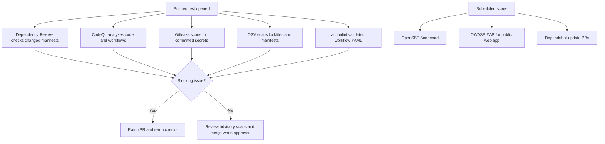

# Security CI Scans

NutsNews uses GitHub Actions and repository security settings to catch dependency, workflow, secret, and supply-chain risks before release.

## Simple Summary

The NutsNews repos now have more safety checks, like extra locks on a door, so risky code, leaked secrets, and unsafe dependencies are easier to catch before they ship.

## Intermediate Summary

This update adds or verifies recommended security scans for `ramideltoro/nutsnews` and `ramideltoro/nutsnews-worker`. It covers CodeQL, Dependency Review, Dependabot, Gitleaks, OSV-Scanner, actionlint, OpenSSF Scorecard, Lighthouse CI for the web app, and OWASP ZAP baseline scanning for the public web URL. Trivy is skipped because neither repo has Dockerfiles or container manifests. Worker Lighthouse and ZAP are skipped because the Worker repo does not define public web pages or a safe staging URL for baseline scanning.

## Expert Summary

The web app already had CodeQL, Snyk, Dependabot npm updates, and Lighthouse CI. The new web workflows add Dependency Review, Gitleaks, OSV-Scanner, actionlint, OpenSSF Scorecard, and a non-blocking OWASP ZAP baseline scan against `https://www.nutsnews.com` on schedule or manual dispatch. The Worker repo now has CodeQL for JavaScript/TypeScript and GitHub Actions, Dependency Review, Gitleaks, OSV-Scanner, actionlint, OpenSSF Scorecard, and expanded Dependabot coverage for GitHub Actions and `local-ai-service`. The Worker PR also fixes existing workflow YAML health issues so actionlint can validate the baseline. Manual repository settings are still REQUIRED for GitHub Secret Scanning and Push Protection because those controls cannot be fully enabled from workflow files.

## What Changed

### `ramideltoro/nutsnews`

| Scan | Status | Workflow or config | Notes |
| --- | --- | --- | --- |
| CodeQL | Already installed and verified | `.github/workflows/codeql.yml` | Scans JavaScript/TypeScript and GitHub Actions on PR, push, weekly schedule, and manual dispatch. |
| Dependency Review | Added, non-blocking until Dependency graph is enabled | `.github/workflows/dependency-review.yml` | Reports high-severity dependency changes. Enable Dependency graph before making this required. |
| Dependabot | Strengthened | `.github/dependabot.yml` | Existing npm updates kept; GitHub Actions updates added. |
| Secret scan | Added Gitleaks; manual GitHub settings still REQUIRED | `.github/workflows/gitleaks.yml` | CI scans committed secrets; GitHub Secret Scanning and Push Protection must be enabled in repo settings. |
| OSV-Scanner | Added | `.github/workflows/osv-scanner.yml` | Scans lockfiles and manifests recursively. |
| actionlint | Added | `.github/workflows/actionlint.yml` | Validates workflow syntax and common GitHub Actions mistakes. |
| OpenSSF Scorecard | Added | `.github/workflows/openssf-scorecard.yml` | Publishes SARIF and OpenSSF results. |
| Trivy | Skipped | Not applicable | No Dockerfiles, container images, or container manifests were found. |
| Lighthouse CI | Already installed and verified | `.github/workflows/lighthouse-ci.yml` | Applies to web-facing app pages. |
| OWASP ZAP baseline | Added | `.github/workflows/owasp-zap-baseline.yml` | Non-blocking passive scan of `https://www.nutsnews.com`; can be manually pointed at staging. |

### `ramideltoro/nutsnews-worker`

| Scan | Status | Workflow or config | Notes |
| --- | --- | --- | --- |
| CodeQL | Added | `.github/workflows/codeql.yml` | Scans JavaScript/TypeScript and GitHub Actions. |
| Dependency Review | Added, non-blocking until Dependency graph is enabled | `.github/workflows/dependency-review.yml` | Reports high-severity dependency changes. Enable Dependency graph before making this required. |
| Dependabot | Strengthened | `.github/dependabot.yml` | Existing `/worker` and `/controller` npm updates kept; GitHub Actions and `/local-ai-service` updates added. |
| Secret scan | Added Gitleaks; manual GitHub settings still REQUIRED | `.github/workflows/gitleaks.yml` | CI scans committed secrets; GitHub Secret Scanning and Push Protection must be enabled in repo settings. |
| OSV-Scanner | Added | `.github/workflows/osv-scanner.yml` | Scans lockfiles and manifests recursively. |
| actionlint | Added with protected workflow exclusions | `.github/workflows/actionlint.yml` | Validates editable workflow syntax and common GitHub Actions mistakes. `worker-controller-ci.yml` and `worker-pipeline.yml` are immutable-guarded and require explicit owner approval before fixes. |
| OpenSSF Scorecard | Added | `.github/workflows/openssf-scorecard.yml` | Publishes SARIF and OpenSSF results. |
| Trivy | Skipped | Not applicable | No Dockerfiles, container images, or container manifests were found. |
| Lighthouse CI | Skipped | Not applicable | Worker repo does not own public web pages. |
| OWASP ZAP baseline | Skipped with blocker | Not added | No safe staging Worker URL is configured for baseline scanning. Add one before enabling ZAP for Worker endpoints. |

## Why It Matters

- CodeQL catches code and workflow security issues.
- Dependency Review blocks risky dependency changes before merge.
- Dependabot keeps package and action versions current.
- Gitleaks catches committed secrets in CI.
- GitHub Secret Scanning and Push Protection stop secret exposure at the repository platform layer.
- OSV-Scanner checks manifests and lockfiles against open vulnerability databases.
- actionlint prevents broken workflow YAML and common Actions mistakes.
- OpenSSF Scorecard highlights supply-chain posture gaps.
- Lighthouse CI protects public web quality.
- OWASP ZAP baseline passively checks deployed web pages for common security header and passive scanner findings.

## Failure Guide

| Check | How to interpret a failure | Common response |
| --- | --- | --- |
| CodeQL | A code or workflow query found a security issue. | Review the SARIF alert, patch the code or workflow, and rerun. |
| Dependency Review | A PR introduces a dependency with a high-severity advisory, or the repo Dependency graph is disabled. | Enable Dependency graph, then upgrade, remove, or justify the dependency before merge. |
| Dependabot | A version or security update PR failed validation. | Inspect the failing project tests and adjust the dependency update. |
| Gitleaks | A secret-like value appears in history or the PR diff. | Revoke the secret, rotate credentials, remove it from history when required, and rerun. |
| OSV-Scanner | A manifest or lockfile resolves to a vulnerable package. | Upgrade the vulnerable package or document a temporary exception. |
| actionlint | A workflow has invalid YAML, invalid expressions, or unsafe Actions syntax. | Fix the workflow file before merging. |
| OpenSSF Scorecard | The repo has a supply-chain posture gap. | Treat as advisory unless the workflow itself fails; improve score over time. |
| Lighthouse CI | Web performance or quality budget regressed. | Inspect the Lighthouse report and fix public-page regressions. |
| OWASP ZAP baseline | Passive scanner found a deployed-page concern. | Review the report; tune false positives or fix headers/content issues. |

## Manual GitHub Settings

The following settings are REQUIRED and must be enabled in GitHub repository settings for both `ramideltoro/nutsnews` and `ramideltoro/nutsnews-worker`:

- Secret Scanning.
- Push Protection.
- Dependency graph.
- Dependabot alerts.
- Dependabot security updates.
- Code scanning alerts.

These settings cannot be fully enforced from repository workflow files alone. A maintainer must verify them in GitHub under repository security settings.

## Maintenance Notes

- Keep workflow permissions minimal. Add write permissions only when an action needs SARIF upload or another documented write path.
- Keep noisy scans non-blocking at first when they target deployed public URLs or produce posture scores.
- Keep Dependency Review blocking for high-severity dependency changes.
- Keep Dependency Review non-blocking until Dependency graph is enabled in each repository.
- Update action versions through Dependabot GitHub Actions PRs.
- Review OpenSSF Scorecard trends periodically instead of treating every score change as a release blocker.
- Add Trivy only if Dockerfiles, container images, or container filesystem artifacts are introduced.
- Add Worker ZAP only after a safe staging Worker URL exists and rate/side-effect risk is documented.
- Fix immutable-guarded Worker workflow health issues only after the repo owner explicitly approves edits to `.github/workflows/worker-controller-ci.yml` and `.github/workflows/worker-pipeline.yml`.

### 2026-07-04 OSV Dependency Override Fix

Simple Summary: OSV found a few unsafe helper packages, so the web app now tells npm to use fixed versions.

Intermediate Summary: The `OSV Scanner` scheduled/push run failed on `ramideltoro/nutsnews` because `web/package-lock.json` resolved vulnerable transitive versions of `postcss`, `tmp`, and `uuid`. The app fix adds npm `overrides` in `web/package.json` and refreshes `web/package-lock.json` so the scanner sees fixed versions without changing public reader behavior.

Expert Summary: Run `28718139650` failed in the `Scan repository dependencies / osv-scan` job during `Run osv-scanner-reporter`. The scanner reported `postcss@8.4.31`, `tmp@0.0.33`, `tmp@0.1.0`, and `uuid@8.3.2` from `web/package-lock.json`. `postcss` was pulled through `next`; `tmp` and `uuid` were pulled through `@lhci/cli` and its `external-editor` dependency. `@lhci/cli` was already current, so the smallest fix was to add npm overrides for `postcss`, `tmp`, and `uuid`, regenerate the lockfile, and validate with `npm ls`, `npm audit`, `lhci --version`, lint, build, and lockfile checks. Roll back by reverting the dependency override PR and rerunning `OSV Scanner`; if a future parent dependency release removes the need for overrides, remove the overrides in a normal dependency maintenance PR.

### 2026-07-20 OSV Dev Dependency Lockfile Refresh

Simple Summary: The safety checker found three old helper packages in the web app lockfile. The lockfile now points to the fixed versions.

Intermediate Summary: The `OSV Scanner` push run failed on `ramideltoro/nutsnews` after PR #291 merged because `web/package-lock.json` still resolved vulnerable dev-only versions of `body-parser`, `brace-expansion`, and `js-yaml`. The app fix refreshes only the lockfile to versions already allowed by the parent dependency ranges, so there is no product behavior, runtime configuration, database, or deployment-flow change.

Expert Summary: Run `29788781874` failed in `Scan repository dependencies / osv-scan` during `Run osv-scanner-reporter`. OSV reported `body-parser@1.20.5`, `brace-expansion@1.1.15`, and `js-yaml@4.2.0` from `web/package-lock.json`; the fixed versions are `1.20.6`, `1.1.16`, and `4.3.0`. `npm update body-parser brace-expansion js-yaml --package-lock-only` moved the lockfile to the fixed versions without changing `web/package.json`. Risk is limited to dev/test tooling dependency resolution. Mitigation is to rerun npm audit, route tests, CPU/cache guardrails, lint, build, and the GitHub OSV workflow. Roll back by reverting the dependency PR if CI exposes tooling regressions.

## PR Security Scan Flow

## Rollback Plan

Revert the app and Worker workflow PRs and this documentation update. If a scan is too noisy but still valuable, prefer temporarily narrowing its triggers or marking the job non-blocking before removing it completely.

## Related PRs

- App PR: https://github.com/ramideltoro/nutsnews/pull/152
- Worker PR: https://github.com/ramideltoro/nutsnews-worker/pull/14
- Docs PR: https://github.com/ramideltoro/nutsnews-docs/pull/5
