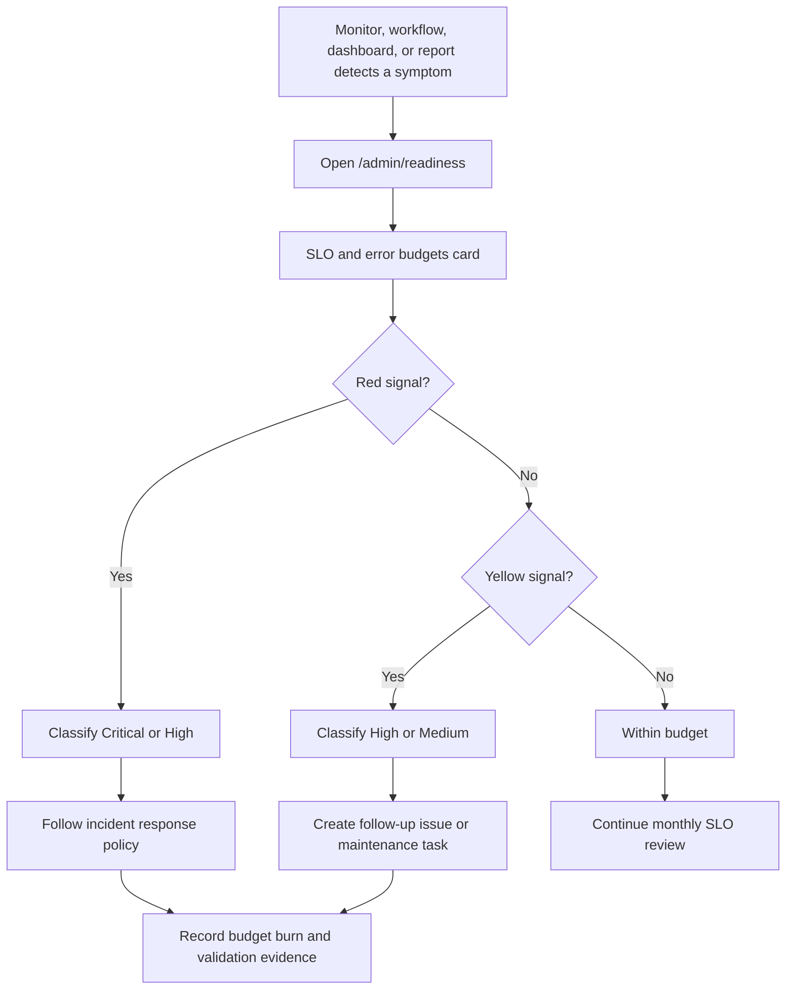

# NutsNews Service Level Objectives

Issue: https://github.com/ramideltoro/nutsnews/issues/89

App PR: https://github.com/ramideltoro/nutsnews/pull/241

This runbook defines the first explicit NutsNews SLOs, error budgets, alert thresholds, and incident classes for reader, API, Worker, feed freshness, translation, and backup health.

## Simple Summary

NutsNews now has promises for what "healthy" means. If the site, API, Worker, translations, or backups fall outside those promises, admins can see how serious it is and what to check next.

## Intermediate Summary

The target is a stable reader experience with clear operating limits. Homepage and `/api/articles` availability use a 99.5% monthly target, Worker ingestion needs recent successful runs, the public feed must stay fresh enough for readers, translations should be mostly complete for recent stories, and backup restore checks must stay current. The admin readiness dashboard now includes an "SLO and error budgets" card that rolls up existing readiness signals and links back to this policy.

## Expert Summary

Issue #89 adds an SLO/error-budget operating layer over existing NutsNews observability. The application repository adds a derived `/admin/readiness` signal in `web/lib/adminProductionReadiness.ts`; it does not create a new table, credential, external monitor, or provider mutation. The signal maps the existing readiness inputs for public API health, graceful degradation, Worker/controller freshness, DB growth/feed freshness, translation coverage, backup freshness, CI status, and configuration into a green/yellow/red SLO budget status. Historical availability and latency remain measured by external uptime, Lighthouse CI, Vercel, Cloudflare, and Grafana rather than by a new app-side metrics store.

## SLO Targets

| Surface | Target | Green evidence | Error budget / warning | Critical breach |
| --- | --- | --- | --- | --- |
| Homepage availability | 99.5% monthly availability for public reader entry points | `/healthz` and homepage checks pass; admin readiness has no red reader signal | Any confirmed downtime burns the monthly 216-minute budget; repeated yellow readiness states need review | Homepage or `/healthz` confirmed timeout/5xx for 5 minutes or more |
| Homepage latency | p95 public document response under 2.5 seconds and Lighthouse performance budget passing | Lighthouse CI and preview smoke pass; Vercel/Cloudflare do not show sustained slow responses | p95 over target for 30 minutes or two consecutive CI quality regressions | Sustained slow responses make the reader unusable or timeout-prone |
| `/api/articles` success | 99.5% monthly success rate for read-only article API calls | `/api/articles?limit=1` and `/api/articles?home=1` return valid JSON; public-feed fallback is available | 5xx, timeout, invalid JSON, or maintenance-mode responses burn API budget | API timeout/5xx or invalid JSON for 10 minutes, especially without a feed fallback |
| `/api/articles` latency | p95 under 1.5 seconds for read-only API calls | Preview smoke and public reader smoke pass; no sustained runtime slowness | p95 over target for 30 minutes or repeated preview-smoke latency regressions | Latency causes client errors, timeouts, or homepage reader breakage |
| Worker/controller successful runs | 95% successful scheduled/controller runs over 30 days; latest success within 3 hours | `/admin/readiness` Worker signal is green and `/admin/shards` shows healthy shards | Latest success older than 3 hours or intermittent run failures | Latest successful run older than 24 hours, latest run failed, or ingestion stops |
| Feed freshness | Full first page available from `public_feed_snapshot` or safe fallback; new published growth in 24 hours | Public API health is green and DB growth is green | Snapshot short, DB fallback only, or no published growth in 24 hours | No snapshot/fallback first page or no published growth in 7 days |
| Translation completion | At least 90% recent non-English summary rows available for the sampled recent articles | Translation coverage card is green | Coverage below 90% or missing quality evidence | Coverage below 75% while multilingual content is being promoted |
| Backup freshness | Latest Supabase backup and disposable restore fire drill completed successfully within 30 hours | Backup freshness card is green and links to a successful workflow run/report artifact | Token/API unavailable, run pending, skipped, neutral, missing, or stale without active mutation | Failed/stale backup while a production mutation, incident recovery, or restore decision needs it |

## Error Budget Rules

| Rule | Value |
| --- | --- |
| Monthly availability target | 99.5% |
| Approximate 30-day monthly downtime budget | 216 minutes |
| High-burn warning | 25% of the monthly budget consumed, about 54 minutes |
| Critical-burn threshold | 50% of the monthly budget consumed, about 108 minutes, or any active reader/data/recovery risk |
| Review window | Monthly, with immediate review for critical incidents |

Budget burn is tracked from external uptime evidence, GitHub Actions failures, admin readiness history, provider dashboards, and incident notes. Until NutsNews has a dedicated time-series SLO store, the readiness dashboard is the live status surface and this runbook is the source of truth for target thresholds.

## Alert Thresholds

| Signal | Medium | High | Critical |
| --- | --- | --- | --- |
| Homepage availability | Intermittent check failure that self-recovers | Confirmed outage under 5 minutes or repeated flapping | Confirmed outage for 5 minutes or more |
| Homepage latency | One CI or dashboard warning | p95 over target for 30 minutes | Reader requests timing out or failing because of latency |
| `/api/articles` success | Single failed smoke/API check | Repeated invalid JSON, timeout, or 5xx under 10 minutes | Timeout/5xx/invalid JSON for 10 minutes |
| `/api/articles` latency | One preview-smoke or runtime warning | p95 over 1.5 seconds for 30 minutes | Latency causes public feed failure or homepage timeout |
| Worker/controller | Latest success older than 3 hours | Latest run failed or ingestion delayed for a business day | Latest success older than 24 hours and public feed freshness is threatened |
| Feed freshness | Snapshot short but DB fallback exists | No published growth in 24 hours or edge snapshot stale | No first-page feed fallback or no published growth in 7 days |
| Translation completion | Recent coverage below 90% | Coverage below 75% but English fallback works | Translation failure blocks publication or breaks reader content |
| Backup freshness | Backup status unknown or token unavailable | Restore check stale/failed without active mutation | Backup unusable while recovery or production mutation depends on it |

## Incident Classes

NutsNews uses Critical, High, and Medium incident classes for SLO/error-budget decisions. These map to the incident response policy as follows:

| SLO class | Incident policy mapping | Meaning | Response |
| --- | --- | --- | --- |
| Critical | SEV1 | Active reader outage, data risk, security risk, or recovery risk | Immediate owner contact, mitigation within 15 minutes, post-incident review |
| High | SEV2 | Production degraded, release blocked, or budget burn likely to become reader/recovery risk | Owner email or issue/PR update within 4 hours, scoped fix with evidence |
| Medium | SEV3 | Maintenance warning or observability gap that does not threaten the current reader path | Track in backlog or next maintenance window |

Use the highest class that matches the evidence. A backup failure is Medium when no mutation is planned, High when it blocks a release, and Critical when recovery or a production mutation needs that backup.

## Dashboard And Report Signals

The application readiness dashboard now includes an `SLO and error budgets` signal. It is derived from:

- `public-api-health`
- `graceful-degradation`
- `worker-controller`
- `db-growth`
- `translation-coverage`
- `backup-freshness`
- `ci-status`
- `configuration`

Green means the core live signals are inside the current budget. Yellow means one or more watch signals should be verified and classified as High or Medium. Red means at least one critical readiness signal is burning error budget and should be triaged against this runbook before promotion.

## Operating Flow

## Operational Steps

1. Open `/admin/readiness` before release promotion, cache policy changes, migrations, or recovery work.
2. If the SLO card is red, pause promotion and classify the underlying red signal as Critical or High.
3. If the SLO card is yellow, verify the linked dashboard or workflow and decide whether it is High or Medium.
4. Record outage duration, affected surface, budget impact, linked workflows/dashboards, and validation evidence in the issue or incident notes.
5. Reset the incident only after the same signal that detected the breach is green or manually verified.

## Environment And Permissions

No new environment variable, secret, database migration, provider credential, or external service permission is introduced by issue #89. Existing optional live readiness features still use:

- `SUPABASE_URL` or `NEXT_PUBLIC_SUPABASE_URL`
- `SUPABASE_SERVICE_ROLE_KEY`
- `ACTIONS_READ_TOKEN` for server-side GitHub Actions status reads

External uptime, Grafana, Sentry, Vercel, Cloudflare, and Supabase dashboards remain provider-owned. Do not paste secrets, private URLs, tokens, raw environment files, or credential values into SLO notes.

## Risks And Mitigations

| Risk | Mitigation |
| --- | --- |
| The app signal looks like a complete historical SLO store | The dashboard copy and this runbook state that historical budget burn still comes from external uptime, provider dashboards, workflows, and incident notes. |
| Targets drift from code thresholds | Update this file, `PRODUCTION_READINESS_DASHBOARD.md`, and `web/lib/adminProductionReadiness.ts` together when thresholds change. |
| Every yellow signal becomes urgent | Yellow signals must be classified as High or Medium by reader, data, and recovery impact. |
| A backup warning is under-prioritized | Escalate backup freshness to Critical whenever recovery or a production mutation depends on it. |
| Latency evidence is incomplete | Use Lighthouse CI, preview smoke, Vercel, Cloudflare, and Grafana together until a dedicated latency SLO store exists. |

## Rollback

Revert the app PR that adds the `SLO and error budgets` readiness signal, then revert this documentation file and the related production-readiness documentation updates. No database, secret, provider, Cloudflare, Vercel, Supabase, Grafana, or Sentry rollback is required.

## Related

- App issue: https://github.com/ramideltoro/nutsnews/issues/89
- App PR: https://github.com/ramideltoro/nutsnews/pull/241
- Production readiness dashboard: [PRODUCTION_READINESS_DASHBOARD.md](PRODUCTION_READINESS_DASHBOARD.md)
- Incident response policy: [INCIDENT_RESPONSE_POLICY.md](INCIDENT_RESPONSE_POLICY.md)
- Observability overview: [OBSERVABILITY.md](OBSERVABILITY.md)
- Backup runbook: [NUTSNEWS_DB_BACKUPS.md](NUTSNEWS_DB_BACKUPS.md)
