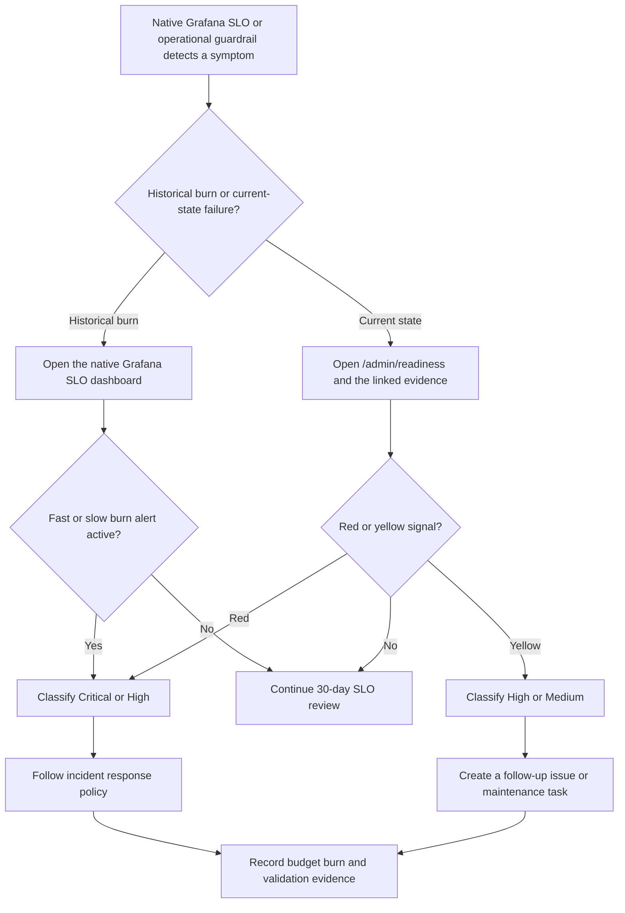

---
wiki:
  approval:
    state: unreviewed
    publishing: allowed
    reviewed_by: pending
    reviewed_on: pending
    technical_source_hash: 405923ced57e4265f479783ac6cfddb4a4ec48f357ffe8af5a7782103d0acc66
---
# NutsNews Service Level Objectives

Issue: https://github.com/ramideltoro/nutsnews/issues/89

App PR: https://github.com/ramideltoro/nutsnews/pull/241

This runbook defines the NutsNews native Grafana SLOs, supplementary readiness
guardrails, alert thresholds, and incident classes for reader, API, Worker,
feed freshness, translation, and backup health.

## Simple Summary

NutsNews has four staged, 30-day Grafana SLOs for public availability, API
latency, feed freshness, and Worker terminal success. Existing readiness checks
remain useful operational guardrails, but they are not additional native SLOs.

## Intermediate Summary

The target is a stable reader experience with clear operating limits. Four
source-controlled Grafana SLO resources use rolling 30-day windows, while the
admin readiness dashboard continues to roll up current-state checks for public
API health, graceful degradation, Worker/controller freshness, feed growth,
translation coverage, backups, CI, and configuration. The Grafana resources
are staged until a protected apply and post-apply evidence confirm their UUIDs,
queries, recording rules, dashboards, and notifications.

## Expert Summary

Issue #89 added a derived `/admin/readiness` signal in
`web/lib/adminProductionReadiness.ts`; it does not create a table, credential,
external monitor, or provider mutation. The Grafana hardening adds exactly four
native SLO resources in `ramideltoro/nutsnews-infra`, backed by public synthetic
checks and durable production telemetry. The native rolling error budgets and
the readiness card have different jobs: Grafana measures history and burn,
while `/admin/readiness` supports promotion and incident triage at the current
point in time.

## Native Grafana SLOs

The following source-controlled contract becomes live only after a protected
Grafana Cloud apply and successful post-apply verification. Each native SLO uses
a rolling 30-day compliance window.

| Native Grafana SLO | Objective | Good and eligible events | Alert behavior |
| --- | ---: | --- | --- |
| Public availability | 99.5% over 30 days | Successful canonical-homepage observations from both public probes divided by all canonical-homepage observations | Grafana-generated fast- and slow-burn alerts are enabled. |
| API latency | 95% over 30 days | Successful read-only article API observations completed within 750 milliseconds divided by all successful article API observations | Grafana-generated fast- and slow-burn alerts are enabled. Status, body, and cache-header validation failures remain separate availability/correctness failures. |
| Feed freshness | 99% over 30 days | Eligible intervals in which the durable published-feed age from the current production publication owner is no more than 15 minutes | Grafana-generated fast- and slow-burn alerts are enabled. A separate critical guardrail fires when feed age exceeds three hours. |
| Worker terminal success | 99% over 30 days | Event-weighted outcomes across all canonical delivery stages: `success|duplicate` divided by `success|duplicate|invalid|failure|dlq`; intermediate `retry` outcomes are excluded | The SLO remains visible for shadow qualification, but generated burn alerts remain disabled until an approved production cutover. |

`terminal` is an SLI classification, not an `outcome` label value. A zero
eligible-event denominator is No Data, not a synthetic failure or proof of
health. No SLO may group by user, feed, article, correlation identifier, or
other unbounded dimension.

The Worker ratio is not publication-only or per-article success. One pipeline
can contribute multiple eligible stage completions across the seven delivery
processors; scheduler cycles are outside the stage-event family. Source defaults
`worker_terminal_slo_alerting_enabled` to `false` while the uplift is shadowed,
so the candidate omits the generated burn-alert block. The protected live value
must still be confirmed during rollout. This native control is separate from the
`nutsnews_worker_expected_active` joins used by custom worker-local rules and
must change only during the same reviewed cutover.

The Worker-Uplift Pipeline dashboard's five descriptive SLI entries and its
hand-authored rules are compatibility metadata and operational guardrails, not
five additional native Grafana SLOs. Their shorter 5-minute, 15-minute, and
1-hour ranges are alert-evaluation windows rather than 30-day compliance
windows. `nutsnews_worker_expected_active=0` keeps shadow-worker conditions
visible without paging; missing required telemetry still blocks cutover. That
ownership gate applies to worker-local signals and Worker terminal-success burn
alerts, not to the global reader-visible feed-freshness SLO or its three-hour
critical guardrail. Those feed signals remain enabled under either legacy or
split-worker ownership.

All eight split workers are shadow-only in the baseline. Each must still be
deployed with `up == 1`, scrape age below 180 seconds, exact non-`unknown`
build/deployment identity, and readiness series. These structural requirements
are never ownership-gated. Only a service with
`nutsnews_worker_expected_active=1` must additionally report a successful
readiness outcome, scheduler loop/cycle or delivery-stage activity as
applicable, last success, and worker-local paging eligibility.

Oldest worker pressure is the backend-owned
`nutsnews_backend_worker_uplift_oldest_unconfirmed_outbox_age_seconds` gauge,
used only when `nutsnews_backend_worker_uplift_outbox_available == 1`. It is
not the global feed-freshness SLI. That SLI continues to measure reader-visible
durable content against the 15-minute objective regardless of which ingestion
implementation owns production.

Producer/source ownership is separate from alert-routing `owner` labels:
`nutsnews-backend` owns worker deployment, backend Alloy, and backend-hosted
ownership/outbox gauges; the eight service repositories each own their service
identity, health, lifecycle, and latency; `nutsnews-infra` alone owns Grafana;
and the `nutsnews-worker` meta-repository coordinates rollout. The Current
Production Ownership dashboard must show the backend revision plus exact
identities for scheduler, fetcher, canonicalizer, enrichment, approval,
translation, persistence, and publication.

## Legacy Readiness And Operational Guardrails

The following established thresholds remain useful for current-state readiness,
release gates, and incident classification. Unless explicitly mapped to one of
the four native resources above, they do not create or reset a Grafana error
budget.

| Surface | Target | Green evidence | Error budget / warning | Critical breach |
| --- | --- | --- | --- | --- |
| Homepage availability | 99.5% monthly availability for public reader entry points | Canonical homepage and `/readyz` checks pass; admin readiness has no red reader signal | Any confirmed downtime burns the monthly 216-minute budget; repeated yellow readiness states need review | Homepage or `/readyz` confirmed timeout/5xx for 5 minutes or more |
| Homepage latency | p95 public document response under 2.5 seconds and Lighthouse performance budget passing | Lighthouse CI and preview smoke pass; Vercel/Cloudflare do not show sustained slow responses | p95 over target for 30 minutes or two consecutive CI quality regressions | Sustained slow responses make the reader unusable or timeout-prone |
| `/api/articles` success | 99.5% monthly success rate for read-only article API calls | `/api/articles?limit=1` and `/api/articles?home=1` return valid JSON; public-feed fallback is available | 5xx, timeout, invalid JSON, or maintenance-mode responses burn API budget | API timeout/5xx or invalid JSON for 10 minutes, especially without a feed fallback |
| `/api/articles` latency | p95 under 1.5 seconds for read-only API calls | Preview smoke and public reader smoke pass; no sustained runtime slowness | p95 over target for 30 minutes or repeated preview-smoke latency regressions | Latency causes client errors, timeouts, or homepage reader breakage |
| Worker/controller successful runs | 95% successful scheduled/controller runs over 30 days; latest success within 3 hours | `/admin/readiness` Worker signal is green and `/admin/shards` shows healthy shards | Latest success older than 3 hours or intermittent run failures | Latest successful run older than 24 hours, latest run failed, or ingestion stops |
| Feed freshness | Full first page available from `public_feed_snapshot` or safe fallback; new published growth in 24 hours | Public API health is green and DB growth is green | Snapshot short, DB fallback only, or no published growth in 24 hours | No snapshot/fallback first page or no published growth in 7 days |
| Translation completion | At least 90% recent non-English summary rows available for the sampled recent articles | Translation coverage card is green | Coverage below 90% or missing quality evidence | Coverage below 75% while multilingual content is being promoted |
| Backup freshness | Latest Supabase backup and disposable restore fire drill completed successfully within 30 hours | Backup freshness card is green and links to a successful workflow run/report artifact | Token/API unavailable, run pending, skipped, neutral, missing, or stale without active mutation | Failed/stale backup while a production mutation, incident recovery, or restore decision needs it |

## Legacy Manual Error Budget Rules

| Rule | Value |
| --- | --- |
| Monthly availability target | 99.5% |
| Approximate 30-day monthly downtime budget | 216 minutes |
| High-burn warning | 25% of the monthly budget consumed, about 54 minutes |
| Critical-burn threshold | 50% of the monthly budget consumed, about 108 minutes, or any active reader/data/recovery risk |
| Review window | Monthly, with immediate review for critical incidents |

After a protected Grafana Cloud apply confirms the four SLO UUIDs and live
queries, native Grafana SLOs own their rolling 30-day error budgets and generated
fast- and slow-burn alerts. `/admin/readiness` remains a current-state promotion
and incident-triage surface; it does not calculate or reset native error
budgets. Legacy Worker/controller, translation, backup, homepage-performance,
API-success, feed-availability, and fallback-growth thresholds remain
supplementary operational guardrails unless they are explicitly mapped to one
of the four native SLOs. Until that apply is verified, external uptime evidence,
workflows, provider dashboards, and incident notes remain the historical
evidence source.

## Supplementary Alert Thresholds

| Signal | Medium | High | Critical |
| --- | --- | --- | --- |
| Homepage availability | Intermittent check failure that self-recovers | Confirmed outage under 5 minutes or repeated flapping | Confirmed outage for 5 minutes or more |
| Homepage latency | One CI or dashboard warning | p95 over target for 30 minutes | Reader requests timing out or failing because of latency |
| `/api/articles` success | Single failed smoke/API check | Repeated invalid JSON, timeout, or 5xx under 10 minutes | Timeout/5xx/invalid JSON for 10 minutes |
| `/api/articles` latency | One preview-smoke or runtime warning | p95 over 1.5 seconds for 30 minutes | Latency causes public feed failure or homepage timeout |
| Worker/controller | Latest success older than 3 hours | Latest run failed or ingestion delayed for a business day | Latest success older than 24 hours and public feed freshness is threatened |
| Feed freshness | Snapshot short but DB fallback exists | No published growth in 24 hours or edge snapshot stale | No first-page feed fallback or no published growth in 7 days |
| Translation completion | Recent coverage below 90% | Coverage below 75% but English fallback works | Translation failure blocks publication or breaks reader content |
| Backup freshness | Backup status unknown or token unavailable | Restore check stale/failed without active mutation | Backup unusable while recovery or production mutation depends on it |

## Incident Classes

NutsNews uses Critical, High, and Medium incident classes for SLO/error-budget decisions. These map to the incident response policy as follows:

| SLO class | Incident policy mapping | Meaning | Response |
| --- | --- | --- | --- |
| Critical | SEV1 | Active reader outage, data risk, security risk, or recovery risk | Immediate owner contact, mitigation within 15 minutes, post-incident review |
| High | SEV2 | Production degraded, release blocked, or budget burn likely to become reader/recovery risk | Owner email or issue/PR update within 4 hours, scoped fix with evidence |
| Medium | SEV3 | Maintenance warning or observability gap that does not threaten the current reader path | Track in backlog or next maintenance window |

Use the highest class that matches the evidence. A backup failure is Medium when no mutation is planned, High when it blocks a release, and Critical when recovery or a production mutation needs that backup.

## Dashboard And Report Signals

The application readiness dashboard now includes an `SLO and error budgets` signal. It is derived from:

- `public-api-health`
- `graceful-degradation`
- `worker-controller`
- `db-growth`
- `translation-coverage`
- `backup-freshness`
- `ci-status`
- `configuration`

Green means the core current-state signals pass. Yellow means one or more watch
signals should be verified and classified as High or Medium. Red means at least
one critical readiness signal requires triage before promotion; it does not by
itself prove that a native Grafana error budget is burning. Only the native SLI
query and its recording/burn rules determine that historical budget state.

## Operating Flow

```mermaid
flowchart TD
  A["Native Grafana SLO or operational guardrail detects a symptom"] --> B{"Historical burn or current-state failure?"}
  B -->|"Historical burn"| C["Open the native Grafana SLO dashboard"]
  B -->|"Current state"| D["Open /admin/readiness and the linked evidence"]
  C --> E{"Fast or slow burn alert active?"}
  D --> F{"Red or yellow signal?"}
  E -->|"Yes"| G["Classify Critical or High"]
  E -->|"No"| H["Continue 30-day SLO review"]
  F -->|"Red"| G
  F -->|"Yellow"| I["Classify High or Medium"]
  F -->|"No"| H
  G --> J["Follow incident response policy"]
  I --> K["Create a follow-up issue or maintenance task"]
  J --> L["Record budget burn and validation evidence"]
  K --> L
```

## Operational Steps

1. Open `/admin/readiness` before release promotion, cache policy changes, migrations, or recovery work.
2. If the SLO card is red, pause promotion and classify the underlying red signal as Critical or High.
3. If the SLO card is yellow, verify the linked dashboard or workflow and decide whether it is High or Medium.
4. Record outage duration, affected surface, budget impact, linked workflows/dashboards, and validation evidence in the issue or incident notes.
5. Reset the incident only after the same signal that detected the breach is green or manually verified.

## Environment And Permissions

No new environment variable, secret, database migration, provider credential, or external service permission is introduced by issue #89. Existing optional live readiness features still use:

- `SUPABASE_URL` or `NEXT_PUBLIC_SUPABASE_URL`
- `SUPABASE_SERVICE_ROLE_KEY`
- `ACTIONS_READ_TOKEN` for server-side GitHub Actions status reads

The later Grafana hardening rollout is separate from issue #89 and does require
protected provider, Synthetic Monitoring, SLO, and telemetry inputs. As of
2026-08-01 its read-only synthetic-audit Environment exists but all four scoped
inputs are absent, its writer/reviewer prerequisites are incomplete, and the
five-minute 86,400-execution cadence choice remains unresolved in
[`ramideltoro/nutsnews-infra#474`](https://github.com/ramideltoro/nutsnews-infra/issues/474).
Therefore none of the four native Grafana SLOs is live.

External uptime, Grafana, Sentry, Vercel, Cloudflare, and Supabase dashboards remain provider-owned. Do not paste secrets, private URLs, tokens, raw environment files, or credential values into SLO notes.

## Risks And Mitigations

| Risk | Mitigation |
| --- | --- |
| The readiness card looks like a complete historical SLO store | Keep the four native rolling budgets distinct from current-state readiness and legacy guardrails. |
| Targets drift from code thresholds | Update this file, `PRODUCTION_READINESS_DASHBOARD.md`, and `web/lib/adminProductionReadiness.ts` together when thresholds change. |
| Every yellow signal becomes urgent | Yellow signals must be classified as High or Medium by reader, data, and recovery impact. |
| A backup warning is under-prioritized | Escalate backup freshness to Critical whenever recovery or a production mutation depends on it. |
| Native SLO resources are mistaken for live before rollout | Keep the bundle unreviewed and require protected apply, query health, UUID, burn-rule, and notification evidence before calling it live. |
| API latency accidentally counts failed probes as slow successes | The SLI denominator must contain only successful article API observations; availability and response-validation failures remain separate signals. |

## Rollback

Roll back an individual native SLO or its burn notifications through
`nutsnews-infra` without disabling the telemetry pipeline or unrelated alerts.
If the application readiness card itself must be removed, revert the app PR that
added it and the related production-readiness documentation. Never delete live
SLO history merely to clear a breach.

## Related

- App issue: https://github.com/ramideltoro/nutsnews/issues/89
- App PR: https://github.com/ramideltoro/nutsnews/pull/241
- Production readiness dashboard: [PRODUCTION_READINESS_DASHBOARD.md](PRODUCTION_READINESS_DASHBOARD.md)
- Incident response policy: [INCIDENT_RESPONSE_POLICY.md](INCIDENT_RESPONSE_POLICY.md)
- Observability overview: [OBSERVABILITY.md](OBSERVABILITY.md)
- Backup runbook: [NUTSNEWS_DB_BACKUPS.md](NUTSNEWS_DB_BACKUPS.md)
