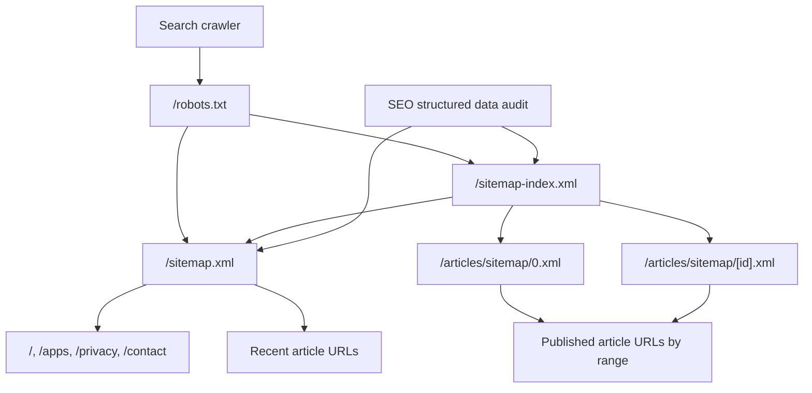

# Sitemap Scaling Strategy

Related issue: `ramideltoro/nutsnews#115`

Related app PR: `ramideltoro/nutsnews#237`

## Simple Summary

NutsNews now treats `/sitemap-index.xml` as the crawler entry point for the full article archive. The root `/sitemap.xml` stays small and fast by listing public static pages plus a recent article window.

## Intermediate Summary

The web app splits article discovery across generated article sitemap shards at `/articles/sitemap/[id].xml`. Each shard uses a bounded Supabase range query, and the sitemap index advertises the root sitemap plus every generated article shard. Robots advertises both the index and the legacy root sitemap so Google, Bing, and other crawlers can continue discovering important pages while the archive grows.

## Expert Summary

The app-side contract is defined by `web/lib/sitemapConfig.ts`. The root sitemap requests `ROOT_SITEMAP_RECENT_ARTICLE_LIMIT=100` items. Article shards use `ARTICLE_SITEMAP_PAGE_SIZE=1000` and `MAX_ARTICLE_SITEMAP_SHARDS=50`, which keeps each request comfortably below search-engine per-sitemap URL limits while avoiding an unbounded database scan. The production SEO audit now tries `/sitemap-index.xml` before `/sitemap.xml`, follows same-origin sitemap indexes recursively, and caps traversal at `MAX_SITEMAP_FETCHES=25`.

## Discovery Flow

## Route Contract

| Route | Purpose | Cache expectation |
| --- | --- | --- |
| `/robots.txt` | Advertises both `/sitemap-index.xml` and `/sitemap.xml` | `public-robots-cache-3600s` |
| `/sitemap-index.xml` | Lists the root sitemap and article sitemap shards | `public-sitemap-index-cache-3600s` |
| `/sitemap.xml` | Lists public static pages and the most recent article URLs | `public-sitemap-cache-3600s` |
| `/articles/sitemap/[id].xml` | Lists one bounded page of published article URLs | `public-article-sitemap-cache-3600s` |

## Operational Checks

- The scheduled sitemap/robots workflow must verify `/robots.txt`, `/sitemap.xml`, and, after deployment, `/sitemap-index.xml`.
- Cache observability should include the sitemap index and first article sitemap shard.
- The SEO structured data audit should discover article URLs through `/sitemap-index.xml` first, then fall back to `/sitemap.xml` for compatibility.
- If article count grows beyond the current shard cap, increase `MAX_ARTICLE_SITEMAP_SHARDS` deliberately and confirm Supabase query latency before release.

## Risks And Mitigations

| Risk | Mitigation |
| --- | --- |
| Root sitemap becomes slow again | `test:sitemap-scaling` checks that `/sitemap.xml` uses a 100-article recent window |
| Article archive is not fully advertised | `/sitemap-index.xml` lists generated article sitemap shards from the published article count |
| Crawler discovers stale or missing sitemap paths | `robots.txt` advertises both the index and root sitemap during rollout |
| SEO audit only sees the root sitemap | Audit traversal follows sitemap indexes with a same-origin and max-fetch guard |
| Cache policy drift increases runtime pressure | `test:public-cache`, API contract tests, and cache observability config cover the new sitemap routes |

## Rollback

1. Revert the app PR that added `/sitemap-index.xml`, `/articles/sitemap/[id].xml`, and the shared sitemap config.
2. Confirm `/robots.txt` again advertises only `/sitemap.xml`.
3. Run `npm run test:api-contracts`, `npm run test:public-cache`, and `npm run audit:cache:config`.
4. After deployment, run the sitemap/robots production check and confirm `/sitemap.xml` still contains the static public pages.

## Validation

- `npm run test:sitemap-scaling`
- `npm run test:api-contracts`
- `npm run test:public-cache`
- `npm run audit:cache:config`
- `npm run test:public-route-cpu-cache`
- `npx tsc --noEmit`
- `npm run lint`
- Staging-safe `npm run build` with disabled side effects
- `git diff --check`
