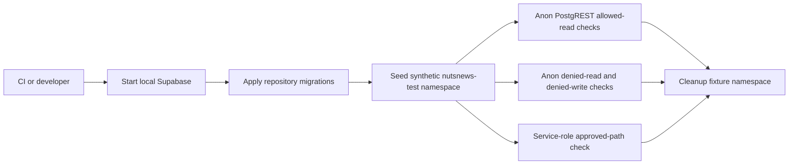

# Supabase RLS Regression Tests

## Simple Summary

NutsNews now has a local database check that makes sure public readers can only see the safe news data, while private tables and write actions stay locked.

## Intermediate Summary

The `ramideltoro/nutsnews` app repository includes a Supabase RLS regression script for issue [#212](https://github.com/ramideltoro/nutsnews/issues/212). It runs against a disposable local Supabase stack, seeds a synthetic `nutsnews-test-*` fixture namespace, checks allowed and denied access through the same REST API roles the app uses, and cleans up the fixture before exiting.

This affects developers and CI maintainers who change Supabase migrations, table grants, RLS policies, public read surfaces, or service-role-only runtime tables. The existing container-image migration gate now runs this policy check after applying all migrations to a local database.

## Expert Summary

The regression command is `node scripts/supabase_rls_regression.mjs` from the app repository root, or `npm run test:supabase-rls` from `web/`. It reads local disposable database values from `supabase status --output env` without printing keys, seeds fixture rows with the local service role through `psql`, exercises anonymous and service-role requests through PostgREST, and asserts:

- anonymous readers can query published `articles`;
- draft `articles` remain hidden;
- `article_summaries` are visible only when attached to published articles with images;
- `public_feed_snapshot` excludes drafts and image-less rows;
- anonymous mutation attempts are denied;
- anonymous users cannot read `runtime_feature_flags` or `staging_fixture_runs`;
- the public migration contract RPC remains readable;
- privileged staging-fixture reset RPCs remain service-role-only.

The same change adds migration `20260716090000_lock_down_privileged_nutsnews_functions.sql`, which removes explicit `anon` and `authenticated` execution grants from privileged `nutsnews_*` helper functions while leaving `nutsnews_migration_schema_contract()` publicly readable for readiness checks.

The CI path is the existing `Container Image` workflow `migration-gate` job. That job starts local Supabase, resets through the complete migration set, runs migration and fixture checks, and now also runs the RLS regression before stopping local services.



## Bootstrap And Run

From `ramideltoro/nutsnews`:

```bash
supabase start -x studio,imgproxy,logflare,vector
supabase db reset --local
node scripts/supabase_rls_regression.mjs --namespace=nutsnews-test-local-rls-policy-123456
supabase stop --no-backup
```

From `web/`, after the local Supabase stack is running and reset:

```bash
npm run test:supabase-rls
```

The namespace must start with `nutsnews-test-` so the cleanup routine cannot target production-like data.

## Risks, Mitigations, And Rollback

Risk: a migration can accidentally relax a grant or RLS policy and expose private rows.
Mitigation: the CI migration gate fails before release-candidate approval when the local policy assertions no longer match the expected allow/deny contract.

Risk: fixture cleanup could remove real data if pointed at a broad namespace.
Mitigation: the script requires a bounded `nutsnews-test-*` namespace and uses the existing synthetic fixture reset function.

Rollback: revert the application PR that introduced the script and workflow step. No production schema change is required because the test uses the repository migrations and a disposable local Supabase stack only.
