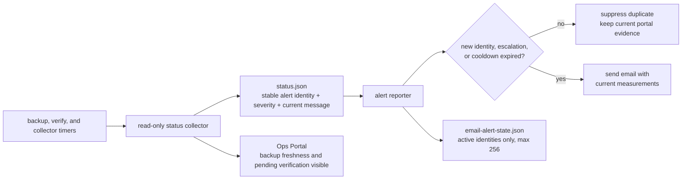

# VPS Alert Email Policy

This runbook defines how the NutsNews Ops Portal turns read-only VPS status into useful email alerts without turning changing measurements into inbox noise.

## Easy Summary

Each operational problem has a stable alert identity. The email can still show current values such as percent used or hours remaining, but those changing words do not make the problem look new every five minutes.

The same warning sends once during its cooldown. A warning that becomes critical can send immediately. When a problem clears, its active state is removed, so a later recurrence is treated as a new incident.

Backup freshness is not storage quota. The portal shows snapshot age in the backup health section. The free-tier section shows only measurable local backup-cache GiB; it does not invent a OneDrive quota or describe snapshot age as storage consumption.

## Intermediate Summary

### Alert identity and cooldown

| Field | Purpose |
| --- | --- |
| Stable identity | Machine-readable condition such as `backup.snapshot_stale` or `free_tier.vercel_bandwidth.quota_risk` |
| Severity | `warning` or `critical`; a severity increase can notify immediately |
| Message | Current human-readable evidence included in the email, never used as the primary cooldown key |
| Last sent time | Determines whether the same identity and severity is still inside the cooldown |

The reporter applies these rules:

1. A new identity sends once.
2. The same identity and severity is suppressed until the cooldown expires, even when its rendered message changes.
3. A warning-to-critical escalation sends promptly.
4. A critical-to-warning de-escalation remains subject to the cooldown.
5. An identity absent from the current alert set is cleared; if it later returns, it sends as a new incident.
6. Only active alert records are retained, with a hard cap of 256 records. State contains identities, severities, and timestamps—not rendered messages, credentials, or provider tokens.

Independent conditions have independent identities. A backup failure cannot suppress a disk warning, and a provider quota warning cannot suppress a verification failure.

### Backup freshness and storage

`latest_snapshot_age_hours` belongs to backup health. The default stale-backup threshold is 30 hours, and a snapshot older than that threshold remains a critical alert.

The free-tier provider named `Backup Local Cache` covers only local, measurable backup cache usage in GiB against local filesystem capacity. It does not represent remote OneDrive capacity. If remote quota cannot be obtained through a real read-only source, the portal must not invent a zero, a limit, or a remaining value.

A snapshot that is 79.7% through its 30-hour freshness window is still fresh. It must not produce a message such as “Backup Storage free-tier usage is warning” or “6.09 hours remaining.”

### Daily backups and weekly verification

Daily backups normally create a newer snapshot than the last weekly verification. That mismatch remains visible as `latest_unverified`, with a `pending` policy status and the verification deadline shown in the portal. It does not send an email by itself while the last successful verification remains inside the 192-hour policy window.

Email remains warranted when:

- the verification command failed;
- successful verification is older than the 192-hour policy deadline;
- no successful verification has completed by that deadline;
- the verification timer is inactive while backups are enabled; or
- the newest backup itself is stale, failed, or otherwise unhealthy.

The conservative verification timer stays weekly on Sunday around 05:15 server-local time with up to six hours of randomized delay. It is deliberately separate from the daily backup timer and from the full restore drill tracked in `nutsnews-infra` issue #24.

## Alert Flow



## Expert Summary

On 2026-07-12 the five-minute alert timer exposed three independent policy defects:

- A free-tier alert fingerprint included the complete rendered message. Snapshot age changed each collection, so values such as remaining hours and percent used produced a new fingerprint and bypassed the 21,600-second cooldown.
- The backup provider treated snapshot age as a quota metric whose “limit” was the 30-hour stale threshold. This produced storage-style warnings for a fresh snapshot.
- A successful daily backup made the newest snapshot differ from the most recently verified snapshot. The collector immediately warned even though verification intentionally ran weekly and remained inside its 192-hour policy.

The live services showed successful backup, prune, and verification results. These messages represented a misleading metric and an expected transitional state, not a failed backup. Stable identities fix cooldown behavior; separating freshness from capacity and adding an explicit verification deadline fixes the semantics.

## Read-Only Troubleshooting

Use the existing restricted operations account and do not print environment files, SMTP settings, restic credentials, rclone configuration, CSRF material, or alert email bodies that may contain sensitive operational context.

Useful read-only checks include:

```bash
date -u
hostname
systemctl list-timers nutsnews-restic-backup.timer nutsnews-restic-verify.timer nutsnews-ops-portal-collector.timer nutsnews-ops-alert-check.timer
systemctl show nutsnews-restic-backup.timer nutsnews-restic-verify.timer nutsnews-ops-portal-collector.timer nutsnews-ops-alert-check.timer -p ActiveState -p SubState -p LastTriggerUSec -p NextElapseUSecRealtime
systemctl show nutsnews-restic-backup.service nutsnews-restic-verify.service nutsnews-ops-portal-collector.service nutsnews-ops-alert-check.service -p ActiveState -p SubState -p Result -p ExecMainStatus
journalctl --utc --no-pager -u nutsnews-restic-backup.service -u nutsnews-restic-verify.service -u nutsnews-ops-portal-collector.service -u nutsnews-ops-alert-check.service
```

Sanitize JSON inspection to these classes of fields:

- backup snapshot ID/time, age, backup/prune result, and verification policy status/deadline;
- timer active state, last trigger, and next trigger;
- reporting status, cooldown seconds, pending count, and suppressed count; and
- alert-state schema, identity count, severity, and timestamps.

Do not print cookie values, email addresses, SMTP fields, environment contents, credentials, or arbitrary message text. A healthy deployed alert state uses schema version 2, contains at most 256 active identities, and contains no stored rendered messages.

### Diagnosis guide

| Symptom | Interpretation | Safe next step |
| --- | --- | --- |
| Same identity appears every five minutes | Reporter may still be using message-based fingerprints or old code | Confirm deployed infra commit and state schema; fix through GitOps |
| New daily snapshot is `latest_unverified` and policy is `pending` | Expected before weekly verification | Check the deadline and timer state; no manual verify is required |
| Verification policy is `overdue` or state is `stale` | Actionable verification gap | Inspect timer/service result and sanitized journal, then repair through GitOps |
| Latest snapshot age exceeds 30 hours | Actionable stale backup | Inspect backup timer/service and repository connectivity without mutating the host |
| Backup Local Cache reports GiB risk | Real local filesystem capacity pressure | Check local cache size and root filesystem capacity; do not infer OneDrive quota |

## Deployment and Rollback

The policy is owned by `ramideltoro/nutsnews-infra`. After review and merge, run Protected Ansible Apply in check mode, inspect the proposed reporter/collector/fixture changes, and obtain the required approval before apply. Do not manually edit the VPS or dispatch backup/verification merely to validate this policy.

After apply, perform read-only verification across several alert-timer cycles. Confirm the deployed infra commit, schema version 2, bounded active state, `Backup Local Cache` GiB semantics, the verification policy state/deadline, and successful timer/service results.

Protected apply performs its non-sending reporting-status refresh with the same managed email values used by the systemd reporter. A bare reporter process does not load `/etc/nutsnews/ops-reporter.env`; if it is invoked without an explicit managed environment, it can temporarily display email as disabled even though the scheduled service remains configured. Prefer the managed timer and treat an environmentless apply-time refresh as a GitOps defect.

Rollback is a Git revert of the owning infra change followed by the same protected check/apply process. Do not delete alert state or replace the reporter manually.
