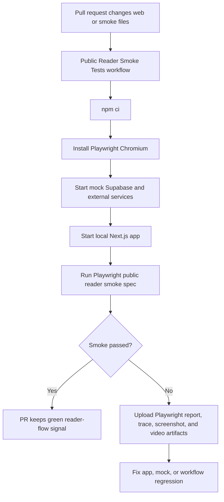

# Web Public Reader Smoke Test

NutsNews uses a dedicated Playwright smoke test to verify critical public reader flows with offline mock services.

## Simple Summary

This test checks that the main parts readers use still work, like seeing stories, scrolling for more, changing language, reading pages, and opening a story.

## Intermediate Summary

The web app now has PR smoke coverage for the public reader experience. The test runs the real Next.js app against local mock Supabase, Turnstile, and email services, so it does not need production secrets. It verifies article loading, infinite-scroll pagination, French language switching with translation metadata, invalid contact-form blocking, Privacy/About rendering, and a known article detail route.

## Expert Summary

Issue #87 adds `npm run test:e2e:public-smoke` in `web/package.json`, backed by `scripts/web_public_reader_smoke.mjs`, `web/playwright.public-smoke.config.ts`, and `web/tests/public-reader-smoke.spec.ts`. The harness starts local HTTP mocks for PostgREST/Supabase-style article reads, translated summaries, Turnstile verification, and Resend email delivery. The Playwright config starts `next dev`, runs Chromium only, retains traces/videos on failure, captures screenshots on failure, and writes artifacts under `web/playwright-report/public-reader-smoke` and `web/test-results/public-reader-smoke`. The `Public Reader Smoke Tests` workflow installs Chromium with Playwright and uploads those artifacts only when the job fails.

## Covered Flows

- Home page loads fixture-backed public article cards.
- Infinite scroll requests another article page through cursor pagination and receives more articles.
- Language switching to French reloads localized articles, updates the first article card language, and confirms the API returned `languageCode=fr`, `language_code=fr`, `requested_language_code=fr`, and `translation_available=true` for the known French fixture.
- Contact page renders and browser validation blocks an invalid submission before `/api/contact`.
- Privacy and About pages render.
- Article detail page opens from a stable `/articles/public-smoke-article-01` URL.

## Local Run

From the web app repository:

```bash
cd web
npm run test:e2e:public-smoke
```

The command starts:

- A mock Supabase/PostgREST server on `WEB_PUBLIC_SMOKE_SUPABASE_PORT` or `8905`.
- A mock Turnstile/Resend/image server on `WEB_PUBLIC_SMOKE_EXTERNAL_PORT` or `8906`.
- A local Next.js server on `WEB_PUBLIC_SMOKE_WEB_PORT` or `3021`.

## CI Behavior

The `.github/workflows/public-reader-smoke.yml` workflow runs on:

- Pull requests to `main` when `web/**`, `scripts/web_public_reader_smoke.mjs`, or the workflow changes.
- Pushes to `main`.
- Manual dispatch.

CI steps:

1. Check out the repository.
2. Install Node.js 22 dependencies with `npm ci`.
3. Install Playwright Chromium with `npx playwright install --with-deps chromium`.
4. Run `npm run test:e2e:public-smoke`.
5. Upload Playwright report, trace, screenshot, and video artifacts only on failure.

The public reader smoke spec is intentionally isolated to `web/playwright.public-smoke.config.ts`. Accessibility CI uses `web/playwright.accessibility.config.ts` so it only selects `accessibility.spec.ts` and does not run smoke tests without the local mock harness. The shared `web/playwright.config.ts` remains available for the Vercel preview smoke command, which passes `tests/vercel-preview-smoke.spec.ts` explicitly.

## Issue #279 translation reliability coverage

- Simple: the smoke test now proves the visible French card came from a real translated fixture, not from a broad English fallback.
- Intermediate: Playwright parses the `/api/articles?home=1&lang=fr` response and compares the known fixture title plus language metadata before checking the rendered card.
- Expert: this complements the live preview smoke. Public smoke uses deterministic local data for the available-translation case; preview smoke handles live data by requiring API metadata before allowing English fallback.

## Failure Artifacts

When CI fails, download the `public-reader-smoke-playwright-artifacts` artifact. It can include:

- `web/playwright-report/public-reader-smoke`
- `web/test-results/public-reader-smoke`
- Retained traces.
- Failure screenshots.
- Failure videos.

To inspect a trace locally:

```bash
cd web
npx playwright show-trace test-results/public-reader-smoke/**/*.zip
```

## Secret And Environment Assumptions

The smoke test does not require production Supabase, Cloudflare, Resend, admin, or Vercel secrets. The harness injects local-only placeholder values for:

- `NEXT_PUBLIC_SUPABASE_URL`
- `NEXT_PUBLIC_SUPABASE_ANON_KEY`
- `SUPABASE_URL`
- `SUPABASE_SERVICE_ROLE_KEY`
- `NEXT_PUBLIC_TURNSTILE_SITE_KEY`
- `TURNSTILE_SECRET_KEY`
- `TURNSTILE_VERIFY_URL`
- `RESEND_API_KEY`
- `RESEND_EMAILS_URL`
- `CONTACT_TO_EMAIL`
- `CONTACT_FROM_EMAIL`
- `AUTH_SECRET`
- `NEXTAUTH_URL`

These values point at local mocks or harmless test-only strings.

## PR-To-Smoke-Test Flow



## Risks And Mitigations

| Risk | Mitigation |
| --- | --- |
| Fixture data drifts away from production shape | Mock rows use the same fields consumed by the public feed, language, contact, and detail flows. |
| Infinite scroll becomes timing-sensitive | The test asserts the cursor-paginated `/api/articles` response and payload instead of relying only on visual count changes. |
| Contact form depends on Cloudflare or email services | Turnstile and email delivery are mocked locally. |
| Artifacts become noisy | CI uploads Playwright artifacts only on failure. |

## Rollback

Revert the app PR that adds the smoke workflow, Playwright config/spec, package script, and harness. Then revert this documentation page and README link.

## Related PRs

- App PR: https://github.com/ramideltoro/nutsnews/pull/158
- Docs PR: https://github.com/ramideltoro/nutsnews-docs/pull/6
