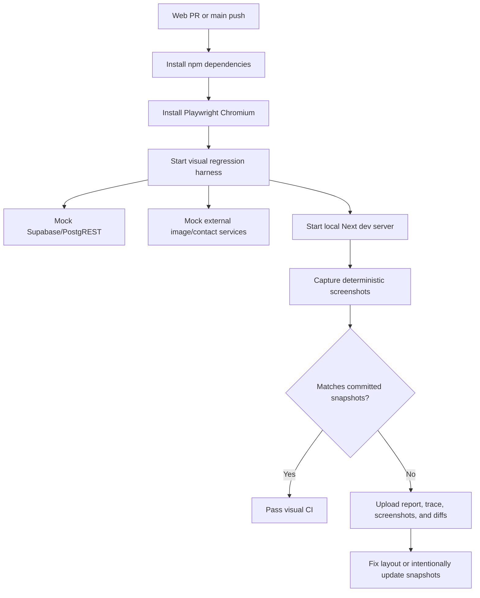

# Web Visual Regression Tests

NutsNews uses Playwright screenshot snapshots to catch public layout regressions that smoke, accessibility, and API tests can miss.

---

## Simple Summary

The visual regression suite opens public pages with deterministic offline data and compares screenshots against committed baselines. If a page layout changes unexpectedly, CI fails and uploads screenshot diff artifacts.

## Intermediate Summary

The suite runs through `npm run test:visual` in `ramideltoro/nutsnews/web`. It reuses the public-reader mock harness, starts local mock Supabase and external services, starts `next dev`, and captures desktop and mobile screenshots for the homepage and article detail page. It also checks desktop settings, search, and localized states.

## Expert Summary

The visual harness is backed by:

```text
scripts/web_visual_regression.mjs
scripts/web_public_reader_smoke.mjs
web/playwright.visual.config.ts
web/tests/visual-regression.spec.ts
web/tests/visual-regression.spec.ts-snapshots/
.github/workflows/visual-regression.yml
```

The Playwright config uses platform-neutral snapshot paths, deterministic local storage for language/theme, mocked image responses, mocked search responses, disabled animations, retained traces on failure, and failure-only artifact upload. Production Supabase, production credentials, cookies, CSRF tokens, and live user data are not required.



---

## Covered States

The committed baseline covers:

- Homepage desktop.
- Homepage mobile.
- Article detail desktop.
- Article detail mobile.
- Settings theme panel.
- Settings language panel.
- Search results dialog.
- Search empty-state dialog.
- French localized privacy page.

Desktop-only overlays are intentionally captured on desktop to keep the suite focused and stable. Homepage and article detail are captured on both desktop and mobile.

---

## Local Commands

Run visual regression comparisons:

```bash
cd web
npm run test:visual
```

Update snapshots after an intentional layout change:

```bash
cd web
npm run test:visual:update
```

Review all generated snapshot changes before committing. A snapshot update is acceptable only when the layout change is intentional and the PR explains it.

---

## CI Workflow

Workflow:

```text
.github/workflows/visual-regression.yml
```

The workflow runs on web PRs, pushes to `main`, and manual dispatch. It uploads artifacts only on failure:

```text
web/playwright-report/visual-regression
web/test-results/visual-regression
```

Those artifacts contain the actionable evidence: actual screenshots, expected screenshots, diffs, failure screenshots, and Playwright traces where available.

---

## Stability Rules

- Keep visual tests on offline mock data.
- Keep language and theme deterministic before each screenshot.
- Keep image responses mocked and tiny.
- Disable animations before comparing screenshots.
- Avoid full production pages, real cookies, live credentials, CSRF tokens, or sensitive response bodies.
- Prefer small, named snapshots for representative states instead of broad screenshots of every possible page.

---

## Rollback

Revert the app PR that added the visual workflow, Playwright visual config/spec, snapshots, package scripts, and visual harness wrapper. Then revert this documentation page and README link.
