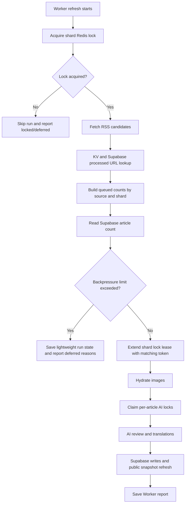

# Worker Backpressure and Lock Safety

Issue #93 adds ingestion pressure controls to `ramideltoro/nutsnews-worker` so RSS spikes do not immediately turn into expensive AI calls, translation work, image hydration, or write-heavy Supabase traffic.

## Simple Summary

NutsNews now checks whether the story line is too crowded before it starts costly work. If another worker is already working, or the line is too long, the worker waits and tells admins why.

## Intermediate Summary

The Worker refresh path now reports queued article counts by source and shard, extends its Redis shard lock lease before expensive work, and defers image hydration, AI review, translation, article writes, review writes, and feed snapshot refresh when queue or database limits are exceeded. Operators can tune the queue and DB thresholds with environment variables and use the worker response/logs to see queued, deferred, retried, locked, and processed counts.

## Expert Summary

The change lives in `ramideltoro/nutsnews-worker`. `worker/src/index.ts` now calculates queue visibility after RSS candidate de-dupe and before `hydrateMissingArticleImages`, `claimArticlesForAiReviewWithRedis`, summary translation, article saves, review saves, and snapshot refresh. It adds token-checked Redis lease extension with `EVAL`/`GET`/`EXPIRE`, keeps release token-checked, reports retryable no-thumbnail reviews from the Supabase processed-URL lookup, and emits structured result fields for `queuedCount`, `queuedBySource`, `deferredCount`, `deferredReasons`, `retriedCount`, `processedCount`, `backpressureQueueLimit`, `backpressureDbArticleLimit`, `backpressureDbArticleCount`, and Redis lock counts. A focused regression script, `scripts/assert_worker_backpressure_locks.mjs`, verifies the key source-level invariants. Rollback is to revert the worker commit and redeploy shards; the existing per-article AI locks and manual rate limits remain as fallback controls.

## Request Flow



## What Changed

- Queue visibility now reports queued/unreviewed article counts by RSS source and worker shard.
- Worker refresh results now include queued, deferred, retried, processed, and lock-related counters.
- The worker performs backpressure checks before image hydration, AI review, summary translation, article writes, review writes, and public snapshot refresh.
- Shard locks now support holder-only lease extension; only the worker with the matching token can extend or release the lock.
- Manual and scheduled lock skips report `lockedCount`, `deferredCount`, `deferredReasons`, and `processedCount`.
- Translation backlog runs extend the same shard lock before translation work.

## Why It Changed

RSS bursts can create many unreviewed articles at once. Without backpressure, overlapping runs can spend AI/API budget and Supabase write capacity on duplicate or low-priority work. The new controls reduce duplicate work, make queue pressure visible, and stop expensive steps early when the queue or DB size is already above configured limits.

## Who Is Affected

- Admins and operators: get clearer worker responses and Better Stack logs for queue pressure.
- Maintainers: can tune thresholds without code changes.
- Readers: public article behavior should not change; this only controls when worker runs process new content.
- Cost owners: get earlier protection before AI calls, article page fetches, translation calls, and write-heavy operations.

## Configuration

| Variable | Default | Purpose |
| --- | ---: | --- |
| `INGESTION_BACKPRESSURE_QUEUE_LIMIT` | `250` | Maximum queued/unreviewed RSS candidates allowed before expensive work is deferred. |
| `INGESTION_BACKPRESSURE_DB_ARTICLE_LIMIT` | `30000` | Article table count at or above this limit defers expensive work. |
| `UPSTASH_REDIS_WORKER_LOCK_TTL_SECONDS` | `600` | Shard lock TTL. The worker now extends this lease before expensive work. |
| `UPSTASH_REDIS_AI_REVIEW_LOCK_TTL_SECONDS` | `1800` | Per-article AI review lock TTL used to prevent overlapping review claims. |

No new production dependency is required. The DB-size signal uses a read-only Supabase `HEAD` count request against `articles`.

## Operational Behavior

- If `INGESTION_BACKPRESSURE_QUEUE_LIMIT` is exceeded, the worker returns a successful deferred report instead of starting image hydration, AI review, translation, or writes.
- If `INGESTION_BACKPRESSURE_DB_ARTICLE_LIMIT` is reached, the worker also defers expensive work.
- If the Supabase count check fails, the worker logs `worker.backpressure.db_count_failed` or `worker.backpressure.db_count_parse_failed`, reports the telemetry error, and continues. This avoids halting ingestion because of a monitoring/count endpoint issue.
- If another shard run already holds the worker lock, manual requests return a skipped response and scheduled runs log a skip.
- If lock lease extension fails, the worker logs `worker.redis.worker_lock_extend_failed` or `worker.redis.translation_lock_extend_failed` without printing token values.

## How To Interpret Reports

| Field | Meaning | Next step |
| --- | --- | --- |
| `queuedCount` | Candidate articles not already processed before image hydration. | If high, inspect `queuedBySource` and pause noisy feeds. |
| `queuedBySource` | Queued count grouped by source and shard. | Review source quality and feed volume. |
| `deferredCount` | Count of queued items deferred by lock or backpressure. | Check `deferredReasons`, then tune thresholds or reduce load. |
| `deferredReasons` | Human-readable reason a run skipped expensive work. | Follow the specific reason: queue limit, DB limit, or active lock. |
| `retriedCount` | Old no-thumbnail reviews eligible for another attempt. | Watch repeated image misses and source image quality. |
| `processedCount` | Articles processed in the current run report. | Use with `aiReviewedCount`, accepted/rejected counts, and lock counts. |
| `redisAiReviewLockSkippedCount` | Articles skipped because another run holds the per-article review lock. | Indicates overlap protection is working. |

## Risks And Mitigations

| Risk | Mitigation |
| --- | --- |
| Thresholds too low defer useful work. | Raise `INGESTION_BACKPRESSURE_QUEUE_LIMIT` or `INGESTION_BACKPRESSURE_DB_ARTICLE_LIMIT` after checking logs. |
| Thresholds too high allow expensive spikes. | Lower the queue limit and reduce `MAX_AI_REVIEWS`/manual limits during incidents. |
| Supabase count endpoint unavailable. | Worker reports `backpressureDbArticleCountError` and continues; fix Supabase/PostgREST telemetry separately. |
| Redis unavailable. | Existing behavior continues without Redis locks, and `redisEnabled` reports false. Restore Upstash Redis before high-volume runs. |
| Lock TTL too short for long translation runs. | Increase `UPSTASH_REDIS_WORKER_LOCK_TTL_SECONDS` and verify lease-extension logs. |

## Rollback

1. Revert the worker commit that added issue #93 backpressure and lock extension.
2. Redeploy all Worker shards from `ramideltoro/nutsnews-worker`.
3. Keep `UPSTASH_REDIS_*` configured so existing lock behavior remains available.
4. Re-run the offline worker regression before restoring normal shard cadence.

## Validation

Run from `ramideltoro/nutsnews-worker/worker`:

```bash
npm run test:backpressure-locks
npx tsc --noEmit
npm run test:e2e:offline
npm run test:immutable
```

`test:e2e:offline` uses mocked RSS, AI, Supabase, and web services and does not require production secrets.

## Related Links

- App issue: https://github.com/ramideltoro/nutsnews/issues/93
- Worker repository: https://github.com/ramideltoro/nutsnews-worker
- Upstash Redis worker lock note: [Worker Local AI Lock](NUTSNEWS_WORKER_LOCAL_AI_LOCK.md)
- Cost and quota guardrails: [Free-Tier Guardrails](FREE_TIER_GUARDRAILS.md)
