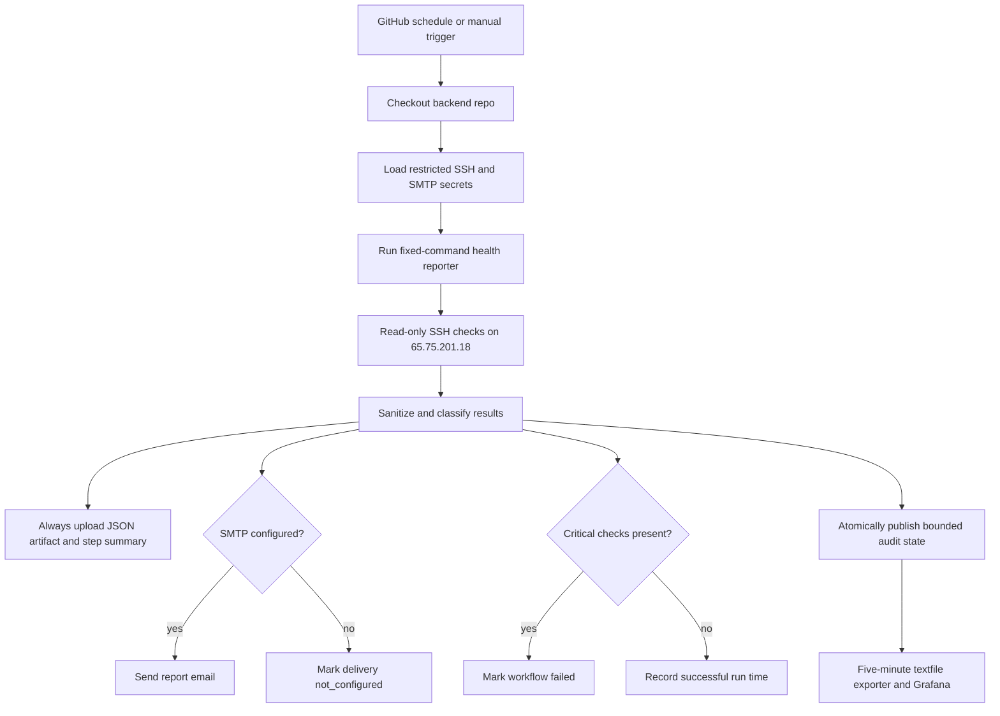

# NutsNews Backend Health Report

## Simple Summary

NutsNews has a daily backend checkup. Its checks are read-only and it can email
the result. Backend PR #471 separately stages one bounded write of sanitized
audit state for Grafana; that change is not deployed yet and does not remediate
the server.

## Intermediate Summary

The `ramideltoro/nutsnews-backend` repository owns a scheduled GitHub Actions
workflow named `Backend Health Report`. The established workflow uses a
restricted SSH session for read-only checks, generates a sanitized JSON
artifact, writes a GitHub run summary, and sends email when SMTP secrets are
configured. Backend PR #471 stages fail-on-critical behavior and one tightly
scoped host mutation: it atomically publishes sanitized audit state to
`/var/lib/nutsnews/health-audit/last-run.json`. It does not accept arbitrary
commands or mutate packages, services, firewall policy, or application data.

## Expert Summary

Backend issue `ramideltoro/nutsnews-backend#38` adds
`scripts/backend_health_report.py`, `.github/workflows/backend-health-report.yml`,
tests, and `runbooks/BACKEND_HEALTH_REPORT.md`. The reporter executes a closed
set of read-only SSH commands, redacts common sensitive patterns, and classifies
checks as `healthy`, `warning`, `critical`, `unknown`, or `not_configured`.
Backend PR #471 stages scheduled execution with `--fail-on-critical`: any
critical result records a failed workflow conclusion and returns nonzero after
the report is written.
SMTP delivery uses repository secrets by name only and degrades to
`not_configured` when optional reporting credentials are absent.

The candidate report exports `workflow.conclusion`, `critical_check_count`,
`last_success_at`, and `last_success_age_seconds`. A failed run carries forward
the prior successful timestamp rather than resetting freshness. This lets a
host textfile exporter and Grafana alert on repeated failures or a missed
schedule. Artifact upload and the job summary use an always-run path so failure
evidence is not lost.

The candidate workflow first atomically publishes the bounded audit-state JSON
through its restricted SSH/sudo contract. Backend source then stages host
textfile publication every five minutes for
`nutsnews_backend_health_audit_available`, bounded
`nutsnews_backend_health_audit_conclusion{conclusion=...}`, last-run timestamp
and live age, last-success timestamp and live age, consecutive failures,
critical-check count, and the 24-hour expected interval. Grafana source rules
alert after at least two consecutive failures and when valid run evidence is
missing or older than 30 hours. These additions remain unapplied until the
backend deploy and protected Grafana apply produce retained live-query and
firing/recovery evidence.

## Control Flow



## Report Contents

The generated report includes:

- run timing and next expected run;
- memory, root disk, root inode, load, uptime, kernel, and OS signals;
- reboot-required and package-update state;
- SSH, UFW, fail2ban, Docker, Caddy, PostgreSQL, Alloy, and sysstat service states;
- backup tool presence such as restic/rclone;
- RabbitMQ broker health, drift status, and last smoke status when probe
  evidence exists;
- RabbitMQ recovery evidence when
  `/var/lib/nutsnews/rabbitmq-recovery/last-*.json` files exist;
- cleanup last-run status when `/var/lib/nutsnews/cleanup/last-cleanup.json`
  exists;
- recovery last-run status when `/var/lib/nutsnews/recovery/last-recovery.json`
  exists;
- relevant timers and backend units;
- public listener inventory;
- recent critical journal entries visible to the read-only audit user;
- delivery status without recipient or credential values.
- workflow conclusion, critical-check count, prior last-success time, and
  last-success age for Grafana freshness alerts.

Backend services that are intentionally absent, such as Docker or PostgreSQL in
the current phase, appear as `not_configured` rather than failed production
services.

For the worker-uplift broker, RabbitMQ checks report broker health, drift
status, last smoke status, definition export, clean rebuild drill, and
stopped-volume restore drill freshness without exposing raw definitions,
password hashes, broker data, or credential files. The health report reads
existing RabbitMQ evidence; it does not run smoke probes or restart the broker.

## Required Secrets

Repository secrets in `ramideltoro/nutsnews-backend`:

| Secret | Purpose |
| --- | --- |
| `NUTSNEWS_BACKEND_SSH_PRIVATE_KEY` | Restricted SSH key for read-only checks and the candidate's single allowlisted audit-state publication |
| `NUTSNEWS_BACKEND_KNOWN_HOSTS` | Verified known_hosts entry for `65.75.201.18` |
| `NUTSNEWS_REPORT_SMTP_HOST` | SMTP host for report delivery |
| `NUTSNEWS_REPORT_SMTP_USERNAME` | SMTP username |
| `NUTSNEWS_REPORT_SMTP_PASSWORD` | SMTP password or provider token |
| `NUTSNEWS_REPORT_EMAIL_FROM` | Sender address |
| `NUTSNEWS_REPORT_EMAIL_TO` | Recipient address list |

Optional variables:

| Variable | Default |
| --- | --- |
| `NUTSNEWS_BACKEND_HOST` | `65.75.201.18` |
| `NUTSNEWS_REPORT_SMTP_PORT` | `587` |
| `NUTSNEWS_REPORT_SMTP_STARTTLS` | `true` |
| `NUTSNEWS_REPORT_SUBJECT_PREFIX` | `[NutsNews backend]` |

## Operational Impact

The report improves visibility while the backend host is still in the early
bootstrap phase. It shows known blockers such as package updates, missing
fail2ban deployment, missing restic, and lack of noninteractive sudo without
remediating any of them. If PR #471 is deployed, its only host write is the
bounded audit-state file described above.

The workflow runs daily at `12:17 UTC`. Manual runs can disable email delivery for validation.

## Validation

Backend validation for the change:

```bash
python3 scripts/validate_no_secret_files.py
python3 scripts/validate_recovery_workflows.py
python3 scripts/validate_backend_credential_inventory.py
python3 scripts/validate_service_baseline.py
python3 scripts/validate_abuse_protection_decision.py
python3 scripts/validate_redis_valkey_decision.py
python3 scripts/validate_search_service_decision.py
python3 scripts/validate_postgres_replacement_plan.py
python3 -m unittest discover -s tests
actionlint .github/workflows/backend-health-report.yml .github/workflows/backend-checks.yml .github/workflows/backend-credential-readiness.yml .github/workflows/backend-drift-check.yml .github/workflows/protected-backend-ansible-apply.yml
/tmp/nutsnews-backend-ansible-venv/bin/ansible-playbook ansible/playbooks/bootstrap.yml --syntax-check -i ansible/inventories/production/hosts.yml
python3 scripts/backend_health_report.py --ssh-host 65.75.201.18 --ssh-user rami --ssh-key ~/.ssh/servercheap_65_75_201_18 --known-hosts ~/.ssh/known_hosts --output /tmp/backend-health-report-live.json
```

The live no-email report on July 16, 2026 showed `0` critical checks, `3` warnings, `5` not-configured checks, and `8` healthy checks. Warnings were package updates, inactive fail2ban, and lack of noninteractive sudo.

## Risks And Mitigations

| Risk | Mitigation |
| --- | --- |
| Report output could include sensitive data | Reporter redacts common token, private-key, URL-password, and email patterns before writing output |
| Email could become noisy | Manual runs can disable email, and future alert-deduplication work can add cooldown state |
| Scheduled workflow could fail if repository secrets are missing | Missing SSH secrets fail early by name only; missing SMTP secrets degrade to `not_configured` |
| A health audit could be mistaken for remediation | Checks remain read-only; the candidate write is limited to one sanitized audit-state file and never changes packages, firewall policy, services, or application data |
| A critical report could still look green because an artifact exists | `--fail-on-critical` fails the workflow while the always-run upload retains evidence; Grafana watches conclusion and last-success age |

## Rollback

Disable the `Backend Health Report` workflow or revert the backend PR if reports become noisy or delivery fails. Rotate SMTP or SSH credentials in GitHub secrets if credential exposure is suspected.
