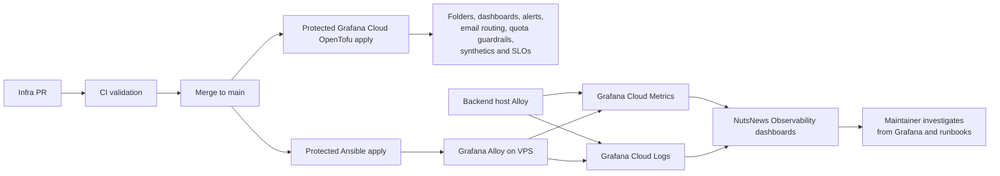
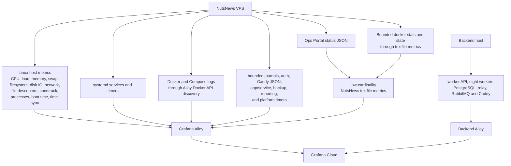
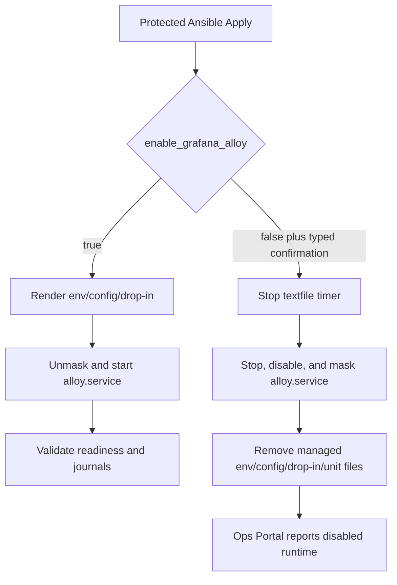

# NutsNews Grafana Cloud Observability

Architecture status: Grafana Cloud resources are centralized in
`ramideltoro/nutsnews-infra`. Backend and VPS hosts are telemetry producers;
they do not own Grafana resource provisioning. The same boundary is reflected
in [Architecture](ARCHITECTURE.md) and
[Worker-Uplift Operation Map](NUTSNEWS_WORKER_UPLIFT_OPERATION_MAP.md).

This explains the Grafana Cloud observability hardening contract for NutsNews:
host and application telemetry, managed alert delivery, five read-only synthetic
checks, four service-level objectives, and free-tier guardrails.

## Easy Summary

NutsNews has a staged Grafana Cloud observability enhancement that stays
GitOps-managed. The repository changes are not proof that production was
changed: live state changes only after merge and the protected OpenTofu and
Ansible workflows succeed.

The authoritative rollout ledger is
[`ramideltoro/nutsnews-infra#474`](https://github.com/ramideltoro/nutsnews-infra/issues/474).
As of 2026-08-01:

- Worker Contracts `1.0.0` and Worker Runtime `1.0.0` are published, attested,
  and install-smoke verified from merge commits
  `e86ea51814cb1b1d810e95b7971a59d90a2fce31` and
  `80bc2d1cc1ce2f089386c2653f9a69abe1ce9808` respectively;
- the infrastructure, web, and backend changes remain open rollout work; all
  eight worker-service PRs are merged and their immutable Runtime 1 images are
  published and verified, while backend digest pinning, a fresh fail-closed
  qualification, and deployment remain pending;
- no production Grafana/Ansible apply, backend or worker deployment, alert
  receipt, synthetic execution, native SLO activation, or failure drill has
  been performed for this enhancement; and
- the five-minute synthetic topology is a source candidate, not an approved
  operating choice. Its 86,400 monthly executions cross the 85,000 major band,
  so production plan/apply remains fail-closed until an operator records one of
  the allowed budget decisions below.

There are two halves:

1. `ramideltoro/nutsnews-infra` installs and configures Grafana Alloy on the VPS through the protected Ansible workflow.
2. The same infra repo manages Grafana Cloud folders, dashboards, alert rules,
   quota alerts, backend imports, the protected email route, five production
   Synthetic Monitoring checks, and four SLOs through OpenTofu.

The VPS side is read-only. Alloy collects host metrics, systemd state, bounded
journals, redacted Caddy and application logs, and low-cardinality textfile
metrics. Unsupported cAdvisor panels are replaced by bounded `docker stats`
textfile metrics; Alloy does not require `containerd.sock` access.

The backend host is also a telemetry producer. `ramideltoro/nutsnews-backend` keeps only backend Prometheus remote_write and Loki push credentials for its host collector. Its existing `NutsNews Backend Ops` dashboards and `NutsNews Backend Guardrails` alert group are imported and managed from `ramideltoro/nutsnews-infra`; backend direct Grafana provisioning is retired after import plus live query/alert verification passes.

The backend retirement record is
`ramideltoro/nutsnews-backend/docs/backend-grafana-handoff.json`. Backend CI
runs `scripts/validate_backend_grafana_handoff.py` to confirm the backend keeps
only telemetry producer duties, preserves the existing dashboard and alert UIDs,
and does not regain a workflow path that can create, update, or delete Grafana
Cloud resources.

The worker-uplift telemetry scope is documented separately in
[NutsNews Worker-Uplift Telemetry Scope](NUTSNEWS_WORKER_UPLIFT_TELEMETRY_SCOPE.md).
All eight worker metrics endpoints are private backend scrape targets. RabbitMQ
metrics, worker lifecycle metrics, fixed-bucket latency histograms, readiness,
and structured logs are required. `expected_active` keeps shadow services from
paging on production behavior, but it never suppresses missing scrape,
freshness, identity, or readiness-series evidence. Full trace export, exemplars,
and profiling remain
deferred, and article/model payloads are forbidden in telemetry.

This does not add a shell button, restart button, package installer, portal mutation path, or broad workflow command runner. Production changes still go through commits, PRs, checks, merge, and protected apply.

## Intermediate Summary

The rollout has separate credentials for separate jobs:

| Credential type | Used by | Purpose |
| --- | --- | --- |
| Grafana Cloud Access Policy token | Ansible-managed Alloy on each producing host | Write telemetry to Grafana Cloud metrics and logs |
| Grafana service account token | OpenTofu in GitHub Actions | Manage folders, dashboards, alert rules, contact routing, and SLO resources; native SLO management also requires SLO Writer or SLO Admin plus folder write access |
| Grafana Synthetic Monitoring API token | OpenTofu in GitHub Actions | Manage the five HTTP checks and their two public probes |

Grafana management/service-account credentials stay only in `ramideltoro/nutsnews-infra`. Do not reuse the service account token for telemetry writes. Do not commit Grafana URLs, usernames, tokens, tenant IDs, backend config, Synthetic Monitoring targets, or tfvars.

The OpenTofu preflight must prove that the Grafana service account has SLO
Writer or SLO Admin and write access to every target folder. Equivalently, a
custom role needs `grafana-slo-app.slo:read`, `:write`, and `:delete`,
`plugins.app:access` for `plugins:id:grafana-slo-app`, and the required
`folders:read`/`folders:write` scopes. Dashboard and alert permissions alone are
not sufficient and can leave all four `grafana_slo` resources failing with
HTTP 403. See Grafana's
[SLO RBAC requirements](https://grafana.com/docs/grafana-cloud/observe-and-act/alert-and-measure-reliability/slo/set-up/rbac/).

The high-level flow:



## Expert Summary

The infra implementation keeps observability useful without making Grafana Cloud a cost surprise:

- Alloy scrape interval defaults to 60 seconds.
- Alloy is enabled production desired state. Disabling it requires an explicit
  protected-workflow confirmation and is an incident action, not a casual
  feature toggle.
- Host metrics come from Alloy's Unix exporter.
- Host-exporter and Alloy-self targets have distinct scrape identities.
- Container metrics come from a bounded `docker stats` textfile collector, not
  cAdvisor.
- Docker logs are collected for the `nutsnews-service-foundation` and `nutsnews-app` Compose projects through the Docker API socket.
- Docker state still appears through the Ops Portal collector and low-cardinality textfile metrics.
- High-cardinality labels such as container IDs, image IDs, request IDs, user IDs, raw IPs, and full dynamic paths are dropped or avoided.
- Logs are redacted, size-limited, and rate-limited before leaving the VPS.
- Debug and trace logs are intentionally dropped.
- Rotated compressed logs and stale logs are ignored.
- The current source candidate requires five protected Synthetic Monitoring
  targets, exactly two public probes, and a five-minute cadence. That cadence is
  not approved yet; production plan/apply remains blocked by the protected
  decision gate.
- Synthetic API checks must stay within Grafana's 10-second through 60-minute
  interval range.
- A value-free validator and OpenTofu block plan/apply when projected API
  executions reach or exceed 90% of the current free allowance, preserving a
  10% hard buffer.
- Browser Synthetic Monitoring and Grafana Cloud k6 execution are not enabled by default.
- Worker-uplift telemetry must match
  `ramideltoro/nutsnews-infra/terraform/grafana-cloud/catalog/worker-uplift-telemetry-scope.json`.
  Reconciliation between that catalog and producer metrics is a pre-apply
  acceptance gate; neither document can make the other live.
- The legacy `nutsnews-worker` remains the production ingestion owner. Split
  workers remain shadow-only until a separately approved cutover.

Grafana's current public free-tier assumptions used by the docs and module are:

| Area | Current assumption |
| --- | ---: |
| Metrics | 10,000 active series per month |
| Logs | 50 GB ingested per month with 14-day retention |
| Synthetic API tests | 100,000 executions per month |
| Synthetic browser tests | 10,000 executions per month |
| k6 | 500 virtual user hours per month |

Always verify the live Grafana pricing page before adding more telemetry: https://grafana.com/pricing/

Grafana Cloud usage and limit metrics are queried through the `grafanacloud-usage` datasource. Grafana documents the `grafanacloud_instance_metrics_limits`, `grafanacloud_logs_instance_limits`, and related usage metrics here: https://grafana.com/docs/grafana-cloud/cost-management-and-billing/manage-invoices/understand-your-invoice/usage-limits/

## What Alloy Collects



## Container Metrics Strategy

The accepted container-metrics model is:

- Alloy host, systemd, journald/file, and textfile telemetry;
- Alloy Docker log collection for NutsNews Compose projects only.
- a root-run, bounded `docker stats --no-stream` collection for CPU, memory,
  network, block I/O, state, health, and restarts;
- atomic overwrite of `/var/lib/nutsnews/alloy/textfile/nutsnews.prom` on every
  run, including an explicit exporter-unavailable state after collection
  failure.

Docker log shipping is controlled separately by `vps_service_foundation_grafana_alloy_collect_docker_logs`, which is enabled by default. It grants the non-root `alloy` user membership in the `docker` group so Alloy can read `/var/run/docker.sock` and discover only containers labeled with the `nutsnews-service-foundation` or `nutsnews-app` Compose project. That is the accepted log-collection privilege boundary today.

Do not make `/run/containerd/containerd.sock` world-readable, chmod host
sockets, or run Alloy as root to silence cAdvisor. Production dashboards must
query the bounded textfile metrics and must return data or display an explicit
`disabled by configuration` state.

The custom NutsNews textfile metrics cover state that already exists locally:

- Ops Portal status feed availability and age.
- Alert counts by severity.
- Backup enabled/configured state, latest snapshot age, stale threshold, last backup/prune/verify result, missing paths, and missing configuration.
- Email reporting enabled/configured state, pending/suppressed alert counts, recipient count, and last report timestamps.
- App enablement, route enablement, container running/healthy state, and route readiness.
- Selected systemd service active/enabled state.
- Docker container running/health/restart count with low-cardinality labels.
- Docker CPU, memory, network, and block-I/O snapshots from bounded Docker
  stats output.
- Snapshot resource percentages and recent failed-login counters.
- Current production ownership: web target, database provider, ingestion owner,
  worker-uplift mode/write gate, backend revision, the exact deployed identity
  of all eight split-worker services, and exporter freshness.

## Logs And Redaction

Log collection is intentionally selective:

| Source | Treatment |
| --- | --- |
| bounded journald units | Worker API, sync relay, PostgreSQL, RabbitMQ canary, related timers, and platform services with rate limiting |
| auth/security logs | Collected with secret and IP redaction |
| Caddy logs | JSON access/error logs collected from Docker stdout |
| app/service logs | Collected from managed NutsNews log directories |
| backup/reporting logs | Collected for operations visibility |
| Ops Portal logs | Collected for collector/reporting diagnosis |
| Docker logs | Collected for the NutsNews Compose projects through the Docker API socket |

Intentionally excluded:

- debug and trace noise
- very large log lines
- old compressed rotations
- raw IP addresses
- request IDs, message IDs, correlation IDs, trace fields, article/feed IDs,
  idempotency IDs, user IDs, container/image IDs, and full dynamic paths as
  indexed labels
- secrets, authorization headers, tokens, passwords, API keys, and credentials

This is a practical observability feed, not a copy of every byte the server has ever muttered.

At the Alloy boundary, Loki keeps only these canonical indexed labels:

```text
deployment_environment, service, service_version, host, source, severity
```

Request, message, article, feed, and idempotency IDs, plus `pipelineRunId`,
`correlationId`, and `traceparent`, remain parsed structured metadata. The
source-controlled pipeline drilldown filters those fields at query time and
uses dashboard table field links without enabling Tempo. True hosted-Loki
datasource-level or per-log-row derived links remain deferred because taking
ownership of Grafana Cloud's managed datasource could overwrite provider-managed
connection settings. Sentry remains the canonical scrubbed exception and replay
store.

## Grafana Assets Managed As Code

OpenTofu manages these Grafana folders and resource addresses:

| Scope | Host | Folder UID | OpenTofu address | Owner |
| --- | --- | --- | --- | --- |
| VPS observability | `vps.nutsnews.com` | `nutsnews-observability` | `grafana_folder.observability` | `ramideltoro/nutsnews-infra` |
| Backend observability | `backend.nutsnews.com` | `nutsnews-backend-ops` | `grafana_folder.backend_observability` | `ramideltoro/nutsnews-infra` |

The `NutsNews Observability` VPS folder contains:

- NutsNews VPS Overview
- NutsNews Logs Overview
- NutsNews CPU Load Processes
- NutsNews Memory Swap
- NutsNews Disk Filesystem IO
- NutsNews Network Caddy Edge
- NutsNews Docker Compose Containers
- NutsNews Systemd Services Timers
- NutsNews Logs Security Auth
- NutsNews Backups Restore Verification
- NutsNews Ops Portal Reporting
- NutsNews Application Service Health
- NutsNews Synthetic Uptime API Checks
- NutsNews Grafana Cloud Usage Quota
- NutsNews Current Production Ownership

The imported `NutsNews Backend Ops` folder contains:

- NutsNews Backend Host Overview
- NutsNews Backend Docker and Runtime
- NutsNews Backend Caddy and Edge
- NutsNews Backend Service Health
- NutsNews Backend Backups
- NutsNews Backend PostgreSQL Failover
- NutsNews Backend OS Updates
- NutsNews Backend Metrics Quota
- NutsNews Backend Alert and Synthetic Health
- NutsNews Backend Logs

Backend dashboards use `grafana_dashboard.backend_observability["<dashboard_uid>"]`, and backend alert rules are owned as a single Grafana rule group at `grafana_rule_group.backend_guardrails`. The import IDs are the existing backend UIDs, not new names, so OpenTofu can adopt live resources without duplicate UIDs. If a protected apply proves a catalog dashboard UID is missing remotely, the infra catalog may set `importExisting` to `false` with the apply-run evidence so OpenTofu creates that missing dashboard from source. This is currently used for `nutsnews-backend-postgres-failover` after Grafana Cloud Apply run `29984664724`.

The draft OpenTofu source declares `NutsNews operations email` from the
protected existing report recipient, with firing and resolved notifications.
The target notification policy groups by alert name, service, and deployment
environment:

| Severity | Group wait | Group update | Repeat |
| --- | ---: | ---: | ---: |
| `critical`, `major` | 30 seconds | 5 minutes | 1 hour |
| `warning`, `minor`, `low` | 5 minutes | 15 minutes | 6 hours |

Every Terraform-managed rule must include `severity`, `owner`, `route`,
`service`, and `deployment_environment` labels plus dashboard and runbook URLs.
The former `empty` receiver is not an acceptable route. A named notification
canary must be fired and resolved after rollout and quarterly; receipt evidence
is operational evidence and must not be inferred from a successful apply.

The 2026-07-31 live audit found the root route using the contact point named
`empty`, which had no delivery integration; nine alert instances were active
on that dead-end route at audit time. No firing or recovery email has been
received for this rollout. Only a new live audit or the protected apply plus
redacted receipt/recovery evidence may change that status.

The draft correction replaces the obsolete active-series query that caused
three quota alerts to fire on No Data during the 2026-07-31 audit. The target
query is:

```promql
max(
  grafanacloud_instance_active_series
  / on(id)
  grafanacloud_instance_metrics_limits{
    limit_name="max_global_series_per_user"
  }
)
```

The 70%, 85%, and 95% threshold alerts use `NoData=OK`. A separate major alert
detects missing numerator or denominator usage telemetry. Post-apply checks
query the numerator, denominator, ratio, and rule health so missing telemetry
cannot masquerade as quota exhaustion.

A separate pipeline group covers Alloy readiness, independent host-exporter and
Alloy-self scrape health, remote-write failures/backlog, Loki drops/retries,
collector freshness, and high error-log volume. The 40 non-Terraform Linux
integration rules are inventoried as integration-owned and retained unless a
query-level review proves a duplicate.

Do not remove existing backend Grafana resources until import and query/alert
verification pass. The protected apply workflow uploads a
`grafana-cloud-post-apply-verification` report after checking folders,
dashboards, rule ownership, contact routing, SLOs, synthetics, Prometheus query
data, and recent Loki data. A successful report proves resource and query state;
it does not prove an email was received or that a controlled failure drill was
performed.

## Synthetic Monitoring

The production hardening contract requires exactly five enabled read-only HTTP
checks and exactly two public probes. The current infra PR encodes a five-minute
frequency, but issue #474 keeps that cadence unresolved because of its quota
forecast. Targets and probe IDs remain protected inputs; their presence in code
or a plan is not evidence that checks have executed.

Synthetic checks use a separate Grafana Synthetic Monitoring API token. The
Grafana service account token manages folders, dashboards, and alert rules, but
the provider needs `GRAFANA_SM_ACCESS_TOKEN`, stored as the protected
`NUTSNEWS_GRAFANA_SYNTHETIC_MONITORING_ACCESS_TOKEN` secret.

The provider also needs the stack-region Synthetic Monitoring API endpoint as
`GRAFANA_SM_URL`, supplied through the protected
`NUTSNEWS_GRAFANA_SYNTHETIC_MONITORING_URL` input. Copy it from **Testing &
synthetics > Synthetics > Config > General**. The validator requires an exact,
query-free HTTPS `synthetic-monitoring-api*.grafana.net` origin and maps it
explicitly in plan, drift, and apply; a valid token sent to another region is
rejected.

The protected plan and apply workflows use a source-controlled input validator
before OpenTofu. It enforces JSON shape, positive unique probe IDs, HTTPS
targets, 10-second through 60-minute intervals, bounded timeouts, token and
regional-endpoint presence, and the 90% execution-budget ceiling. Its report is
deliberately value-free: it includes only counts, interval bounds, projected
executions, endpoint-configured status, and the configured ceiling. It never
emits target URLs, regional endpoints, check names, probe IDs, or credentials.

The dedicated `grafana-observability-readonly` environment now exists with a
custom branch policy whose only entry is the exact `main` branch and with no
reviewer gate. It intentionally still has zero secrets and zero variables. Its
four least-privilege inputs remain operator work:

- variable `NUTSNEWS_GRAFANA_SYNTHETIC_MONITORING_URL`;
- variable `NUTSNEWS_GRAFANA_SYNTHETIC_EXPECTED_INVENTORY_JSON`;
- secret `NUTSNEWS_GRAFANA_SYNTHETIC_MONITORING_READONLY_ACCESS_TOKEN`; and
- secret `NUTSNEWS_GRAFANA_SYNTHETIC_HTTP_CHECKS_JSON`.

Production writer inputs, the two public probe IDs, the operations recipient,
the Grafana UI/API origins, and the worker-terminal alerting state still require
operator confirmation. No new synthetic checks or Grafana SLOs are live.

| Check | Required assertions |
| --- | --- |
| `canonical_homepage` | Status 200, real NutsNews content present, maintenance payload absent |
| `canonical_readiness` | `ready=true`, `Cache-Control: no-store`, and canonical deployment identity is either `production-vps` or `vercel-production` |
| `canonical_articles_api` | Status 200, article content present, and a public cache header |
| `vps_readiness` | Direct VPS `/readyz`, `ready=true`, no-store, `deploymentTarget=production-vps` |
| `vercel_secondary_readiness` | Vercel-secondary `/readyz`, `ready=true`, no-store, `deploymentTarget=vercel-production` |

New Grafana checks do not probe `/healthz`, refresh, controller, ingestion,
trigger, publication, OAuth callback, or other mutation routes. `/healthz`
remains a compatibility route for older callers, while `/readyz` is the Grafana
monitoring source.

Five checks across two probes every five minutes project to exactly 86,400
executions in a 30-day month: `5 * 2 * (43,200 / 5)`. That is 86.4% of the
100,000-execution allowance, above the 85,000 `major` band but below the 90,000
hard operating ceiling. This is an unresolved rollout choice, not an accepted
steady state. Before a production plan or apply, the operator must record one
of these mutually exclusive decisions:

1. change the source cadence to six minutes, approximately 72,000 executions;
2. retain five minutes and set the protected major-forecast acknowledgment only
   after explicitly accepting the standing major; or
3. change the major threshold in source while retaining the 90,000 ceiling and
   attach supporting quota evidence.

Until then the acknowledgment remains false and production plan/apply fails
closed. Acceptance still requires both probe series to pass and controlled
body, header, and status mismatches to fail.

## Grafana SLOs

OpenTofu declares four low-cardinality, 30-day Grafana SLOs:

| SLO | Objective | Signal | Burn alerts |
| --- | ---: | --- | --- |
| Public availability | 99.5% | Canonical homepage success from two probes | Fast and slow |
| API latency | 95% | Successful read-only article API checks within 750 ms divided by all successful article API checks | Fast and slow; correctness and availability failures remain separate signals |
| Feed freshness | 99% | Durable published-feed age from the current production publication owner is no more than 15 minutes | Fast and slow; separate critical alert at 3 hours |
| Worker terminal success | 99% | All canonical stage events: `success|duplicate` over `success|duplicate|invalid|failure|dlq`; `retry` is excluded | Dashboard-only while shadowed |

Do not group SLOs by user, feed, article, message, or other unbounded identity.
Worker burn alerts are controlled by the protected
`worker_terminal_slo_alerting_enabled` boolean. Source defaults it to `false`
while the uplift is shadowed; the protected live value must be confirmed during
rollout and may be enabled only at a separately approved production cutover.
Creating the declarations in a branch does not create SLOs in Grafana Cloud;
the merged protected apply and post-apply report must confirm their UUIDs and
queries.

## Backend And Worker Telemetry Contract

The following is source-staged target state. Existing host/log visibility and
previously verified RabbitMQ dashboards remain live where separately evidenced;
new worker scrapes, backend API/PostgreSQL/Caddy/content telemetry, pipeline
correlation, and drill hooks are not operational until their changes merge,
protected applies succeed, and retained live-query or firing/recovery evidence
exists.

Backend Alloy scrapes the eight private worker `/metrics` endpoints on ports
`18081` through `18088`. Each service must have a fresh `up` series plus
distinct liveness, startup, and readiness signals. Identity includes expected
deployment mode, adapter mode, revision, version, and scheduler last-success
time through bounded info or gauge metrics.

Readiness must be truthful:

- a production scheduler requires a running scheduling loop and production
  dependency adapters;
- the fetcher exposes its actual state-store mode, and a production fetcher
  cannot report ready while using in-memory state;
- all eight split services remain shadow-only in the baseline with
  `nutsnews_worker_expected_active=0`, but all eight must still be deployed,
  report `up == 1`, have scrape age below 180 seconds, expose readiness series,
  and publish exact non-`unknown` build and deployment identity;
- missing scrape, scrape-freshness, identity, and readiness-series conditions
  are structural and are never ownership-gated;
- only a service with `nutsnews_worker_expected_active=1` must additionally
  report a successful readiness outcome, scheduler loop/cycle or delivery-stage
  activity as applicable, last success, and worker-local paging eligibility;
  consumer, latency, publication, and worker-local freshness rules may use that
  production-ownership gate;
- the reader-visible durable feed-freshness SLO and its three-hour critical
  guardrail are global production-content signals. They remain enabled
  regardless of whether legacy or split workers currently own ingestion;
- legacy `nutsnews-worker` remains the production ingestion owner until the
  protected cutover contract changes it.

Approval, translation, and persistence count accepted, duplicate, invalid,
retry, DLQ, and terminal outcomes exactly once. Service-owned fixed-bucket
histograms in seconds are the canonical stage-latency SLI source. Worker
Contracts `1.0.0` and Worker Runtime `1.0.0` are published and verified in that
order. All eight service PRs are now merged, and their immutable Runtime 1
images have successful main-push publication, signature, provenance, SBOM,
manifest, and revision evidence recorded in
[`nutsnews-infra#474`](https://github.com/ramideltoro/nutsnews-infra/issues/474#issuecomment-5152934401).
No image has been deployed; backend digest pinning and a fresh fail-closed
qualification are still in progress. The currently deployed/legacy Runtime
`0.5` and Contracts `0.4` baseline may therefore still expose `_duration_ms`
summary families. Those summaries are not the new stage-latency SLI, and a
published Runtime 1 image is not proof that its metric schema is live. Event
dimensions remain bounded to `service`, `stage`, `queue`, `outcome`,
`dependency`, `language`, `provider`, `probe`, and `check`; build and deployment
identity belongs in bounded info metrics. RabbitMQ coverage includes queue
depth, ready/unacked messages, consumer count, retries, DLQs, private canary
state, and broker queue age. Oldest worker pressure comes instead from the
backend-owned
`nutsnews_backend_worker_uplift_oldest_unconfirmed_outbox_age_seconds` gauge
and is valid only while
`nutsnews_backend_worker_uplift_outbox_available == 1`. This is separate from
the global reader-visible 15-minute feed-freshness SLO.

Producer/source ownership is not alert-routing ownership.
`nutsnews-backend` owns worker deployment, backend Alloy, and the
backend-hosted ownership/outbox gauges. The scheduler, fetcher, canonicalizer,
enrichment, approval, translation, persistence, and publication repositories
each own their service identity, health, lifecycle, and latency signals.
`nutsnews-infra` alone owns Grafana resources, and the `nutsnews-worker`
meta-repository coordinates rollout. An alert's bounded `owner` label remains
a separate routing and triage field.

The backend compatibility API provides:

- `/livez` for process liveness;
- PostgreSQL-aware `/readyz` as the monitoring source;
- `/metrics` with bounded request/error counters and request-duration
  histograms by operation, method, and status class;
- safe structured request/error logs; and
- the existing `/healthz` response for compatibility only.

Backend telemetry also includes PostgreSQL connections, transactions,
locks/deadlocks, cache, checkpoints, autovacuum, storage/WAL growth, and
replication; sync-relay availability, real lag, failed-table count, and
last-success age; and Caddy request rate, 4xx/5xx/429 ratios, p95/p99 latency,
upstream errors, and certificate expiry. Do not add nginx or Redis integrations
unless those services are actually deployed.

Durable host-exported web/content signals run every five minutes: worker
success and freshness, feed health, snapshot age, translation/image coverage,
failover state, AI usage, and database growth. These replace process-local
Vercel counters as reliability sources.

## k6 Policy

Grafana Cloud k6 is not enabled by default.

If a future smoke or performance test is added, use manual or low-frequency scheduling and calculate virtual user hours first:

```text
(maximum VUs x test duration minutes) / 60 = VUh
```

Grafana states that the free tier and trial are limited to 500 VUh per month. Keep any initial test far below that and stop for approval before enabling a cloud run that could consume paid quota.

## Workflow Health And Operational Context

Scheduled health audits must fail their workflow when a critical check fails.
Their durable report still uploads and exports the workflow conclusion, critical
check count, last successful run timestamp, and last-success age. Grafana alerts
on repeated failures and missed schedules instead of treating artifact creation
as health.

Promotion, rollback, failover, and database-provider workflows must append
`nutsnews-deployment` annotations containing commit, image digest, version,
target, and outcome. A staged publisher script or dashboard annotation stream
does not prove those workflows invoke it; workflow wiring and a live event are
rollout evidence. The Current Production Ownership dashboard combines those
events with the exported web target, database provider, ingestion owner,
worker-uplift mode/write gate, backend revision, exact identities for all eight
split workers, and telemetry freshness.

Backup and restore-verification freshness is standardized at 30 hours
(`108000` seconds) for daily jobs. Infra source changes
`nutsnews-restic-verify.timer` to a daily `05:15` run with up to six hours of
randomized delay and the same 30-hour overdue threshold; the read-only live scan
still showed the older weekly/192-hour state until protected apply. Backend
source now implements durable backup
last-run and last-success state plus the corresponding timestamp, live-age, and
30-hour freshness metrics; deployment and live query evidence are still
pending. Infra source also stages a hardened home-server backup exporter that
preserves last success across failed attempts and overwrites stale output with
an explicit unavailable state, but it is not deployed: the live home-server
exporter remains unmanaged and does not yet emit the last-success timestamp.

Sentry stays the canonical scrubbed exception and replay store. Tempo,
exemplars, and profiling remain deferred until policy and quota review approve
them. Faro is optional only after core telemetry is healthy, free-tier headroom
remains, the existing consent/GPC/DNT gate is enforced, session recording is
off, and query strings and identifiers are excluded.

## Rollout Procedure

| Layer | What branch validation can prove | What still requires production evidence |
| --- | --- | --- |
| Producer code | Syntax, tests, metric schemas, bounded labels, readiness logic | Merged deploy, fresh scrape series, current logs |
| Grafana IaC | Resource declarations, ownership, alert metadata, quota math | Protected plan/apply, provider state, healthy rules and queries |
| Alert delivery | Contact and policy configuration | Canary firing and resolved emails received |
| Synthetics and SLOs | Exact check/SLO contracts and budget calculation | Executions from both probes, assertion failures, SLO UUIDs and data |
| Failure handling | Dry-run plans, bounded source controls, and expected alerts | Protected rollout prerequisites plus bounded live artifacts showing fire, route where applicable, recovery, and resolve |

The package and worker-image publication steps are complete. Worker Contracts `1.0.0` was
published, attested, and install-smoke verified from
`e86ea51814cb1b1d810e95b7971a59d90a2fce31`; Worker Runtime `1.0.0` then locked
to that immutable package and completed the same release evidence from
`80bc2d1cc1ce2f089386c2653f9a69abe1ce9808`. All eight service PRs then merged
and published verified immutable images; exact merge, run, digest, attestation,
and Rekor evidence is retained in
[`nutsnews-infra#474`](https://github.com/ramideltoro/nutsnews-infra/issues/474#issuecomment-5152934401).
Backend digest pinning, fail-closed qualification, and deployment are not
complete, so image publication is still not a deployed revision.

1. Land the remaining reviewed producer changes in the application and backend,
   pin the eight exact worker image digests in backend deployment source, and
   complete the fresh fail-closed qualification without changing the legacy
   ingestion owner.
2. Preserve the completed exact-`main` branch policies for `production-vps`,
   `cloudflare-admin`, and `grafana-observability-readonly`; complete the
   designated reviewer and self-review/bypass decisions, populate the four
   read-only synthetic-audit inputs, and add/confirm the
   protected Grafana management, email-recipient, datasource, Synthetic
   Monitoring, Alloy write, and backend drill inputs. Do not commit their values.
3. Record the synthetic cadence/threshold decision. Leave the protected
   five-minute acknowledgment false unless the standing-major option is chosen.
4. Run `Grafana Cloud Plan` and review the normal plan, refresh-only drift
   check, and `grafana-cloud-read-only-evidence` artifact. The artifact must
   contain the value-free input report plus current dashboard, alert,
   Prometheus, and Loki proof, resource counts, ownership, and no unintended
   destroys.
5. Merge the infra PR only after checks pass.
6. Run `Grafana Cloud Apply` from `main` with
   `confirm_apply=grafana-cloud`.
7. Review the `grafana-cloud-post-apply-verification` artifact for the contact
   point, policies, five synthetics, four SLOs, rules, dashboards, live query
   data, and recent logs.
8. Run `Protected Ansible Apply` in check mode with
   `enable_grafana_alloy=true`; review the package, config, systemd, scrape,
   journal, exporter, and label-boundary changes.
9. Run apply mode with `confirm_apply=vps.nutsnews.com` and
   `enable_grafana_alloy=true`.
10. Fire and resolve the named notification canary. Retain redacted evidence of
   both received emails; schedule the same proof quarterly.
11. Confirm every required dashboard panel has data or an explicit disabled
    state and no unexpected `DatasourceNoData` or `DatasourceError` instance.
    The ownership dashboard must show the backend revision and exact identities
    for scheduler, fetcher, canonicalizer, enrichment, approval, translation,
    persistence, and publication.
12. Run only the bounded failure drills whose protected hooks have been deployed
    and attach their firing, routing where applicable, and recovery evidence.
13. Confirm fewer than 7,000 active series and fewer than 90,000 projected
    monthly synthetic API executions.

After apply, also verify the host-side Alloy state:

```bash
systemctl show alloy.service --property=ActiveState,SubState,User,SupplementaryGroups,DropInPaths --no-pager
curl -fsS http://127.0.0.1:12345/-/ready
sudo journalctl -u alloy.service --since "-30 min" --no-pager | grep -c "containerd.sock: connect: permission denied"
sudo find /var/lib/nutsnews/alloy/textfile -maxdepth 1 -type f -name '*.prom' -printf '%s %p\n'
```

The `journalctl` count must be `0` after the 30-minute post-apply window has aged out pre-fix lines.

## Disabling Alloy

### Simple

Alloy is enabled production desired state. `enable_grafana_alloy=false` is
accepted only with
`confirm_disable_grafana_alloy=disable-grafana-alloy`. A confirmed disable
stops and masks the service, disables the textfile timer, and removes managed
credentials/config instead of leaving an old agent running.

### Intermediate

Use `Protected Ansible Apply` with `run_mode=check` first and supply the typed
disable confirmation. The disabled-state diff should show removal of the
managed Alloy env file, Alloy config, systemd drop-in, and textfile
service/timer units, plus `alloy.service` moving to stopped/disabled/masked when
the unit exists. Then rerun apply with `confirm_apply=vps.nutsnews.com` and the
same disable confirmation.

The package and Grafana apt repository can remain installed. That keeps rollback simple while still removing the managed credential and config artifacts that would let the service keep sending telemetry.

### Expert

Disabled convergence is deliberately separate from the enabled installation block. This prevents a false disabled state where the Ops Portal says Alloy is disabled but an older `alloy.service` process, drop-in, and root-only env file are still present. Re-enabling is the rollback path: set `enable_grafana_alloy=true`, rerun check/apply, and Ansible un-masks `alloy.service`, recreates the managed env/config from protected Environment secrets, starts the textfile timer, and repeats readiness and journal validation.



Use Loki Explore after apply:

```logql
{deployment_environment="production", source="journal"}
{deployment_environment="production", source="journal", service="sshd"}
{deployment_environment="production", source="container", service="caddy"} | json
{deployment_environment="production", severity=~"error|critical"}
```

## Required Environment Inputs

Infra-owned Grafana writer inputs belong in `ramideltoro/nutsnews-infra` under
Settings -> Environments -> `production-vps`. Their names below define required
state; the document does not claim the live values are present.

As of 2026-08-01, `production-vps`, `cloudflare-admin`, and
`grafana-observability-readonly` each have a single exact-`main` custom branch
policy. Reviewer configuration was not changed. A designated non-self reviewer
and the remaining self-review/bypass policy decisions are still required before
protected mutations, but the repository currently has only one collaborator;
another collaborator must be invited before that reviewer can be configured.
`production-vps` also lacks `NUTSNEWS_BACKEND_OBSERVABILITY_DRILL_TOKEN`. Do not
apply or drill around these remaining gates.

Telemetry write secrets:

| Secret | Purpose |
| --- | --- |
| `NUTSNEWS_GRAFANA_CLOUD_METRICS_URL` | Grafana Cloud metrics remote write endpoint |
| `NUTSNEWS_GRAFANA_CLOUD_METRICS_USERNAME` | Grafana Cloud metrics username |
| `NUTSNEWS_GRAFANA_CLOUD_LOGS_URL` | Grafana Cloud logs push endpoint |
| `NUTSNEWS_GRAFANA_CLOUD_LOGS_USERNAME` | Grafana Cloud logs username |
| `NUTSNEWS_GRAFANA_CLOUD_ACCESS_POLICY_TOKEN` | Access Policy token for telemetry writes |

These VPS telemetry write values are infra-scoped because `nutsnews-infra` manages the VPS Alloy deployment. Backend telemetry write values remain in `ramideltoro/nutsnews-backend` under `production-backend` with the backend names `GRAFANA_CLOUD_PROMETHEUS_URL`, `GRAFANA_CLOUD_PROMETHEUS_USERNAME`, `GRAFANA_CLOUD_PROMETHEUS_PASSWORD`, `GRAFANA_CLOUD_LOKI_URL`, `GRAFANA_CLOUD_LOKI_USERNAME`, and `GRAFANA_CLOUD_LOKI_PASSWORD`.

OpenTofu automation secrets:

| Secret | Purpose |
| --- | --- |
| `NUTSNEWS_GRAFANA_CLOUD_TOFU_BACKEND_CONFIG` | Remote state backend config |
| `NUTSNEWS_GRAFANA_CLOUD_URL` | Grafana Cloud stack URL |
| `NUTSNEWS_GRAFANA_CLOUD_SERVICE_ACCOUNT_TOKEN` | Grafana service account token for IaC |
| `NUTSNEWS_GRAFANA_CLOUD_PROMETHEUS_DATASOURCE_UID` | Metrics datasource UID |
| `NUTSNEWS_GRAFANA_CLOUD_LOKI_DATASOURCE_UID` | Logs datasource UID |
| `NUTSNEWS_GRAFANA_CLOUD_USAGE_DATASOURCE_UID` | Usage datasource UID |
| `NUTSNEWS_EMAIL_TO` | Existing protected operations/report recipient used by the managed email contact point |

Production Synthetic Monitoring secrets and protected variables:

| Secret | Purpose |
| --- | --- |
| `NUTSNEWS_GRAFANA_SYNTHETIC_MONITORING_ACCESS_TOKEN` | Synthetic Monitoring API token; required when probe IDs and enabled HTTP checks are configured |
| `NUTSNEWS_GRAFANA_SYNTHETIC_MONITORING_URL` | Stack-region Synthetic Monitoring API origin in the `synthetic-monitoring-api*.grafana.net` service family; required with the access token and mapped as `GRAFANA_SM_URL` |
| `NUTSNEWS_GRAFANA_SYNTHETIC_PROBE_IDS_JSON` | JSON array of probe IDs |
| `NUTSNEWS_GRAFANA_SYNTHETIC_HTTP_CHECKS_JSON` | JSON object of safe HTTP checks |
| `NUTSNEWS_GRAFANA_SYNTHETIC_MAJOR_FORECAST_ACKNOWLEDGED` | Protected variable; keep false until the unresolved budget choice explicitly selects the standing-major five-minute topology |
| `NUTSNEWS_WORKER_TERMINAL_SLO_ALERTING_ENABLED` | Protected variable; keep false while the split workers are shadow-only |

The exact-`main`, no-reviewer `grafana-observability-readonly` environment is a
separate least-privilege audit boundary. It must contain only:

| Input | Kind | Purpose |
| --- | --- | --- |
| `NUTSNEWS_GRAFANA_SYNTHETIC_MONITORING_URL` | Variable | Pinned Synthetic Monitoring API origin |
| `NUTSNEWS_GRAFANA_SYNTHETIC_EXPECTED_INVENTORY_JSON` | Variable | Sanitized expected check/probe inventory |
| `NUTSNEWS_GRAFANA_SYNTHETIC_MONITORING_READONLY_ACCESS_TOKEN` | Secret | Read-only inventory token |
| `NUTSNEWS_GRAFANA_SYNTHETIC_HTTP_CHECKS_JSON` | Secret | Protected assertion contract used for comparison |

All four are currently absent. Do not attach Terraform backend/config,
Grafana writer, telemetry-write, deployment, SSH, Cloudflare, or drill
credentials to this environment.

Do not paste these values into chat, issues, PR bodies, docs, or committed files.

## Verification Queries

Metrics:

```promql
up{job="integrations/node_exporter",service="host-exporter",deployment_environment="production"}
up{job="integrations/nutsnews-vps-alloy",service="alloy",deployment_environment="production"}
count by (service) (up{job="nutsnews-worker-uplift",deployment_environment="production"})
nutsnews_worker_expected_active
nutsnews_worker_build_info
nutsnews_worker_deployment_info
nutsnews_worker_health{probe="readiness"}
nutsnews_backend_worker_uplift_outbox_available
nutsnews_backend_worker_uplift_oldest_unconfirmed_outbox_age_seconds
nutsnews_backend_api_up
nutsnews_backend_api_dependency_ready{dependency="postgresql"}
nutsnews_backend_sync_relay_healthy
nutsnews_production_ownership_info{deployment_environment="production"}
```

Logs:

```logql
{deployment_environment="production"}
{deployment_environment="production", source="journal", service="sshd"}
{deployment_environment="production", source="journal"}
```

Synthetics when configured:

```promql
count by (job) (probe_success{service_namespace="nutsnews",deployment_environment="production"})
probe_duration_seconds{service_namespace="nutsnews",deployment_environment="production"}
```

Quota:

```promql
grafanacloud_instance_active_series
grafanacloud_instance_metrics_limits{limit_name="max_global_series_per_user"}
max(grafanacloud_instance_active_series / on(id) grafanacloud_instance_metrics_limits{limit_name="max_global_series_per_user"})
```

## Failure-Drill Acceptance

The infra workflow source exposes dry-run plans for all eight drill choices.
Its execute path is source-wired for the fail-safe VPS host hook, the protected
backend drill workflow, and controlled synthetic status/body/header mismatch.
Those paths remain prerequisite-gated until the corresponding protected
workflow and host hooks are merged and deployed. No live drill evidence exists
yet, and a synthetic mismatch proves probe failure and recovery rather than
email routing.

After protected rollout, run each supported drill through its bounded, reviewed
control and retain the resulting Grafana firing and recovery evidence:

- stopped Alloy;
- stale or failed textfile collection;
- unavailable worker scrape;
- zero production consumer while `expected_active=1`;
- growing DLQ;
- PostgreSQL sync-relay lag or failed tables;
- failed readiness; and
- synthetic body/header mismatch.

Do not use a shadow service with `expected_active=0` to prove a production
consumer alert. Restore the fixture after each drill and verify the alert
resolves.

## What This Does Not Do

This layer does not:

- create paid Grafana Cloud features
- enable browser Synthetic Monitoring
- enable Grafana Cloud k6 runs
- enable Tempo, exemplars, profiling, or Faro by default
- change the legacy `nutsnews-worker` production-ingestion ownership
- expose the Ops Portal publicly
- add portal mutation controls
- add arbitrary SSH or workflow command execution
- store Terraform state in Git
- commit Grafana Cloud secrets, URLs, usernames, tenant IDs, targets, or tokens

## Related Docs

- [Observability](OBSERVABILITY.md)
- [Free-Tier Guardrails](FREE_TIER_GUARDRAILS.md)
- [NutsNews Worker-Uplift Telemetry Scope](NUTSNEWS_WORKER_UPLIFT_TELEMETRY_SCOPE.md)
- [NutsNews Infra Operations Platform](NUTSNEWS_INFRA_OPERATIONS_PLATFORM.md)
- [NutsNews Protected Ansible Apply Workflow](NUTSNEWS_PROTECTED_ANSIBLE_APPLY.md)
- [NutsNews Operations Portal v1](NUTSNEWS_OPERATIONS_PORTAL_V1.md)
- [NutsNews VPS Backups](NUTSNEWS_VPS_BACKUPS.md)
