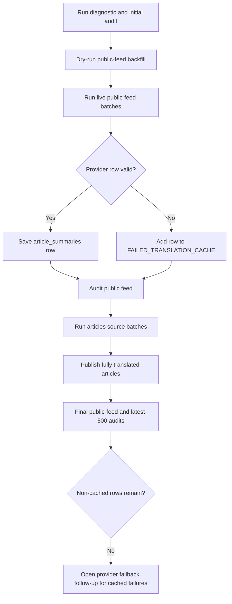

# NutsNews issue #282 final translation backfill audit

Generated on 2026-07-20 for `ramideltoro/nutsnews#282`.

## Simple summary

The production backfill filled every non-cached missing translation row found in the public feed and latest-500 article scans. The remaining gaps are provider failures that were cached for a later retry. No critical translation quality issues remain in either final audit.

Follow-up provider work is tracked in `ramideltoro/nutsnews#287`.

## Intermediate summary

Scope:

- Repository: `ramideltoro/nutsnews`
- Branch: `agent/nutsnews-282-translation-backfill`
- Sources audited: `public_feed_snapshot` and `articles`
- Languages: `fr`, `ja`, `de-CH`, `de`, `el`
- Live provider path: local AI at `https://ai.nutsnews.com`, model `qwen2.5:3b`
- OpenAI fallback: unavailable in the active environment because no `OPENAI_API_KEY` was present

Final audit results:

| Source | Audit limit | Expected rows | Available rows | Coverage | Missing | Warnings | Critical |
| --- | ---: | ---: | ---: | ---: | ---: | ---: | ---: |
| `public_feed_snapshot` | 100 | 500 | 474 | 95% | 26 | 45 | 0 |
| `articles` | 500 | 2500 | 2455 | 98% | 45 | 247 | 0 |

Failure cache after live batches:

| Metric | Count |
| --- | ---: |
| Failed rows cached | 49 |
| `el` failures | 43 |
| `ja` failures | 4 |
| `de` failures | 1 |
| `fr` failures | 1 |
| Non-JSON provider responses | 29 |
| Missing title/summary provider responses | 20 |

The final full articles dry scan selected no non-cached work:

```bash
LANGUAGE_CODES=fr,ja,de-CH,de,el \
BACKFILL_SOURCE=articles \
CANDIDATE_LIMIT=500 \
CANDIDATE_PAGE_SIZE=100 \
SCAN_ALL_CANDIDATES=1 \
BACKFILL_LIMIT=50 \
DRY_RUN=1 \
PUBLISH_READY=1 \
FAILED_TRANSLATION_CACHE=/tmp/nutsnews-282-translation-failures.json \
node scripts/backfill_article_summaries.mjs
```

Result:

```text
Candidate articles scanned: 500
Missing translation rows selected: 0
Nothing to backfill.
```

## Expert summary

The audit and backfill scripts needed reliability fixes before the production backfill could be trusted:

- `audit_article_translations.mjs` now initializes supported language codes before parsing env-provided languages.
- Numeric env parsing now treats unset or blank values as the documented fallback instead of coercing to `0`.
- Audit summary lookup is URL-scoped and batched, so it cannot undercount rows by reading an unrelated capped slice of `article_summaries`.
- `backfill_article_summaries.mjs` rejects generated rows that would be critical in the audit before saving them.
- Publish-ready confirmation batches the summary lookup and article status patch, avoiding oversized PostgREST filters.

Backfill flow:



## Commands run

Initial diagnostics and dry run:

```bash
LANGUAGE_CODES=fr,ja,de-CH,de,el \
AUDIT_LIMIT=100 \
WINDOW_MINUTES=90 \
node scripts/diagnose_missing_article_translations.mjs

LANGUAGE_CODES=fr,ja,de-CH,de,el \
BACKFILL_SOURCE=articles \
CANDIDATE_LIMIT=500 \
SCAN_ALL_CANDIDATES=1 \
CANDIDATE_PAGE_SIZE=100 \
BACKFILL_LIMIT=25 \
DRY_RUN=1 \
PUBLISH_READY=1 \
FAILED_TRANSLATION_CACHE=/tmp/nutsnews-282-translation-failures.json \
node scripts/backfill_article_summaries.mjs
```

Live public-feed batches:

```bash
LANGUAGE_CODES=fr,ja,de-CH,de,el \
BACKFILL_SOURCE=public_feed_snapshot \
CANDIDATE_LIMIT=100 \
BACKFILL_LIMIT=50 \
PUBLISH_READY=0 \
FAILED_TRANSLATION_CACHE=/tmp/nutsnews-282-translation-failures.json \
node scripts/backfill_article_summaries.mjs
```

Live article batches:

```bash
LANGUAGE_CODES=fr,ja,de-CH,de,el \
BACKFILL_SOURCE=articles \
CANDIDATE_LIMIT=500 \
CANDIDATE_PAGE_SIZE=100 \
SCAN_ALL_CANDIDATES=1 \
BACKFILL_LIMIT=50 \
PUBLISH_READY=1 \
FAILED_TRANSLATION_CACHE=/tmp/nutsnews-282-translation-failures.json \
node scripts/backfill_article_summaries.mjs
```

Final audits:

```bash
LANGUAGE_CODES=fr,ja,de-CH,de,el \
AUDIT_LIMIT=100 \
AUDIT_SOURCE=public_feed_snapshot \
TRANSLATION_QUALITY_REPORT_PATH=/tmp/nutsnews-282-final-public-feed-audit.md \
node scripts/audit_article_translations.mjs

LANGUAGE_CODES=fr,ja,de-CH,de,el \
AUDIT_LIMIT=500 \
AUDIT_SOURCE=articles \
TRANSLATION_QUALITY_REPORT_PATH=/tmp/nutsnews-282-final-articles-audit.md \
node scripts/audit_article_translations.mjs
```

## Remaining work

The remaining missing rows are intentionally left out of repeated live retries because they already failed through the active provider path. To reach complete coverage, resolve `ramideltoro/nutsnews#287`, then rerun the saved failure cache with `RETRY_FAILED=1` against an authorized fallback provider.
