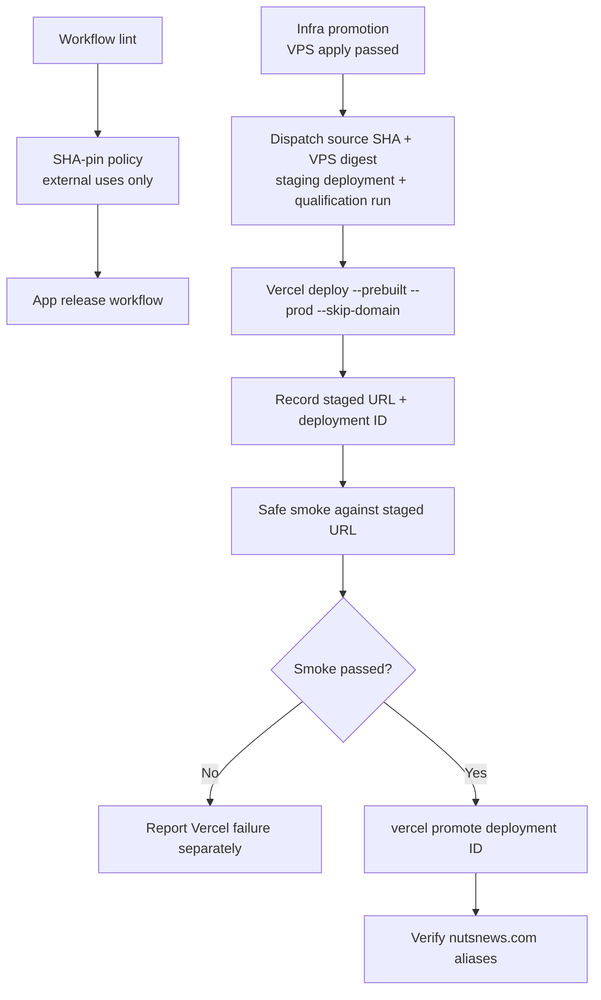

# GitHub Actions SHA Pinning and Vercel Staged Promotion

## Simple Summary

NutsNews now locks GitHub Actions to exact code snapshots and keeps Vercel
production domains off a release until the release proves itself first.

## Intermediate Summary

The app repository pins every external `.github/workflows/*.yml` `uses:` entry
to a full 40-character commit SHA and keeps the readable tag as an inline
comment. A new workflow policy check fails if a future external action or
reusable workflow uses a tag, branch, or other mutable ref. The workflow lint
job also verifies that pinned GitHub action SHAs resolve to commits in the
referenced repository, which prevents annotated tag-object SHAs from passing as
valid pins. Local actions remain allowed because they are reviewed inside the
repository.

The production Vercel flow now creates a staged production deployment with
`--skip-domain`, records the Vercel deployment URL and deployment ID, runs the
safe web smoke suite against that staged URL, and calls `vercel promote` only
after the staged smoke passes. Infra passes the VPS staging deployment ID and
staging qualification run ID into the app dispatch, so the Vercel promotion
decision has both the VPS qualification evidence and Vercel staged test
evidence.

## Expert Summary

Issue #256 changed the GitHub Actions trust boundary. External action refs such
as `actions/checkout`, `actions/setup-node`, CodeQL, Docker build actions,
Supabase setup, OSV, ZAP, Snyk, and reusable OSV workflows are now pinned to
immutable upstream commits. `snyk/actions/setup@master` was replaced with the
current trusted `v1` commit. `scripts/verify_github_actions_pinned.mjs` scans
workflow `uses:` values, ignores local actions, and rejects external refs unless
they end in a full commit SHA or a Docker digest. CI runs the same verifier in
remote commit-validation mode so the SHA must be an actual commit in the action
repository, not only a 40-character object ID.

Issue #175 changed Vercel promotion from direct domain assignment to staged
promotion. `vercel-production-release.yml` now receives a `release` payload
with source SHA, VPS OCI digest, VPS apply run, staging deployment ID, and
qualification run ID. It builds with Vercel Production env, deploys the
prebuilt output as staged production with `--skip-domain`, resolves the Vercel
deployment ID through the Vercel deployment API, smokes the staged URL, then
promotes that deployment ID. Rollback dispatches are marked as `rollback` so
the same staged/promote mechanism can restore Vercel after the protected VPS
rollback apply without treating the VPS OCI digest as a Vercel artifact.

## Operational Impact

- Release operators should look for a staged Vercel URL, Vercel deployment ID,
  staged smoke result, and promotion result in the app workflow summary and
  retained evidence artifact.
- A VPS apply failure is reported by infra before Vercel dispatch. A Vercel
  staging, smoke, promote, or alias failure is reported by the app workflow and
  summarized independently by infra.
- Future action updates should use Dependabot/Renovate-style reviewed SHA
  changes rather than replacing SHAs with tags.

## Rollback Notes

Use the protected rollback workflow for coupled release repair. Do not run a
standalone Vercel production deploy and do not use the VPS OCI digest as a
Vercel deployment identifier. Vercel domain assignment should happen through
the supported Vercel promotion path for the staged deployment, or through the
existing protected rollback automation when restoring a known-good release.

## Related Issues

- `ramideltoro/nutsnews` issue #256
- `ramideltoro/nutsnews` issue #175
