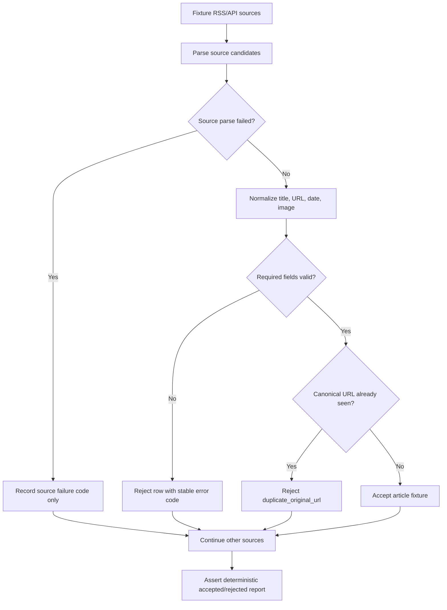

# Feed Ingestion Regression Tests

Issue #211 adds fixture-driven regression coverage for feed ingestion contracts in the app repository.

## Simple Summary

NutsNews now has a small pretend set of news feeds that checks whether good stories are kept, broken stories are ignored, and duplicate stories do not show up twice.

## Intermediate Summary

The web repository now includes stable RSS and API-style ingestion fixtures plus a local `npm run test:feed-ingestion` command. The test verifies accepted and rejected feed inputs, canonical URL dedupe, missing-image handling, and recovery when one source is malformed. It is wired into Web CI so feed-contract regressions are caught before release.

## Expert Summary

The app repo change adds `tests/fixtures/ingestion/` and `scripts/feed_ingestion_regression.mjs`, exposed through `web/package.json` as `test:feed-ingestion`. The regression is intentionally contract-level because the Cloudflare Worker feed pipeline remains owned by `ramideltoro/nutsnews-worker`; app code must not duplicate worker implementation. The suite models RSS and API source inputs, canonicalizes article URLs by removing tracking params and trailing slashes, accepts valid rows with missing images as `image_url: null` plus a stable `missing_image` warning, rejects missing titles and invalid dates, rejects duplicate canonical URLs across source types, and records malformed feed source failures without printing raw feed bodies.

## What Changed

- Added stable ingestion fixtures:
  - `tests/fixtures/ingestion/good-feed.xml`
  - `tests/fixtures/ingestion/bad-feed.xml`
  - `tests/fixtures/ingestion/api-feed.json`
- Added a local regression command:
  - `cd web && npm run test:feed-ingestion`
- Wired the command into Web CI.
- Added CI path filters so changes to the ingestion regression script or fixtures trigger Web CI.

## Why It Changed

External publishers can send malformed dates, missing fields, duplicate stories, missing images, or broken feed bodies. The regression suite gives NutsNews a deterministic fixture layer that catches contract drift before browser tests or live Worker runs.

## Who Is Affected

- Developers changing feed contracts, article dedupe behavior, or public feed assumptions.
- Reviewers checking release readiness for public reader changes.
- Operators investigating source quality or malformed feed behavior.
- Worker maintainers, because the app repo now documents expected input/output behavior without taking ownership of Worker implementation.

## Behavior Difference

Before this change, the app repo had article dedupe checks and live/offline smoke tests, but no focused fixture suite for malformed feed inputs. After this change, Web CI runs a deterministic ingestion contract test that proves:

- valid RSS and API fixture rows are accepted;
- missing images are visible as warnings instead of silently disappearing;
- malformed dates and missing titles are rejected with stable error codes;
- duplicate stories across RSS and API inputs are rejected by canonical URL;
- a bad source does not block unrelated valid sources;
- raw malformed feed bodies and malformed values are not printed in test output.

## Flow

## Setup, Permissions, Migrations, And Limits

- Setup: no deployed environment is required.
- Permissions: no Supabase, Vercel, Cloudflare, or GitHub token is required to run the local command.
- Environment variables: none.
- Migrations: none.
- Limits: this is a contract regression, not a Worker parser replacement. Worker implementation changes still belong in `ramideltoro/nutsnews-worker`.

## Risks And Mitigations

| Risk | Mitigation |
| --- | --- |
| The app repo test drifts away from Worker implementation | Keep the suite focused on shared contract outcomes and update Worker tests separately when Worker parsing changes. |
| Fixtures become too broad or brittle | Keep fixtures small, stable, and explicit about accepted/rejected rows. |
| Sensitive malformed source content appears in logs | The regression asserts that raw malformed feed bodies and malformed input values are not serialized in the report. |
| CI misses fixture/script-only changes | Web CI path filters now include the feed ingestion regression script and fixture directory. |

## Rollback Plan

Revert the app PR that added `scripts/feed_ingestion_regression.mjs`, `tests/fixtures/ingestion/`, the `test:feed-ingestion` package script, and the Web CI step/path filters. This removes the contract suite without changing runtime ingestion or database behavior.

## Related PRs And Issues

- App issue: https://github.com/ramideltoro/nutsnews/issues/211
- App PR: pending at the time this docs note was added.
