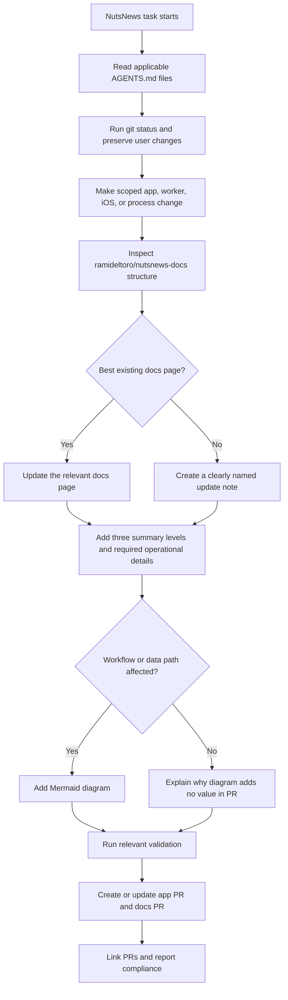

# Mandatory NutsNews Docs Policy

This update documents the REQUIRED policy that every NutsNews change MUST update this documentation repository.

## Simple Summary

Every time NutsNews changes, the docs MUST change too, so future helpers know what happened and why.

## Intermediate Summary

All NutsNews work now requires a matching documentation update in `ramideltoro/nutsnews-docs`. This affects code, configuration, tests, scripts, UI, APIs, database behavior, infrastructure, Cloudflare, admin tools, caching, security, performance, bug fixes, and process-only instruction changes. Codex MUST inspect this docs repository, place the update in the best existing location, and create a clearly named update note when no better page exists.

## Expert Summary

The app repository `AGENTS.md` now makes this docs repository a REQUIRED part of the Definition of Done for every NutsNews task. The policy removes the former "no docs needed" exception and requires docs updates to include what changed, why it changed, who is affected, behavior differences, setup or operational steps, environment variables, permissions, migrations, limits, risks, mitigations, rollback notes, related PRs/issues when available, and three summary levels. Changes that affect workflows, request flow, data flow, caching, Cloudflare, metrics, auth, background jobs, APIs, database behavior, deployment, or infrastructure require Mermaid diagrams in the docs update and PR description.

## What Changed

- The web app repository instructions now require a `ramideltoro/nutsnews-docs` update for ANY NutsNews work.
- There is no "no docs needed" exception.
- Every PR and every docs update MUST include Simple Summary, Intermediate Summary, and Expert Summary sections.
- Workflow, data-flow, cache, Cloudflare, metrics, auth, background-job, API, database, deployment, and infrastructure changes MUST include a Mermaid diagram.
- When app and docs PRs are both required, they MUST link to each other when permissions allow.

## Why It Changed

NutsNews work spans the web app, Worker, iOS, Cloudflare, Vercel, Supabase, automation, and operations. Requiring a docs update for every change keeps operational knowledge in one canonical location and prevents future work from skipping release notes, setup steps, risks, or rollback details.

## Who Is Affected

- Codex runs that modify NutsNews repositories.
- Maintainers reviewing NutsNews app, Worker, iOS, and docs PRs.
- Operators who rely on this repository for setup, deployment, rollback, monitoring, and incident context.
- Future contributors who need to understand why a change was made.

## Behavior Difference

Before this policy, some changes could finish with an explicit no-docs-needed rationale. After this policy, every NutsNews task MUST update this repository. If no existing page is appropriate, the task MUST add a clearly named update note under the existing docs style.

## Required Documentation Content

Every NutsNews docs update MUST include:

- What changed.
- Why it changed.
- Who is affected.
- How behavior is different.
- Any setup, environment variables, permissions, migrations, limits, or operational steps.
- Risks, mitigations, and rollback notes when applicable.
- Links to related PRs or issues when available.
- Simple Summary, Intermediate Summary, and Expert Summary.
- A Mermaid diagram when the change affects workflows, request flow, data flow, caching, Cloudflare, metrics, auth, background jobs, APIs, database behavior, deployment, or infrastructure.

## Workflow

## Setup, Permissions, Migrations, And Limits

- Setup: no runtime setup is required for the product.
- Environment variables: none.
- Permissions: Codex needs repository access to `ramideltoro/nutsnews-docs` when working on NutsNews changes.
- Migrations: none.
- Limits: documentation-only changes do not change Vercel, Cloudflare, Supabase, or Worker quotas.
- Operational steps: reviewers MUST confirm the related docs PR exists and contains the required summaries, operational details, and Mermaid diagram when applicable.

## Risks And Mitigations

| Risk | Mitigation |
| --- | --- |
| Small changes create low-value docs churn | Use the most appropriate existing page or a concise update note that explains what changed and why. |
| App PRs merge without docs context | Require a linked docs PR before declaring the task done. |
| Documentation lands in the wrong repo | Keep product, operations, deployment, cache, automation, and environment documentation in `ramideltoro/nutsnews-docs`. |
| Mermaid diagrams become decorative instead of useful | Include diagrams only for affected workflows or data paths; otherwise explain why the diagram adds no value in the PR description. |

## Rollback Plan

Revert the app repository `AGENTS.md` change that makes docs updates mandatory and revert this documentation note. If PR descriptions were updated only to link this policy, edit those descriptions to remove the obsolete requirement.

## Related PRs And Issues

- App PR: https://github.com/ramideltoro/nutsnews/pull/151
- Docs PR: https://github.com/ramideltoro/nutsnews-docs/pull/4
