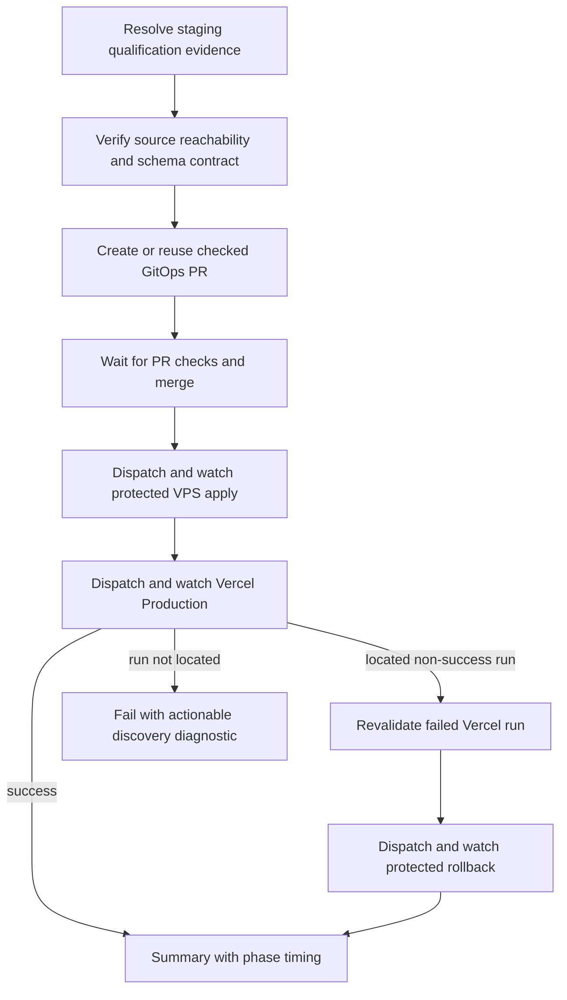

# Production Promotion Timing Update

## Short Summary

Production release promotion now records timing for each major phase and reports
those timings in the workflow summary. Vercel production discovery remains
serial after the protected VPS apply, but a missing Vercel workflow run now
fails with a clearer diagnostic after the bounded discovery window.

## Intermediate Summary

Issue
[nutsnews-infra #335](https://github.com/ramideltoro/nutsnews-infra/issues/335)
improves observability and wait behavior in
`nutsnews-release-promotion.yml`.

The workflow now:

- starts a promotion timer immediately after checkout;
- records `duration_seconds` for release PR creation/reuse, release PR
  check-and-merge, protected VPS apply, Vercel dispatch/deploy, and protected
  rollback when rollback runs;
- records discovery timing for protected apply, Vercel production, and rollback
  child workflows;
- writes a `Phase timing` table into the final job summary;
- keeps the production order serial: staging evidence, schema contract, checked
  GitOps PR, protected VPS apply, Vercel production dispatch, rollback only when
  a located failed Vercel run is revalidated;
- keeps Vercel run discovery bounded at 60 two-second polls and points operators
  to the app repository Actions tab, the `nutsnews-vercel-production-release`
  repository dispatch trigger, and `NUTSNEWS_APP_RELEASE_TOKEN` dispatch
  permissions when discovery times out.

## Expert Summary

No production parallelism was introduced. The workflow still waits for the
protected VPS apply to complete before dispatching Vercel Production, and it
still refuses automated VPS rollback unless the Vercel child workflow run id is
present and the run is rechecked as a non-success `repository_dispatch` run for
the same source commit.

The previous opaque Vercel discovery failure could leave operators guessing
whether the repository dispatch was not accepted, the child workflow was delayed,
or the app workflow name/title filter failed. The new error keeps the same
rollback boundary but identifies the repository, workflow file, event, branch,
source commit titles, dispatch timestamp, and token/trigger checks needed for a
safe retry.

## Operational Impact

Operators should use the `Phase timing` table to compare release runs. The most
important fields are:

- `Promotion total`
- `Release PR create/reuse`
- `Release PR checks and merge`
- `Protected apply`
- `Vercel dispatch and deploy`
- `Rollback path`

If Vercel discovery times out, treat it as a promotion automation or dispatch
visibility problem, not as evidence that the VPS release itself is bad. Inspect
the app repository Actions page, confirm the repository dispatch event is still
accepted, confirm the workflow is enabled on `main`, and verify
`NUTSNEWS_APP_RELEASE_TOKEN` still has dispatch permission before rerunning the
promotion.

## Risks, Mitigations, And Rollback

Risk: GitHub Actions could delay surfacing the Vercel child run long enough to
hit the bounded discovery timeout.

Mitigation: the discovery window remains about two minutes, which is long enough
for normal repository dispatch visibility while avoiding the older unnecessary
wait. The failure output now lists the exact workflow and permissions to inspect
before retry.

Risk: a missing Vercel child run could accidentally trigger VPS rollback.

Mitigation: the rollback condition remains unchanged. Rollback starts only when
the Vercel run id exists, deployment failed, and the rollback step revalidates
that located run as the same release commit and a non-success
`repository_dispatch` run.

Rollback is a normal revert of the infra PR. Reverting removes the timing table
and restored diagnostics but does not change the protected apply workflow,
secrets, production manifest identity, database state, or Vercel configuration.

## Verification

Expected infra validation:

- `python3 ansible/tests/validate_release_promotion.py`
- `python3 ansible/tests/validate_production_eligibility.py`
- `python3 ansible/tests/validate_gate_rehearsal.py`
- `python3 ansible/tests/validate_workflow_action_pins.py`
- `python3 ansible/tests/validate_ci_cost_controls.py`
- `git diff --check`

After the infra PR merges, run the controlled promotion path and compare the
`Phase timing` table against recent production promotion runs. Exercise or
simulate the Vercel dispatch-not-found path through the offline guardrail when a
live missing-dispatch run is not safe to create intentionally.

## Related Work

- `ramideltoro/nutsnews-infra` issue `#335`
- `ramideltoro/nutsnews-infra` workflow
  `.github/workflows/nutsnews-release-promotion.yml`
