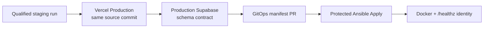

# Staging-Qualified Production Promotion Update

## Simple Summary

Production VPS promotion now has one intended path: a release must pass staging
qualification first, then prove Vercel Production and production Supabase are
already compatible with the same source commit before the VPS manifest changes.

The old direct `nutsnews-production-release` dispatch is not the production
entry point.

## Intermediate Summary

The infra promotion workflow starts from a successful
`nutsnews-staging-qualification.yml` run, or a manual dispatch that names that
exact run and uses the required confirmation phrase. It verifies:

- exact staging qualification attestation;
- current successful staging deployment identity;
- same-source Vercel Production deployment and JSON `/healthz` identity;
- compatible production Supabase schema contract;
- reviewed GitOps manifest PR and checks;
- protected production apply with the complete release identity bundle.

If production Supabase is behind, promotion fails and directs the operator to
the protected app workflow `production-supabase-migration.yml`. It does not run
production migrations automatically.

If the Vercel deployment URL returns a deployment-protection page, alias page,
or other non-JSON response for `/healthz`, promotion now fails with a concise
Vercel health-gate error and does not print the HTML body. Resolve Vercel
deployment protection, alias routing, or the automation bypass before rerunning
promotion.

## Expert Summary

The promotion path keeps evidence, review, and mutation separate. The
promotion workflow does not attach `production-vps`; it creates or reuses the
manifest PR only after Vercel, Supabase, and staging-attestation gates pass.
`Protected Ansible Apply` still performs the pre-secret production eligibility
check and post-apply Docker/public-health identity verification.

The Vercel gate reads `/healthz?release=<source_commit>` from the successful
Production deployment URL with `Accept: application/json`, parses the response
body explicitly, and treats non-JSON responses as a hard gate failure. This
keeps deployment-protection or routing issues readable in Actions logs without
leaking a full HTML response body into the workflow output.

## Updated Docs

- `NUTSNEWS_RELEASE_PIPELINE.md`
- `NUTSNEWS_PROTECTED_ANSIBLE_APPLY.md`
- `MIGRATION_RELEASE_GATE.md`

## Related Pull Requests

- `ramideltoro/nutsnews-infra` PR #242:
  staging-qualified production promotion implementation.
- `ramideltoro/nutsnews-infra` PR #243:
  clearer Vercel `/healthz` non-JSON failure handling.

## Remaining Risks

- `production-vps` approval may still require a human reviewer.
- Vercel, Supabase, GitHub, and the VPS are not atomic; late production apply
  failure still requires the protected rollback path.
- Secret values stay outside Git; this update documents only secret names and
  workflow boundaries.
