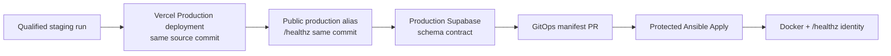

# Staging-Qualified Production Promotion Update

Current note: this file describes the earlier July 2026 staging-qualified VPS
promotion model. The current Vercel production-domain behavior is documented in
`updates/README_ACTION_SHA_PINNING_AND_VERCEL_STAGED_PROMOTION.md`: Vercel now
deploys a staged production candidate with `--skip-domain`, smoke-tests the
staged URL, and promotes with `vercel promote` only after that staged
qualification passes.

## Simple Summary

Production VPS promotion now has one intended path: a release must pass staging
qualification first, then prove Vercel Production and production Supabase are
already compatible with the same source commit before the VPS manifest changes.

The old direct `nutsnews-production-release` dispatch is not the production
entry point.

## Intermediate Summary

The infra promotion workflow starts from a successful
`nutsnews-staging-qualification.yml` run, or a manual dispatch that names that
exact run and uses the required confirmation phrase. It verifies:

- exact staging qualification attestation;
- current successful staging deployment identity;
- same-source Vercel Production deployment evidence and public production alias
  JSON `/healthz` identity;
- compatible production Supabase schema contract;
- reviewed GitOps manifest PR and checks;
- protected production apply with the complete release identity bundle.

If production Supabase is behind, promotion fails and directs the operator to
the protected app workflow `production-supabase-migration.yml`. It does not run
production migrations automatically.

The Vercel gate treats the successful `vercel[bot]` Production deployment as
deployment evidence, then checks `https://www.nutsnews.com/healthz` for the
same source commit. This avoids false failures when Vercel protects the
per-deployment `.vercel.app` URL. If the public production alias returns HTTP
401, non-JSON, or the wrong commit, promotion keeps polling until its deadline
and then fails with the last concise alias-health error.

## Expert Summary

The promotion path keeps evidence, review, and mutation separate. The
promotion workflow does not attach `production-vps`; it creates or reuses the
manifest PR only after Vercel, Supabase, and staging-attestation gates pass.
`Protected Ansible Apply` still performs the pre-secret production eligibility
check and post-apply Docker/public-health identity verification.

The Vercel gate still resolves GitHub Deployment records for the exact source
commit and requires the latest `vercel[bot]` Production status to be
successful. The status URL remains evidence only. Health and runtime-config
verification use the allowlisted public alias `https://www.nutsnews.com`, with
`Accept: application/json` and an explicit source-commit/header match. This
keeps protected `.vercel.app` deployment URLs from blocking valid production
deployments while preserving the same-source Vercel gate.

## Updated Docs

- `NUTSNEWS_RELEASE_PIPELINE.md`
- `NUTSNEWS_PROTECTED_ANSIBLE_APPLY.md`
- `MIGRATION_RELEASE_GATE.md`

## Related Pull Requests

- `ramideltoro/nutsnews-infra` PR #242:
  staging-qualified production promotion implementation.
- `ramideltoro/nutsnews-infra` PR #243:
  clearer Vercel `/healthz` non-JSON failure handling.
- `ramideltoro/nutsnews-infra` PR #244:
  clearer Vercel `/healthz` HTTP status failure handling.
- `ramideltoro/nutsnews-infra` PR #247:
  public production alias verification for protected Vercel deployment URLs.

## Remaining Risks

- `production-vps` approval may still require a human reviewer.
- Vercel, Supabase, GitHub, and the VPS are not atomic; late production apply
  failure still requires the protected rollback path.
- Secret values stay outside Git; this update documents only secret names and
  workflow boundaries.
