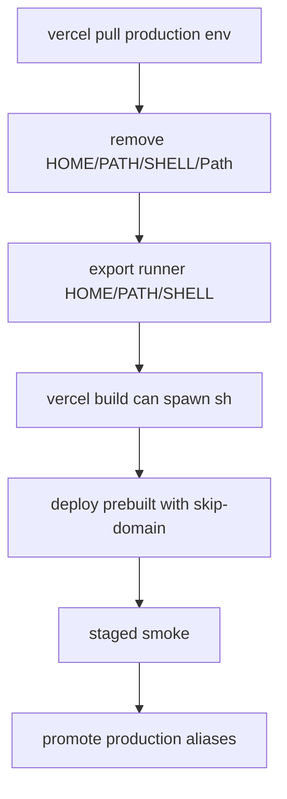

# Vercel Production Build Shell Env Fix

## Simple Summary

The production deploy robot failed because it could not find the shell program
it needs to start the build. The final fix keeps shell settings out of the
Vercel env file and uses the GitHub runner shell settings only for the build
process.

## Intermediate Summary

After the VPS production apply succeeded for app commit
`936062eee2ed097817a81f881920faa9808c2fac`, the Vercel production workflow
failed before deployment. The failed app run was
`ramideltoro/nutsnews` Actions run `29697127993`; `vercel build` reached the
install phase and stopped with `spawn sh ENOENT`.

App PR #262 changed the Vercel production workflow so locally injected `HOME`,
`PATH`, and `SHELL` control values were written as raw `KEY=value` lines instead
of JSON-quoted lines. A follow-up Vercel production run,
`ramideltoro/nutsnews` Actions run `29698142670`, still failed at the same
`spawn sh ENOENT` point. App PR #263 removes `HOME`, `PATH`, `Path`, and
`SHELL` from `.vercel/.env.production.local` entirely, then exports those shell
controls only in the GitHub Actions process before running `vercel build`.

The change does not alter release evidence, deployment targets, Supabase
configuration, runtime app behavior, or production secrets.

## Expert Summary

The workflow still follows the same release chain:

- infra staging deployment and off-VPS qualification;
- protected VPS apply with exact release identity;
- Vercel staged production build with `--skip-domain`;
- staged smoke;
- `vercel promote`;
- public alias identity verification.

The failure is limited to the app-side Vercel local build environment. The
first patch removed JSON quoting, but the Vercel CLI still loaded shell-control
values from the pulled dotenv file before its local install command. The final
patch strips shell-control names from the dotenv file instead of rewriting them:

- remove `HOME`, `PATH`, `Path`, and `SHELL` from
  `.vercel/.env.production.local`;
- export `HOME`, `PATH`, and `SHELL=/bin/sh` in the GitHub Actions shell
  process;
- keep `vercel build --prod`, `vercel deploy --prebuilt --prod --skip-domain`,
  staged smoke, `vercel promote`, and public alias verification unchanged;
- update `scripts/production_release_workflow_regression.mjs` so future changes
  cannot reintroduce shell-control dotenv writes.

## Operational Impact

Operators can retry the guarded production promotion after PR #263 merges. The
latest successful VPS protected apply run `29697967440` already verified the
new VPS image, public `/healthz`, and safe production smoke against
`https://vps.nutsnews.com/`.

## Risks And Mitigations

- If Vercel local-build parsing changes again, the workflow still stages the
  deployment without assigning domains and runs smoke before promotion.
- If Vercel fails after aliases are promoted, use the protected rollback path
  instead of editing VPS or Vercel state manually.

## Rollback

Revert app PR #263 to restore the raw shell-control dotenv write. Reverting PR
#262 as well would restore the original JSON-quoted formatting. For an
in-flight split release, use the protected NutsNews rollback workflow from
`ramideltoro/nutsnews-infra`; do not manually edit `/etc/nutsnews`, Docker
Compose, or Vercel production aliases.

## Related Links

- App PR: https://github.com/ramideltoro/nutsnews/pull/262
- Follow-up app PR: https://github.com/ramideltoro/nutsnews/pull/263
- Failed Vercel workflow: https://github.com/ramideltoro/nutsnews/actions/runs/29697127993
- Follow-up failed Vercel workflow: https://github.com/ramideltoro/nutsnews/actions/runs/29698142670
- Successful fixed VPS apply: https://github.com/ramideltoro/nutsnews-infra/actions/runs/29697967440
- Infra health-target verifier fix: https://github.com/ramideltoro/nutsnews-infra/pull/267
- Infra smoke health-target fix: https://github.com/ramideltoro/nutsnews-infra/pull/268
