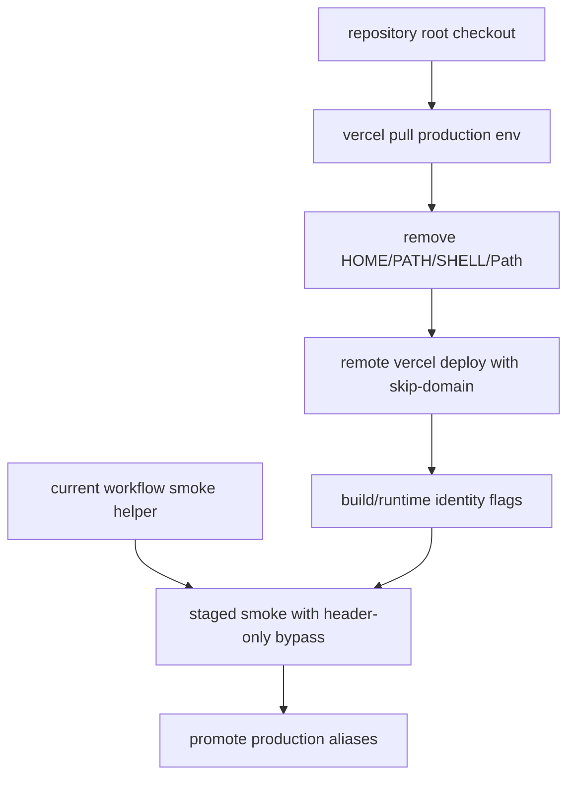

# Vercel Production Build Shell Env, Remote Staging, and Bypass Smoke Fix

## Simple Summary

The production deploy robot failed because it could not find the shell program
it needs to start the build. The guarded release path now avoids that fragile
local build step: Vercel builds the release remotely, the staged URL is checked
first, and the public domains move only after the check passes. A later staged
smoke failure showed that API-style checks must use Vercel's bypass header
without asking for a browser cookie. The workflow also has to run the current
checker, not the old checker bundled inside the already-qualified app commit.

## Intermediate Summary

After the VPS production apply succeeded for app commit
`936062eee2ed097817a81f881920faa9808c2fac`, the Vercel production workflow
failed before deployment. The failed app run was
`ramideltoro/nutsnews` Actions run `29697127993`; `vercel build` reached the
install phase and stopped with `spawn sh ENOENT`.

App PR #262 changed the Vercel production workflow so locally injected `HOME`,
`PATH`, and `SHELL` control values were written as raw `KEY=value` lines instead
of JSON-quoted lines. A follow-up Vercel production run,
`ramideltoro/nutsnews` Actions run `29698142670`, still failed at the same
`spawn sh ENOENT` point. App PR #263 removes `HOME`, `PATH`, `Path`, and
`SHELL` from `.vercel/.env.production.local` entirely, then exports those shell
controls only in the GitHub Actions process before running `vercel build`.

Production Vercel run `29698656625` showed the same `spawn sh ENOENT` failure
even after shell-control dotenv stripping. App PR #264 therefore changes the
guarded production workflow to stage a remote Vercel production deployment with
`--prod --skip-domain`, pass release identity through explicit `--build-env`
and `--env` flags, smoke the staged deployment, and promote it only after that
smoke passes.

Production Vercel run `29699383698` confirmed that the shell failure was gone,
but exposed a new path issue: the workflow ran `vercel deploy` from `web/` while
the Vercel project root is already configured as `web`, so Vercel looked for
`~/work/nutsnews/nutsnews/web/web`. App PR #265 removes `working-directory:
web` from the remote staging step and adds a regression guard so the deploy
runs from the repository root. The staged smoke step still runs from `web/`.

Production Vercel run `29699988008` confirmed that remote staging from the repo
root works and created staged deployment
`https://nutsnews-2qwwioebp-nutsnews.vercel.app`, but the staged smoke failed
with `redirect count exceeded`. The direct staged `/healthz` response redirected
to Vercel SSO, and the Node smoke helper was sending both
`x-vercel-protection-bypass` and `x-vercel-set-bypass-cookie: true`. App PR #266
keeps programmatic `fetch` smoke on the header-only bypass path by default and
leaves bypass-cookie setup as an explicit opt-in for browser-like callers.

Production Vercel run `29700659309` still failed with `redirect count exceeded`
because the workflow correctly checked out the exact qualified app source
`936062eee2ed097817a81f881920faa9808c2fac` before smoke, and that old source
still contained the pre-PR-#266 smoke helper. App PR #267 keeps deployment from
the exact qualified source, but exports the current workflow commit's
`scripts/dual_target_web_smoke.mjs` into `RUNNER_TEMP` and runs that exported
helper for staged smoke.

Observed live state after the failed promotion/rollback attempt:

- VPS: healthy on `936062eee2ed097817a81f881920faa9808c2fac`,
  build `29695471125-1`, target `production-vps`.
- Vercel public aliases: still healthy on previous commit
  `d4e82d0134707d72e4a5ca29baa6aa365acb925c`, target
  `vercel-production`.

The change does not alter Supabase configuration, production secrets, app
runtime behavior, or the staged-smoke-before-promote safety gate.

## Expert Summary

The workflow still follows the same release chain, but Vercel now owns the
production build step:

- infra staging deployment and off-VPS qualification;
- protected VPS apply with exact release identity;
- Vercel remote production deployment with `--skip-domain`;
- staged smoke;
- `vercel promote`;
- public alias identity verification.

The failure is limited to the app-side Vercel local build environment. The first
patch removed JSON quoting, and the second patch stripped shell-control names
from the dotenv file. A third run still failed when `vercel build --prod`
started the install command. The remote staging patch removes that local build
surface:

- remove `HOME`, `PATH`, `Path`, and `SHELL` from
  `.vercel/.env.production.local`;
- replace `vercel build --prod` and `vercel deploy --prebuilt --prod
  --skip-domain` with `vercel deploy --prod --skip-domain --force
  --archive=tgz`;
- run the remote staging deploy from the repository root so the Vercel project
  root setting is applied exactly once;
- send `x-vercel-protection-bypass` without `x-vercel-set-bypass-cookie` from
  Node-based smoke and production identity checks unless
  `VERCEL_SET_BYPASS_COOKIE=true` or `samesitenone` is explicitly set;
- fetch the current workflow commit's smoke helper into `RUNNER_TEMP` so
  release automation fixes apply even when the app source being deployed is an
  older, already-qualified commit;
- pass `NUTSNEWS_SOURCE_COMMIT`, `NUTSNEWS_BUILD_ID`,
  `NUTSNEWS_CONFIG_GENERATION`, `NUTSNEWS_DEPLOYMENT_TARGET`, and matching
  `NEXT_PUBLIC_` identity values through both `--build-env` and `--env`;
- keep staged smoke, deployment ID lookup, `vercel promote`, public alias
  verification, and sanitized release evidence;
- update `scripts/production_release_workflow_regression.mjs` so future changes
  cannot reintroduce local prebuilt production deployment or omit remote
  identity flags.

## Operational Impact

Operators can retry the guarded production promotion after PR #267 merges. The
latest live VPS check already serves the qualified app image and reports:

- source commit: `936062eee2ed097817a81f881920faa9808c2fac`;
- build ID: `29695471125-1`;
- deployment target: `production-vps`;
- readiness: production, live side effects, Supabase primary,
  `productionWritesPaused=false`.

Vercel public aliases should converge only after the remote staged deployment
passes smoke and promotion verifies `www.nutsnews.com` and `nutsnews.com`.

## Risks And Mitigations

- If remote Vercel builds differ from local prebuilt behavior, the workflow
  still stages the deployment without assigning domains and runs smoke before
  promotion.
- If remote build/runtime identity values are not applied, smoke and public
  alias checks fail because `/healthz` and runtime config must report the exact
  source commit, build ID, config generation, and deployment target.
- If Vercel fails after aliases are promoted, use the protected rollback path
  instead of editing VPS or Vercel state manually.
- If a browser-oriented smoke flow needs a bypass cookie, set
  `VERCEL_SET_BYPASS_COOKIE=true` or `samesitenone` explicitly for that caller
  instead of changing the API-smoke default.
- If current-helper export fails, the workflow fails before `vercel promote`, so
  public aliases are not moved.

## Rollback

Revert app PR #267 to run the smoke helper from the checked-out qualified source
again. Revert app PR #266 to restore the default bypass-cookie request in
programmatic smoke. Revert app PR #264 to restore the local prebuilt Vercel
path. Reverting PR #263 would restore the raw shell-control dotenv write, and
reverting PR #262 as well would restore the original JSON-quoted formatting. For
an in-flight split release, use the protected NutsNews rollback workflow or
rerun the guarded promotion after fixes land; do not manually edit
`/etc/nutsnews`, Docker Compose, or Vercel production aliases.

## Related Links

- App PR: https://github.com/ramideltoro/nutsnews/pull/262
- Follow-up app PR: https://github.com/ramideltoro/nutsnews/pull/263
- Remote staging app PR: https://github.com/ramideltoro/nutsnews/pull/264
- Remote staging root fix PR: https://github.com/ramideltoro/nutsnews/pull/265
- Vercel bypass smoke fix PR: https://github.com/ramideltoro/nutsnews/pull/266
- Current smoke helper PR: https://github.com/ramideltoro/nutsnews/pull/267
- Failed Vercel workflow: https://github.com/ramideltoro/nutsnews/actions/runs/29697127993
- Follow-up failed Vercel workflow: https://github.com/ramideltoro/nutsnews/actions/runs/29698142670
- Remote staging failure trigger evidence: https://github.com/ramideltoro/nutsnews/actions/runs/29698656625
- Remote staging root path failure: https://github.com/ramideltoro/nutsnews/actions/runs/29699383698
- Header/cookie staged smoke failure: https://github.com/ramideltoro/nutsnews/actions/runs/29699988008
- Staged deployment from run `29699988008`: https://nutsnews-2qwwioebp-nutsnews.vercel.app
- Old-helper staged smoke failure: https://github.com/ramideltoro/nutsnews/actions/runs/29700659309
- Staged deployment from run `29700659309`: https://nutsnews-6jzpdtb4l-nutsnews.vercel.app
- Parent promotion with deterministic rollback handling: https://github.com/ramideltoro/nutsnews-infra/actions/runs/29698512054
- Parent promotion for root path failure: https://github.com/ramideltoro/nutsnews-infra/actions/runs/29699170344
- Failed rollback attempt: https://github.com/ramideltoro/nutsnews-infra/actions/runs/29698674573
- Successful fixed VPS apply: https://github.com/ramideltoro/nutsnews-infra/actions/runs/29697967440
- Infra health-target verifier fix: https://github.com/ramideltoro/nutsnews-infra/pull/267
- Infra smoke health-target fix: https://github.com/ramideltoro/nutsnews-infra/pull/268
- Vercel Protection Bypass for Automation: https://vercel.com/docs/deployment-protection/methods-to-bypass-deployment-protection/protection-bypass-automation
- Vercel Automated and Agent Access: https://vercel.com/docs/deployment-protection/automated-agent-access
