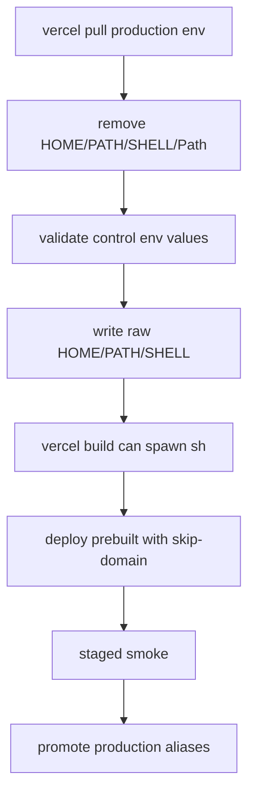

# Vercel Production Build Shell Env Fix

## Simple Summary

The production deploy robot failed because it could not find the shell program
it needs to start the build. The fix keeps the shell path plain instead of
wrapping it in quotes.

## Intermediate Summary

After the VPS production apply succeeded for app commit
`936062eee2ed097817a81f881920faa9808c2fac`, the Vercel production workflow
failed before deployment. The failed app run was
`ramideltoro/nutsnews` Actions run `29697127993`; `vercel build` reached the
install phase and stopped with `spawn sh ENOENT`.

App PR #262 changes the Vercel production workflow so the locally injected
`HOME`, `PATH`, and `SHELL` control values are validated and written as raw
`KEY=value` lines. It still removes any downloaded shell-sensitive values from
`.vercel/.env.production.local` first, and it does not change release evidence,
deployment targets, Supabase configuration, or runtime behavior.

## Expert Summary

The workflow still follows the same release chain:

- infra staging deployment and off-VPS qualification;
- protected VPS apply with exact release identity;
- Vercel staged production build with `--skip-domain`;
- staged smoke;
- `vercel promote`;
- public alias identity verification.

The failure was limited to the app-side Vercel local build environment. The
previous formatter wrote shell control values with `JSON.stringify`, which made
the effective `PATH` unsafe for the Vercel CLI install command in the live
runner. The replacement uses an allowlist pattern for control values and writes
raw lines only after validation. The regression test now asserts that
`PATH`/`SHELL`/`HOME` are not JSON-quoted.

## Operational Impact

Operators can retry the Vercel production release workflow for the same source
commit after PR #262 merges. The successful VPS apply run `29696941428`
already verified the new VPS image, public `/healthz`, and safe production
smoke against `https://vps.nutsnews.com/`.

## Risks And Mitigations

- If a future runner emits an unexpected character in `PATH`, the workflow
  fails closed before writing the Vercel env file.
- If Vercel local-build parsing changes again, the workflow still stages the
  deployment without assigning domains and runs smoke before promotion.
- If Vercel fails after aliases are promoted, use the protected rollback path
  instead of editing VPS or Vercel state manually.

## Rollback

Revert app PR #262 to restore the previous JSON-quoted control-env formatting.
For an in-flight split release, use the protected NutsNews rollback workflow
from `ramideltoro/nutsnews-infra`; do not manually edit `/etc/nutsnews`,
Docker Compose, or Vercel production aliases.

## Related Links

- App PR: https://github.com/ramideltoro/nutsnews/pull/262
- Failed Vercel workflow: https://github.com/ramideltoro/nutsnews/actions/runs/29697127993
- Successful fixed VPS apply: https://github.com/ramideltoro/nutsnews-infra/actions/runs/29696941428
- Infra health-target verifier fix: https://github.com/ramideltoro/nutsnews-infra/pull/267
