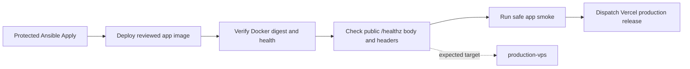

# VPS Release Smoke Health Target Fix

## Simple Summary

The production VPS checker was looking for the wrong name on the health page. It
now checks for the name the live VPS app actually reports.

## Intermediate Summary

The protected VPS apply for the app writer-pause release deployed the reviewed
image and passed Docker/public identity checks, but the final safe app smoke
failed because the infra workflow expected `/healthz` to report `vps`. The live
app route reports the production VPS deployment target, `production-vps`, for
both the JSON payload and `X-NutsNews-Deployment-Target` header.

This update documents the correction in `ramideltoro/nutsnews-infra` PR #268:
the protected apply verifier, smoke invocation, regression test, and short local
runbook now use `production-vps` as the expected public app `/healthz` identity.

## Expert Summary

`web/app/healthz/route.ts` derives `deploymentTarget` from
`NUTSNEWS_DEPLOYMENT_TARGET`. The production VPS app container is deployed with
`NUTSNEWS_DEPLOYMENT_TARGET=production-vps`, so the release smoke script
correctly failed when `protected-ansible-apply.yml` passed
`--expected-health-deployment-target vps`.

The infra fix:

- sets `RELEASE_HEALTH_DEPLOYMENT_TARGET=production-vps`;
- keeps validating `/healthz` body and header identity against the expected
  health target;
- passes `--expected-health-deployment-target production-vps` to
  `scripts/dual_target_web_smoke.mjs`;
- updates `ansible/tests/validate_release_promotion.py`;
- corrects the short operator note in `runbooks/PROTECTED_ANSIBLE_APPLY.md`.

This is validation-only. It does not change the app image, Vercel, Cloudflare,
Supabase, worker behavior, or production secrets. Rollback is to revert
`ramideltoro/nutsnews-infra` PR #268, but the old `vps` expectation is known to
fail the current production VPS app smoke.

## Mermaid Flow

## Validation Evidence

- Failed protected apply before fix:
  https://github.com/ramideltoro/nutsnews-infra/actions/runs/29697591988
- Fix PR:
  https://github.com/ramideltoro/nutsnews-infra/pull/268
- Local infra validation before opening the PR:
  - `python3 ansible/tests/validate_release_promotion.py`
  - `python3 ansible/tests/validate_app_deployment.py`
  - `python3 ansible/tests/validate_production_eligibility.py`
  - `python3 ansible/tests/validate_gate_rehearsal.py`
  - `git diff --check`
