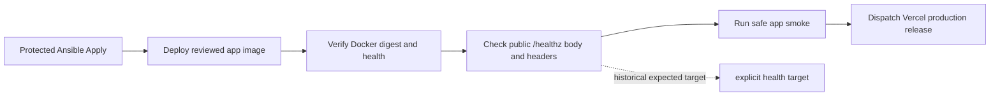

# VPS Release Smoke Health Target Fix

> Superseded note: the current shared VPS image build contract uses `/healthz`
> as build identity (`vps`) and `/readyz` plus `/api/runtime-config` as runtime
> identity (`production-vps` in production). See
> `README_VPS_HEALTH_BUILD_TARGET_CONTRACT_UPDATE.md`.

## Simple Summary

This historical note recorded PR #268. It is no longer current operator
guidance for the shared VPS image.

## Intermediate Summary

The protected VPS apply for the app writer-pause release deployed the reviewed
image and passed Docker/public identity checks, but the final safe app smoke
failed on the public app health target. That observation was later superseded
after the shared VPS image contract was clarified: `/healthz` is build identity,
while runtime target checks belong to `/readyz` and `/api/runtime-config`.

This update documents the older correction in `ramideltoro/nutsnews-infra` PR
#268. For current guidance, use
`README_VPS_HEALTH_BUILD_TARGET_CONTRACT_UPDATE.md`.

## Expert Summary

Current app images are shared across VPS runtime targets. The release smoke
script therefore accepts a separate health target for `/healthz` and runtime
target for `/readyz`.

The infra fix:

- set the historical `RELEASE_HEALTH_DEPLOYMENT_TARGET` value;
- keeps validating `/healthz` body and header identity against the expected
  health target;
- passed an explicit `--expected-health-deployment-target` to
  `scripts/dual_target_web_smoke.mjs`;
- updates `ansible/tests/validate_release_promotion.py`;
- corrects the short operator note in `runbooks/PROTECTED_ANSIBLE_APPLY.md`.

This was validation-only. It did not change the app image, Vercel, Cloudflare,
Supabase, worker behavior, or production secrets.

## Mermaid Flow

## Validation Evidence

- Failed protected apply before fix:
  https://github.com/ramideltoro/nutsnews-infra/actions/runs/29697591988
- Fix PR:
  https://github.com/ramideltoro/nutsnews-infra/pull/268
- Local infra validation before opening the PR:
  - `python3 ansible/tests/validate_release_promotion.py`
  - `python3 ansible/tests/validate_app_deployment.py`
  - `python3 ansible/tests/validate_production_eligibility.py`
  - `python3 ansible/tests/validate_gate_rehearsal.py`
  - `git diff --check`
