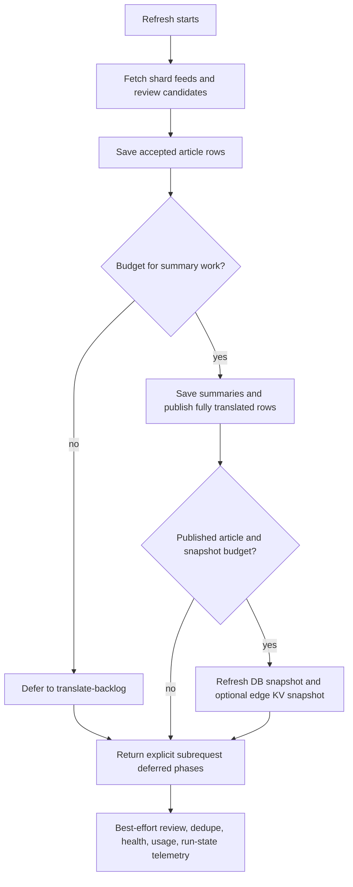

# Worker Summary Translation Subrequest Budget Update

## Problem

The Worker was trying too many summary translation recovery tasks in one invocation. With 20 RSS feed fetches plus dozens of OpenAI/local AI translation calls and Supabase writes, Cloudflare stopped the run with:

`Too many subrequests by single Worker invocation`

That caused translation saves to fail and kept articles stuck in `translation_pending`.

## Fix

The Worker now treats summary translation work as a small per-run task budget instead of expanding recovery articles into dozens of language tasks.

- Caps summary translation tasks per Worker invocation at a safe hard limit.
- Prioritizes newly accepted articles first.
- Uses remaining task budget for recovery of older `translation_pending` articles.
- Keeps skipped articles hidden as `translation_pending` until a later run finishes their translations.
- Adds `articleSummaryTranslationTaskBudget` to Worker responses and translation summary logs.

## Notes

With five enabled languages (`fr,ja,de-CH,de,el`), one article requires five translation tasks. This update keeps shard invocations below the Cloudflare subrequest ceiling while still allowing future scheduled runs to continue draining pending translations.

## Refresh Persistence Budget Follow-Up

Issue: `ramideltoro/nutsnews-worker#49`

The 2026-07-20 production refresh evidence showed accepted article saves were durable again, but long refreshes could still run out of Cloudflare Worker subrequests while saving translated summaries, review rows, feed health, AI usage, Worker run state, processed URL KV state, or public feed snapshots. When that happened, the Worker returned generic `*SaveOk=false` flags and could leave newly accepted articles in `translation_pending` until another recovery pass.

The Worker refresh path now keeps accepted article persistence ahead of every budget gate, then uses a conservative per-invocation subrequest soft budget for the follow-on phases:

- Summary translation work can be deferred from the refresh invocation to the existing controller-triggered `/translate-backlog` invocation.
- Public feed snapshot refresh runs only after this invocation actually publishes an article and has enough remaining budget.
- Review, processed URL KV, feed-health, AI-usage, Worker-run, KV run-state, and Redis stats persistence can be skipped explicitly instead of running into the Cloudflare hard limit.
- Refresh responses now include `subrequestBudget` with `softLimit`, `reserve`, `estimatedUsed`, `estimatedRemaining`, and `deferredPhases`; `deferredReasons` also includes `subrequest_budget:<phase>` entries for existing readers.
- Operators should treat `articleSaveOk=true` plus `subrequest_budget:article_summary_translation_build` as a durable accepted article that is waiting for the separate translation backlog invocation, not as lost publication work.

The defaults are intentionally conservative for the 50-subrequest class: `WORKER_SUBREQUEST_SOFT_LIMIT=45` and `WORKER_SUBREQUEST_RESERVE=3`. These can be raised only after confirming the deployed Cloudflare Worker plan/config limit and leaving room for final log delivery.

